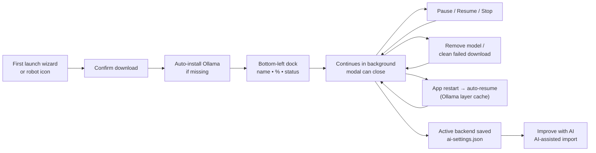
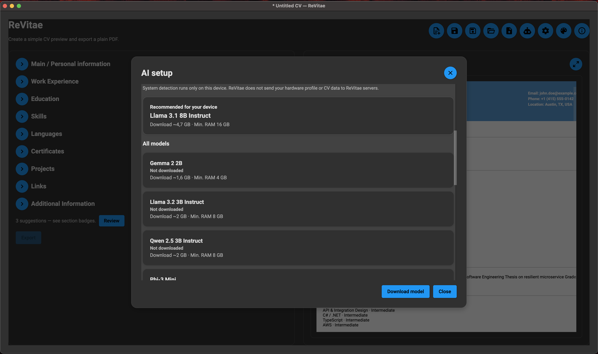
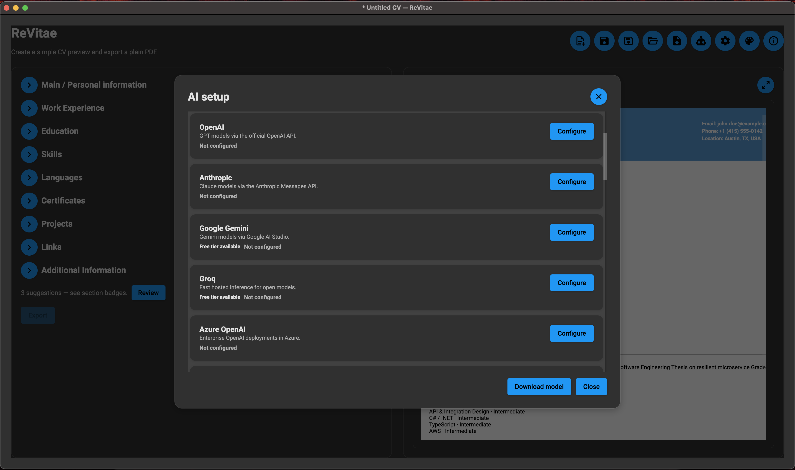
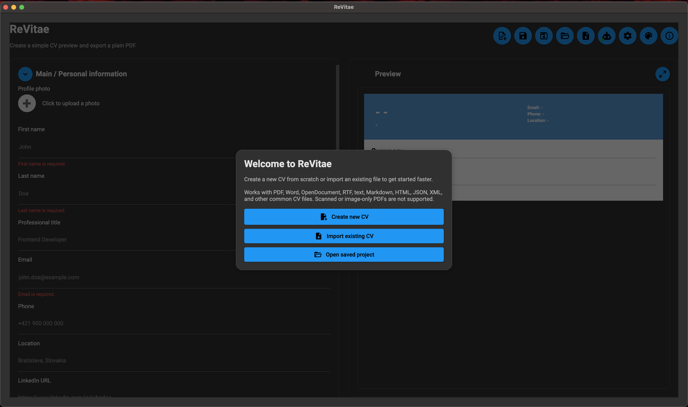
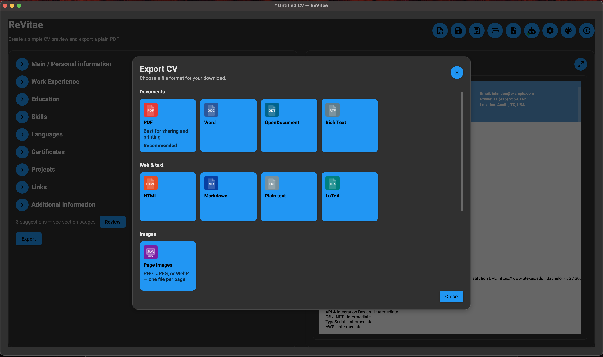

# ReVitae

[](https://github.com/01laky/ReVitae/releases)
[](https://dotnet.microsoft.com/)
[](https://avaloniaui.net/)
[](https://github.com/01laky/ReVitae)
[](https://github.com/01laky/ReVitae/releases)
[](https://github.com/01laky/ReVitae/actions/workflows/ci.yml)

ReVitae is a **desktop CV builder** that keeps your content editable, your templates
swappable, and your files on your machine. Import an existing CV — PDF, Word, scan,
or photo — refine it in clear sections with live preview, then export to PDF or
15 other formats when you are ready.

No account required. No cloud upload for everyday editing. Optional AI runs locally
or through providers you configure yourself.


## Why ReVitae

Most CV tools trap you in one layout. Change the design and you often lose control
over the text. ReVitae treats **content and presentation as separate**:

- **Write once, restyle anytime** — switch among 106 templates without retyping.
- **Import, then edit** — uploaded files become structured drafts you can fix, not frozen PDFs.
- **Stay local** — core editing and import run on your computer; you choose if and when AI is used.
- **Honest imports** — scanned PDFs and photos work via OCR, with a clear review step afterward.

**Good fit if you** want a focused CV app (not a full office suite), care about privacy,
or need to turn an old PDF or Word export into something you can actually maintain.

## Local AI — optional help, on your terms

Want suggestions without sending your CV to a random website? ReVitae can run
**local AI models** (via Ollama) or connect to **online providers you configure**
(OpenAI, Anthropic, Gemini, and others). On first launch, an optional **setup
wizard** walks you through local or online setup — or you can skip and configure
later from the header **robot icon** or **Setup → Show AI setup wizard again**.
Downloads continue in the background — close the setup modal, pause for lunch, even
restart the app; progress picks up where it left off.



**What you get:**

- **First-launch wizard** — optional cold-start path for local download, online
  provider, remind later, or offline-only mode.
- **Background download** — keep editing while a model installs; progress stays in the corner.
- **Pause and resume** — stop safely; Ollama continues from cached layers.
- **Survives restarts** — force-quit or crash; ReVitae resumes on next launch.
- **Managed Ollama** — ReVitae can install a local engine when none is present.
- **Model lifecycle** — see status, remove models, clean failed downloads.
- **Smooth progress** — percent updates even when layer totals change mid-download.
- **Local-first** — system detection and model files stay on your device.
- **11 curated models** — RAM-aware recommendations with disk-space checks.



Full user guide: [`docs/ai-setup.md`](docs/ai-setup.md).

## Features

### Structured CV builder

Everything lives in focused sections — personal info, experience, education,
skills, languages, certificates, projects, links, and free-form notes. Each section
validates as you type, updates the preview instantly, and can expand or collapse
so long CVs stay manageable.

**Also included:**

- Optional **profile photo** (JPEG, PNG, WebP up to 15 MB) with EXIF correction
- **Quality hints** — gentle suggestions in a modal; they never block export
- **Save your work** as `*.revitae.json` (Save / Save As / Open, recent projects,
  autosave recovery)
- **12 UI languages** including English, Slovak, and Czech

Photos appear in preview and in PDF/HTML/DOCX export. Document imports (PDF, Word,
HTML, …) do not pull photos out of files — add one manually if you want it.

### AI setup (local and online)

On **first launch**, ReVitae may show an optional **AI setup wizard** (local
Ollama, curated online providers, remind later, or offline-only). Re-run it anytime
from **Setup** (gear icon) → **Show AI setup wizard again**, or open the header
**robot icon** for the full **AI setup** modal:

- **Online providers** — OpenAI, Anthropic, Gemini, Groq, Azure, Mistral, DeepSeek,
  OpenRouter, or a custom endpoint. One active backend at a time; keys stored encrypted.
- **Local models** — curated Ollama instruct models with managed install and background
  download (see [Local AI](#local-ai--optional-help-on-your-terms) above).

**Improve with AI** on quality hints and **AI-assisted import** (below) always show
you a review step before anything is applied. Details: [`docs/ai-setup.md`](docs/ai-setup.md)
and [`docs/ai-import.md`](docs/ai-import.md).

**Section advice (v0.2.12).** When a backend is active, each editable section offers
**Ask AI for tips** — 1–4 review-only suggestions (each with a short "why"), even when no
static hint fired. You can paste an optional **target role / job description** to tailor
suggestions, every AI write is **undoable**, rewrites stay in your CV's language, and an
**entity guard** flags any detail the model adds that is not in your CV. Empty sections get
guidance, never fabricated degrees or levels.



### CV import — bring what you already have

Start from the welcome screen or the header **Upload** button. If the form already
has data, ReVitae asks before replacing it. Everything runs **locally** on your machine.



**Works with many formats you already have:**

| Category       | Examples                                                         |
| -------------- | ---------------------------------------------------------------- |
| Documents      | PDF, DOC/DOCX, ODT, RTF, TXT, Markdown, HTML                     |
| Structured     | Json Resume, native `*.revitae.json`, YAML, CSV/TSV              |
| Scans & photos | Image-only PDFs, JPEG, PNG, WebP, TIFF, BMP                      |
| Other          | Europass / HR-XML-style XML, LaTeX, legacy AbiWord / Pages / WPS |

Full matrix, limits, and caveats: [`docs/import-formats.md`](docs/import-formats.md).

**What happens after import:** sections populate for review, empty ones stay collapsed,
and uncertain fields stay highlighted so you know what to double-check. ReVitae-exported
PDFs get **smart re-import** (layout hints from export metadata) — no OCR needed when
the text layer is good.

**Scanned PDFs and photos:** when a file has no usable text, ReVitae uses **local OCR**
(Tesseract, English data bundled). Output is always a draft — review every field. On a
failed PDF import, choose **Import as scan (OCR)** to skip the text layer and read the
scan directly. Password-protected files are not supported.

**When parsing is thin or fails:** optional **AI-assisted import** walks through your
document in small steps, then shows a summary before Apply. See [`docs/ai-import.md`](docs/ai-import.md).

#### For developers: import pipeline and tests

Imports use `CvDocumentImporter` with extension-based format detection, a 25 MB size
guard, and a shared text pipeline (PDF layout cleanup, certificate date handling,
institution-first education blocks, and more).

**Regression:** `JohnDoeImportRegressionMatrixTests` generates **51** John Doe variants
(PDF templates 01–10, 49–51, plus text/export fixtures) and asserts zero post-import
validation errors. Filter: `dotnet test --filter Category=ImportMatrix`.

**ReVitae PDF round-trip:** PdfPig reads export metadata, applies per-template column
profiles, and threads layout hints into the parser. Stress fixture:
`tests/ReVitae.Tests/Import/Fixtures/JohnDoeStressCv.pdf`.

Demo CV generator:

```bash
dotnet run --project scripts/GenerateJohnDoeMinimalArchitectCv
```

Produces `John Doe (minimal architect).pdf` and `.txt` at the repo root.

### Templates and export

Pick a look, keep your words. **106 built-in templates** — sidebar, minimal, executive,
photo-forward, and more — all driven by the same structured content. Switch anytime
from the **Templates** toolbar icon; expand the preview for a full-size check. The live
preview **renders the actual export PDF**, so what you see is exactly what you get.

**Export** opens a format picker, then saves locally:

- **PDF** — primary, template-aligned, A4, Unicode-safe (Slovak/Czech diacritics included)
- **Documents** — DOCX, ODT, RTF, TXT, Markdown, HTML, LaTeX
- **Structured** — JSON, YAML, XML, CSV/TSV
- **Page images** — PNG, JPEG, or WebP (ZIP or separate files)

After export: **Open file** or **Show in folder**. Full matrix:
[`docs/export-formats.md`](docs/export-formats.md). Page images can be re-imported via OCR.



**Layout archetypes** span single-column, sidebar, monogram headers, banner strips,
asymmetric corner bars, skill chips, modular cards, dual-tone splits, modernist rules,
centered, ribbon headers, two equal columns, accent footers, boxed headers, duo-band
headers, and dark initials sidebars — each in several curated palettes for **106**
templates in total. A few of the base styles: Classic Sidebar, Modern Sidebar, Clean
Top Header, Dark Sidebar Accent, Centered Minimal, Photo Left Band, Executive Blue
Sidebar, Navy Overlap Photo.


**Setup** (gear icon) is for **language** and **Show AI setup wizard again**.
**About** (last toolbar icon) shows version and early-preview status.

### Validation and review

ReVitae catches problems while you work — required fields, date ranges, URLs,
duplicates, and length limits — with errors shown right under the field. Section
headers show a badge when something inside needs attention; export scrolls to the
first issue if you try to leave with errors. Imported fields that looked uncertain
stay highlighted until you confirm them.


## Product status

ReVitae is an **early-stage desktop app** (v0.2.13) under active development. The
core loop works today: build or import a CV, preview across **106 templates**,
validate, save locally, and export in **16 formats**. First-launch AI wizard, local
and online AI setup, resumable Ollama downloads, AI-assisted import, OCR for scans,
and ReVitae PDF round-trip are all in place. AI advises across CV sections (proactive
per-section tips) and assists imports — enhancing partial parses and surgically
repairing low-confidence fields. Backed by **2395 automated tests**.

**Coming next:** native installers for macOS, Windows, and Linux. See
[`CHANGELOG.md`](CHANGELOG.md) for recent releases.

### Versioning

ReVitae uses three different version concepts:

- **App version** (`0.2.13`): the ReVitae product release shown in the **About**
  modal (toolbar icon), README app badge, `Version.props`, and Git tags such as
  `v0.2.13`.
- **Tech-stack badges**: framework/platform versions such as `.NET 10` and
  `Avalonia 12`.
- **Dependency package versions**: NuGet package versions declared in `.csproj`
  files (QuestPDF, PdfPig, Material.Avalonia, etc.).

To cut a release:

1. Update `Version.props`, `CHANGELOG.md`, and the README app badge.
2. Run `./scripts/verify-version.sh` and `./scripts/verify-vulnerable-packages.sh`.
3. Run `npm run lint` (full suite).
4. Commit, then `git tag vX.Y.Z && git push origin vX.Y.Z`.
5. Create a GitHub Release using the matching `CHANGELOG.md` section.

## Roadmap

**Planned:**

- Native installers / packaged binaries for macOS, Windows, and Linux (the last
  open item of Phase 1)

**Exploring** (design-open — see [`docs/concept.md`](docs/concept.md#open-questions)):

- User-supplied custom templates
- CV version history
- CV **content** localization (multiple language versions of the same CV)

**Recently shipped** ([`CHANGELOG.md`](CHANGELOG.md)):

- Template library expansion (v0.2.13) — **56 → 106 templates** across 14 new
  structural layout archetypes, a content-completeness fix so every template renders
  the full section set, and a Quality-subsystem edge-case test pass, **2395** tests
- Code-refactor pass — unified template rendering (preview rasterizes the export PDF),
  god-file split, shared section/PDF helpers, golden render oracle, bundled Arimo font for
  cross-platform-deterministic PDF export, warning-free build, **2252** tests —
  [`docs/architecture.md`](docs/architecture.md)
- AI section advice & proactive import assist (v0.2.12) — per-section advisor,
  broadened hint coverage, targeted import field repair, entity guard, target-role
  context, **2081** tests (+226) — [`docs/ai-setup.md`](docs/ai-setup.md), [`docs/ai-import.md`](docs/ai-import.md)
- Refactoring & edge-case audit (v0.2.11) — project lifecycle service, import
  extraction split, Ollama abstractions, **1845** tests (+244)
- Technical debt hardening (v0.2.4) — PDF import stability, NU1903 pin, CI gates
- First-launch AI setup wizard — [`docs/ai-setup.md`](docs/ai-setup.md#first-launch-ai-setup-wizard)
- OCR and image import (scans, photos, Force OCR retry)
- ReVitae PDF round-trip — [`docs/import-formats.md`](docs/import-formats.md#revitae-pdf-round-trip)
- AI-assisted import — [`docs/ai-import.md`](docs/ai-import.md)
- Native `.revitae.json` projects — [`docs/revitae-project-json.md`](docs/revitae-project-json.md)

## Tech Stack

- .NET 10
- Avalonia UI
- Material.Avalonia
- PdfPig for local PDF text extraction
- DocumentFormat.OpenXml, NPOI, Markdig, HtmlAgilityPack, YamlDotNet, RtfPipe,
  and related libraries for multi-format CV import surfaces
- QuestPDF for template-based PDF export; DocumentFormat.OpenXml and custom writers for DOCX/ODT/RTF/HTML/MD/TXT/LaTeX and structured JSON/YAML/XML/CSV/TSV export
- Ollama for local AI models; encrypted credential storage for online providers
- Tesseract OCR (English traineddata bundled) for scanned PDFs and image imports
- xUnit for tests (including targeted import edge-case suites and the John Doe
  import regression matrix under `tests/ReVitae.Tests/Import/`)
- markdownlint and C# build checks

## Development

### Prerequisites

- .NET 10 SDK
- Node.js and npm for markdown/C# lint orchestration

### Build

```bash
./scripts/build.sh
```

### Run

```bash
./scripts/run.sh
```

### Test

```bash
./scripts/test.sh
```

CI runs the same lint and test pipeline on every push to `main` (see
[`.github/workflows/ci.yml`](.github/workflows/ci.yml)).

### Test categories and CI

| Category                                    | Local `npm run lint` | Ubuntu/macOS CI | Windows CI | Ubuntu `import-matrix`  |
| ------------------------------------------- | -------------------- | --------------- | ---------- | ----------------------- |
| Default suite                               | yes                  | yes             | yes        | no                      |
| `ImportPdfReimport`                         | yes                  | yes             | no         | flake guard (3× stress) |
| `OcrIntegration`                            | yes                  | yes             | no         | no                      |
| `ImportMatrix` (51 variants)                | yes                  | no              | no         | yes                     |
| `Projects`                                  | yes                  | yes             | yes        | no                      |
| `Ollama`                                    | yes                  | yes             | yes        | no                      |
| `ImportExtraction` / `ImportExtractionFuzz` | yes                  | yes             | yes        | no                      |

Windows CI skips PDF re-import and OCR integration tests (PdfPig geometry and Tesseract
differ on runners); Ubuntu covers them. `dotnet format` and markdown lint run on Ubuntu
and macOS CI only — run `npm run lint` locally on Windows before pushing.

Filter examples:

```bash
dotnet test --filter "Category=ImportMatrix"
dotnet test --filter "Category=ImportPdfReimport"
dotnet test --filter "Category=Projects"
dotnet test --filter "Category=Ollama"
dotnet test --filter "Category=ImportExtraction"
```

### Test-count drift guard

After each release, `TestCountBaselineTests.MinimumTestCount` and the README badge must
match the actual `dotnet test` total. CI runs `./scripts/verify-test-count.sh` on Ubuntu.

### Fast pre-commit (optional)

Full pre-commit runs all **2395+** tests including the 51-variant matrix. For intermediate
commits:

```bash
./scripts/pre-commit-fast.sh
```

This sets `REVITAE_FAST_PRECOMMIT=1` (skips `ImportMatrix` only). Run full `npm run lint`
before push or PR.

### Supply-chain check

`System.Security.Cryptography.Xml` is pinned in `ReVitae.Core` to override a vulnerable
NPOI transitive. Verify with:

```bash
./scripts/verify-vulnerable-packages.sh
```

### Lint

```bash
npm run lint
```

### Format CSharp

```bash
./scripts/format-cs.sh
```

### Format Markdown

```bash
./scripts/format-md.sh
```

## Repository Map

```text
src/
  ReVitae/          Avalonia desktop UI, modals, validation presentation
  ReVitae.Core/     CV models, validation, import/export, AI (Ollama/online)

tests/
  ReVitae.Tests/    Unit, import, AI, Ollama, and UI validation tests

docs/
  Product concept, architecture map, export/import matrices, AI setup/import,
  native project JSON
  img/              App screenshots for README and docs
```

## Design principles

- **Local first** — your CV stays on your machine unless you opt into online AI.
- **Content over layout** — templates decorate; they do not own your data.
- **Editable imports** — every upload is a starting point, not a final answer.
- **Deterministic before AI** — rules and parsers first; models only when needed.
- **Test the edges** — regressions cover real-world mess, not just happy paths.

## Author

**Ladislav Kostolny** — [01laky@gmail.com](mailto:01laky@gmail.com)

## License

This project currently uses the license declared in `package.json`.
