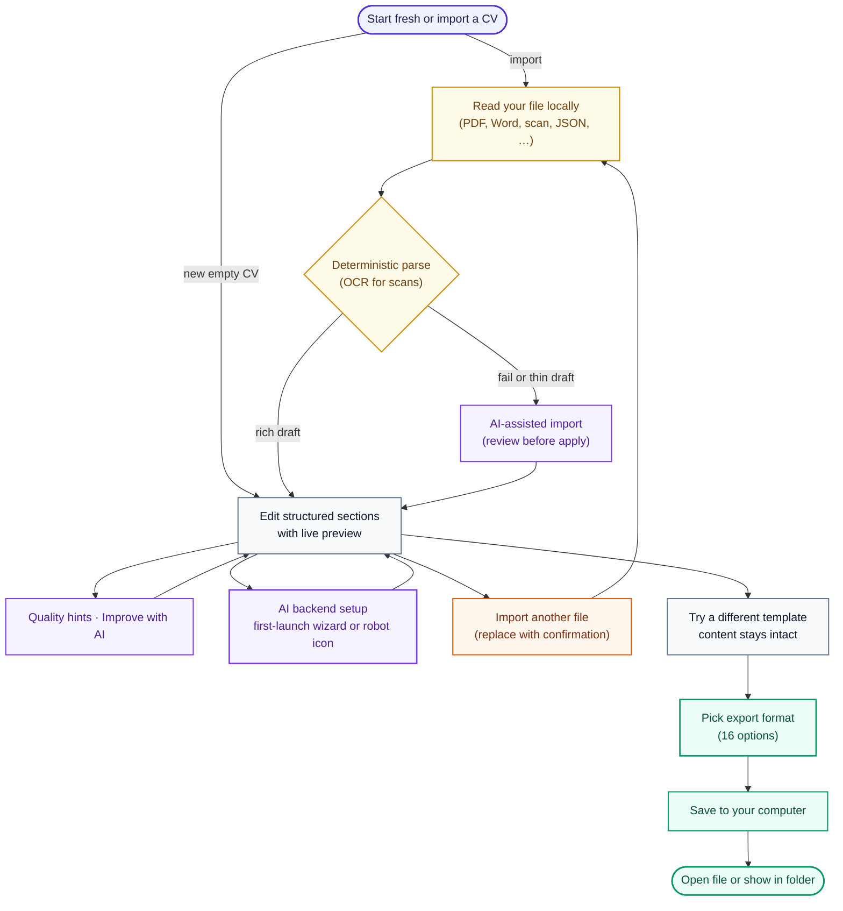

<div align="center">

# ReVitae

**Your CV, on your machine.** Build or import a CV, restyle it across **106 templates**,
and export to **16 formats** — fully offline, with optional AI you control.

[](https://github.com/01laky/ReVitae/releases)
[](https://dotnet.microsoft.com/)
[](https://avaloniaui.net/)
[](https://github.com/01laky/ReVitae)
[](https://github.com/01laky/ReVitae/actions/workflows/ci.yml)
[](https://github.com/01laky/ReVitae/actions/workflows/ci.yml)

One desktop app. No account, no cloud upload for everyday editing. Import any CV —
PDF, Word, scan, or photo — fix it in clean sections, switch designs freely, and
export a polished PDF (or 15 other formats) without your data ever leaving your disk.


</div>

> **ReVitae is the right choice when** you want a focused, private CV app — not a web
> form that owns your data, and not an office suite you fight with for layout. You keep
> the words; templates only decorate them, and AI is optional and on your terms.

## Why ReVitae

|                                        | **ReVitae**             | Online CV builders | Word / Docs   | LaTeX / Overleaf |
| -------------------------------------- | ----------------------- | ------------------ | ------------- | ---------------- |
| Your data stays on your machine        | ✅ local-first          | ❌ cloud           | ✅            | ⚠️ Overleaf = cloud |
| Restyle without retyping               | ✅ 106 templates        | ⚠️ limited         | ❌            | ⚠️ manual        |
| Import an existing CV (PDF/Word/scan)  | ✅ deterministic + OCR + AI | ⚠️ rare        | n/a           | ❌               |
| Export breadth                         | ✅ 16 formats           | ⚠️ usually PDF only | ⚠️ DOCX/PDF  | ⚠️ PDF           |
| AI on your terms (local or your keys)  | ✅                      | ❌ their model     | ❌            | ❌               |
| No account, no subscription            | ✅                      | ❌ freemium        | ⚠️ licensed   | ⚠️ freemium      |

**What sets it apart:**

- **Content and presentation are separate** — write once, switch among 106 templates
  without retyping a word. The live preview **rasterizes the actual export PDF**, so
  what you see is exactly what you get.
- **Import, then edit** — uploaded files become structured drafts you can fix, not
  frozen PDFs. Scanned PDFs and photos work via local OCR, with a clear review step.
- **Local first** — core editing, import, and export run on your computer. Optional AI
  runs locally via Ollama or through online providers you configure with your own keys.
- **Honest about uncertainty** — imported fields that looked shaky stay highlighted
  until you confirm them; AI never auto-applies and an entity guard flags invented facts.

## How it works



## Screenshots

<table>
  <tr>
    <td width="50%"><br><sub><b>Welcome</b> — start fresh, import a file, or open a saved project.</sub></td>
    <td width="50%"><br><sub><b>Templates</b> — switch among 106 layouts; content stays intact.</sub></td>
  </tr>
  <tr>
    <td width="50%"><br><sub><b>Preview</b> — full-size check; the preview is the real export PDF.</sub></td>
    <td width="50%"><br><sub><b>Export</b> — PDF, documents, structured data, or page images.</sub></td>
  </tr>
  <tr>
    <td width="50%"><br><sub><b>Local AI</b> — curated Ollama models with background download.</sub></td>
    <td width="50%"><br><sub><b>Online AI</b> — bring your own keys; one active backend at a time.</sub></td>
  </tr>
  <tr>
    <td width="50%"><br><sub><b>Validation</b> — inline errors and section quality badges.</sub></td>
    <td width="50%"><br><sub><b>Quality hints</b> — gentle suggestions that never block export.</sub></td>
  </tr>
</table>

## Features

### Structured CV builder

Everything lives in focused sections — personal info, experience, education, skills,
languages, certificates, projects, links, and free-form notes. Each section validates
as you type, updates the preview instantly, and can expand or collapse so long CVs stay
manageable.

- Optional **profile photo** (JPEG, PNG, WebP up to 15 MB) with EXIF correction —
  appears in preview and in PDF/HTML/DOCX export.
- **Quality hints** — deterministic suggestions in an in-window modal; they never block export.
- **Save your work** as `*.revitae.json` (Save / Save As / Open, recent projects, autosave recovery).
- **12 UI languages** including English, Slovak, and Czech.

### Import — bring what you already have

Start from the welcome screen or the header **Upload** button. If the form already has
data, ReVitae asks before replacing it. Everything runs **locally**.

| Category         | Formats                                                          |
| ---------------- | ---------------------------------------------------------------- |
| Documents        | PDF, DOC/DOCX, ODT, RTF, TXT, Markdown, HTML                     |
| Structured       | JSON Resume, native `*.revitae.json`, YAML, CSV/TSV             |
| Scans & photos   | Image-only PDFs, JPEG, PNG, WebP, TIFF, BMP (local Tesseract OCR) |
| Other            | Europass / HR-XML-style XML, LaTeX, legacy AbiWord / Pages / WPS |

After import, sections populate for review, empty ones stay collapsed, and uncertain
fields stay highlighted. ReVitae-exported PDFs get **smart re-import** (layout hints from
export metadata — no OCR needed when the text layer is good). When parsing is thin or
fails, optional **AI-assisted import** walks the document in small steps and shows a
summary before Apply. Password-protected files are not supported.

Full matrix and caveats: [`docs/import-formats.md`](docs/import-formats.md).

### Templates and export

Pick a look, keep your words. **106 built-in templates** span single-column, sidebar,
monogram headers, banner strips, asymmetric corner bars, skill chips, modular cards,
dual-tone splits, modernist rules, centered, ribbon headers, two equal columns, accent
footers, boxed headers, duo-band headers, and dark initials sidebars — each in several
curated palettes.

| Group         | Formats                                              |
| ------------- | --------------------------------------------------- |
| PDF           | Primary, template-aligned, A4, Unicode-safe (Slovak/Czech diacritics) |
| Documents     | DOCX, ODT, RTF, TXT, Markdown, HTML, LaTeX          |
| Structured    | JSON, YAML, XML, CSV/TSV                            |
| Page images   | PNG, JPEG, WebP (ZIP or separate files)            |

After export: **Open file** or **Show in folder**. Full matrix:
[`docs/export-formats.md`](docs/export-formats.md).

### Local & online AI — optional, on your terms

Want suggestions without sending your CV to a random website? ReVitae runs **local AI
models** via Ollama or connects to **online providers you configure** (OpenAI, Anthropic,
Gemini, Groq, Azure, Mistral, DeepSeek, OpenRouter, or a custom endpoint). One active
backend at a time; keys are stored encrypted. An optional first-launch wizard walks you
through setup, or you skip it and configure later from the header robot icon.

- **First-launch wizard** — local download, online provider, remind later, or offline-only.
- **Background download** — keep editing while a model installs; progress stays in the corner.
- **Pause / resume / survives restarts** — Ollama continues from cached layers after a crash or quit.
- **Managed Ollama** — ReVitae can install the local engine when none is present.
- **11 curated models** — RAM-aware recommendations with disk-space checks.
- **Section advice** — per-section *Ask AI for tips* (1–4 review-only suggestions, each with a
  short "why"), optional target-role context, one-level undo, and an **entity guard** that flags
  any fact the model adds that is not in your CV. AI is assistant-not-author: nothing auto-applies.

Full user guide: [`docs/ai-setup.md`](docs/ai-setup.md) · [`docs/ai-import.md`](docs/ai-import.md).

## Quick start

> **Prerequisites:** [.NET 10 SDK](https://dotnet.microsoft.com/) and Node.js + npm (for the lint orchestration).

<details>
<summary><b>Run the app</b></summary>

```bash
git clone https://github.com/01laky/ReVitae.git
cd ReVitae
./scripts/run.sh
```

</details>

<details>
<summary><b>Build & test</b></summary>

```bash
./scripts/build.sh          # Release build
./scripts/test.sh           # full test suite
npm run lint                # markdownlint + dotnet format + Release build + tests
```

</details>

<details>
<summary><b>Generate a demo CV</b></summary>

```bash
dotnet run --project scripts/GenerateJohnDoeMinimalArchitectCv
```

Produces `John Doe (minimal architect).pdf` and `.txt` at the repo root.

</details>

## Documentation

| Document | What's inside |
| -------- | ------------- |
| [`docs/concept.md`](docs/concept.md) | Product concept, phases, and open questions |
| [`docs/architecture.md`](docs/architecture.md) | Module map and the unified rendering pipeline |
| [`docs/export-formats.md`](docs/export-formats.md) | Full export matrix |
| [`docs/import-formats.md`](docs/import-formats.md) | Import format matrix, limits, and exclusions |
| [`docs/ai-setup.md`](docs/ai-setup.md) | Local & online AI setup, download manager, first-launch wizard |
| [`docs/ai-import.md`](docs/ai-import.md) | AI-assisted import and targeted field repair |
| [`docs/revitae-project-json.md`](docs/revitae-project-json.md) | Native `*.revitae.json` interchange schema |
| [`CHANGELOG.md`](CHANGELOG.md) | Release history |

## Project status

ReVitae is an **early-stage desktop app** (`v0.3.0`) under active development. The core
loop works today: build or import a CV, preview across 106 templates, validate, save
locally, and export in 16 formats. First-launch AI wizard, local and online AI setup,
resumable Ollama downloads, AI-assisted import, OCR for scans, and ReVitae PDF round-trip
are all in place. Backed by **3037 automated tests** with a drift guard.

**Roadmap:**

- **Planned** — native installers / packaged binaries for macOS, Windows, and Linux
  (the last open item of Phase 1).
- **Exploring** (design-open — see [`docs/concept.md`](docs/concept.md#open-questions)) —
  user-supplied custom templates, CV version history, and CV **content** localization
  (multiple language versions of the same CV).

## Tech stack

- **.NET 10** · **Avalonia UI** · **Material.Avalonia** (cross-platform desktop)
- **QuestPDF** for template-based PDF export; bundled **Arimo** font for byte-deterministic
  rendering across platforms
- **PdfPig** (PDF text), **DocumentFormat.OpenXml**, **NPOI**, **Markdig**, **HtmlAgilityPack**,
  **YamlDotNet**, **RtfPipe** for multi-format import/export
- **Tesseract OCR** (English traineddata bundled) for scanned PDFs and image imports
- **Ollama** for local AI models; encrypted credential storage for online providers
- **xUnit** test suite (3037 tests) with the John Doe import regression matrix and a golden render oracle
- **markdownlint** + `dotnet format` + warning-free Release build, enforced in CI

## Development

CI runs the same lint and test pipeline on every push to `main`
(see [`.github/workflows/ci.yml`](.github/workflows/ci.yml)).

<details>
<summary><b>Test categories & CI matrix</b></summary>

| Category                                    | `npm run lint` | Ubuntu/macOS CI | Windows CI | Ubuntu `import-matrix`  |
| ------------------------------------------- | -------------- | --------------- | ---------- | ----------------------- |
| Default suite                               | yes            | yes             | yes        | no                      |
| `ImportPdfReimport`                         | yes            | yes             | no         | flake guard (3× stress) |
| `OcrIntegration`                            | yes            | yes             | no         | no                      |
| `ImportMatrix` (51 variants)                | yes            | no              | no         | yes                     |
| `Projects` / `Ollama`                       | yes            | yes             | yes        | no                      |
| `ImportExtraction` / `ImportExtractionFuzz` | yes            | yes             | yes        | no                      |

Windows CI skips PDF re-import and OCR integration tests (PdfPig geometry and Tesseract
differ on runners); Ubuntu covers them. `dotnet format` and markdown lint run on Ubuntu and
macOS only — run `npm run lint` locally on Windows before pushing.

```bash
dotnet test --filter "Category=ImportMatrix"
dotnet test --filter "Category=Ollama"
```

</details>

<details>
<summary><b>Drift guards & supply-chain checks</b></summary>

```bash
./scripts/verify-version.sh             # all version concepts in sync
./scripts/verify-test-count.sh          # baseline == README badge == actual
./scripts/verify-vulnerable-packages.sh # NU1903 / pinned transitive overrides
./scripts/pre-commit-fast.sh            # full lint minus the 51-variant matrix
```

Three version concepts stay in sync on a release: the **app version** (`Version.props`,
`package.json`, `app.manifest`, README badge, Git tag), **tech-stack badges**, and **NuGet
package versions**. After each release the test-count baseline and README badge must match
the actual total.

</details>

### Repository map

```text
src/
  ReVitae/          Avalonia desktop UI, modals, validation presentation
  ReVitae.Core/     CV models, validation, import/export, AI (Ollama/online)
tests/
  ReVitae.Tests/    Unit, import, AI, Ollama, and UI validation tests
docs/               Concept, architecture, export/import matrices, AI guides, project JSON
  img/              App screenshots
```

## Design principles

- **Local first** — your CV stays on your machine unless you opt into online AI.
- **Content over layout** — templates decorate; they do not own your data.
- **Editable imports** — every upload is a starting point, not a final answer.
- **Deterministic before AI** — rules and parsers first; models only when needed.
- **Test the edges** — regressions cover real-world mess, not just happy paths.

## Author & license

**Ladislav Kostolny** — [01laky@gmail.com](mailto:01laky@gmail.com)

This project currently uses the license declared in [`package.json`](package.json).
