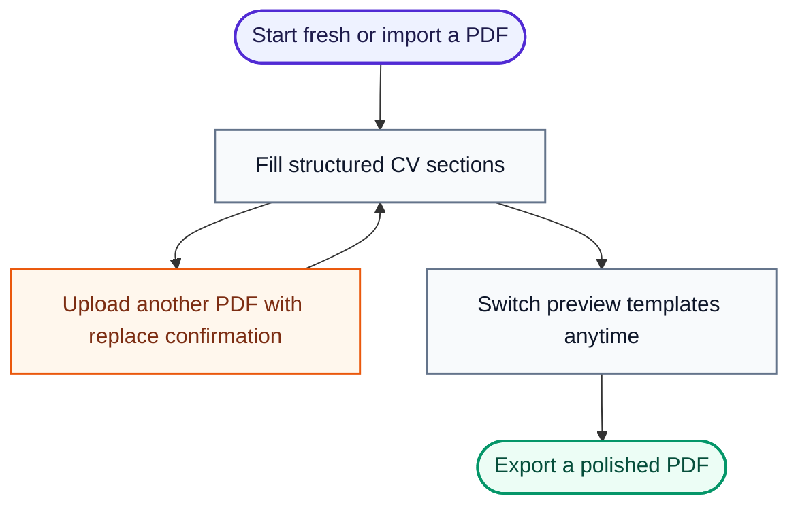

# ReVitae

[](https://github.com/01laky/ReVitae/releases)
[](https://dotnet.microsoft.com/)
[](https://avaloniaui.net/)
[](https://github.com/01laky/ReVitae)
[](https://github.com/01laky/ReVitae)

ReVitae is a privacy-conscious desktop CV builder for creating, importing,
editing, previewing, and exporting professional CVs.

It keeps the CV content structured and editable, while templates handle only the
visual presentation. The goal is simple: spend time improving your CV, not
wrestling with formatting.



## Why ReVitae

Most CV workflows mix content and layout together. ReVitae separates them.

- Your CV data is the source of truth.
- Templates can change without losing content.
- Imported data stays editable.
- The app runs locally by default.
- PDF import is treated as a draft, not as magic.

## Current Highlights

### Structured CV Builder

ReVitae includes dedicated form sections for the core CV content:

- Personal information and professional summary
- Work experience
- Education
- Skills
- Languages
- Certificates
- Projects
- Additional custom links
- Additional information

Each section has focused validation, repeatable entries where needed, live
preview updates, localized UI text, and inline field-level error messages.

### PDF Import

On startup, ReVitae lets you either create a new CV or import an existing PDF.
You can also upload another PDF later from the header toolbar. If the form already
contains data, the app asks for confirmation before replacing the current CV.

The importer extracts text locally, applies deterministic parsing rules, and
populates the structured form directly. Sections with imported data are expanded
for review, while empty sections are collapsed. Low-confidence imported fields
are highlighted for manual review.

The import flow currently supports text-based PDFs. Scanned image-only PDFs and
OCR are not supported yet.

### Template Preview and PDF Export

You can switch between multiple built-in preview templates without changing your
CV content. **Export PDF** downloads a polished, template-aligned PDF that uses
the same structured data as the live preview.

Current template styles include:

- Classic Sidebar
- Modern Sidebar
- Clean Top Header
- Dark Sidebar Accent

The preview can be expanded into a larger modal and scrolls independently from
the form. Exported PDFs use A4 layout, support Unicode text (including Slovak and
Czech diacritics), paginate long CVs automatically, and suggest a filename from
the candidate name.

### Validation and Review

The app validates fields while you work and shows errors inline under the related
control:

- Required personal and section fields
- Date ranges (DatePicker fields in repeatable sections)
- URL formats
- Duplicate entries where relevant
- Maximum field lengths
- Section error badges when a collapsed section contains problems
- Scroll-to-first-error on failed export
- Imported low-confidence fields highlighted for review

## Product Status

ReVitae is an active early-stage desktop app. The structured CV form, inline
validation UI, intro and replace PDF import flows, template preview, and
template-based PDF export are in place. The next major product areas are local
persistence, richer export formats, and smarter import/recommendation features.

### Versioning

ReVitae uses three different version concepts:

- **App version** (`0.1.0`): the ReVitae product release shown in Setup → About,
  README app badge, `Version.props`, and Git tags such as `v0.1.0`.
- **Tech-stack badges**: framework/platform versions such as `.NET 10` and
  `Avalonia 12`.
- **Dependency package versions**: NuGet package versions declared in `.csproj`
  files (QuestPDF, PdfPig, Material.Avalonia, etc.).

To cut a release, update `Version.props`, `CHANGELOG.md`, and the README app
badge, then run `./scripts/verify-version.sh` before tagging.

## Roadmap

Planned areas:

- Save and load local CV projects
- More export formats such as DOCX or HTML
- More import formats such as DOCX or TXT
- Static CV quality hints
- Optional AI-assisted import and recommendations
- Installer/package builds for supported platforms

## Tech Stack

- .NET 10
- Avalonia UI
- Material.Avalonia
- PdfPig for local PDF text extraction
- QuestPDF for template-based PDF export
- xUnit for tests
- markdownlint and C# build checks

## Development

### Prerequisites

- .NET 10 SDK
- Node.js and npm for markdown/C# lint orchestration

### Build

```bash
./scripts/build.sh
```

### Run

```bash
./scripts/run.sh
```

### Test

```bash
./scripts/test.sh
```

### Lint

```bash
npm run lint
```

### Format CSharp

```bash
./scripts/format-cs.sh
```

### Format Markdown

```bash
./scripts/format-md.sh
```

## Repository Map

```text
src/
  ReVitae/          Avalonia desktop UI and validation presentation layer
  ReVitae.Core/     CV models, validation rules, import, localization

tests/
  ReVitae.Tests/    Unit, import, and UI validation tests

prompts/
  Implementation prompts and product increments (001–020)

docs/
  Product concept and planning notes
```

## Design Principles

- Keep user data local by default.
- Keep content separate from presentation.
- Make imported content editable immediately.
- Prefer deterministic behavior before AI.
- Add tests for edge cases, not only happy paths.

## License

This project currently uses the license declared in `package.json`.
