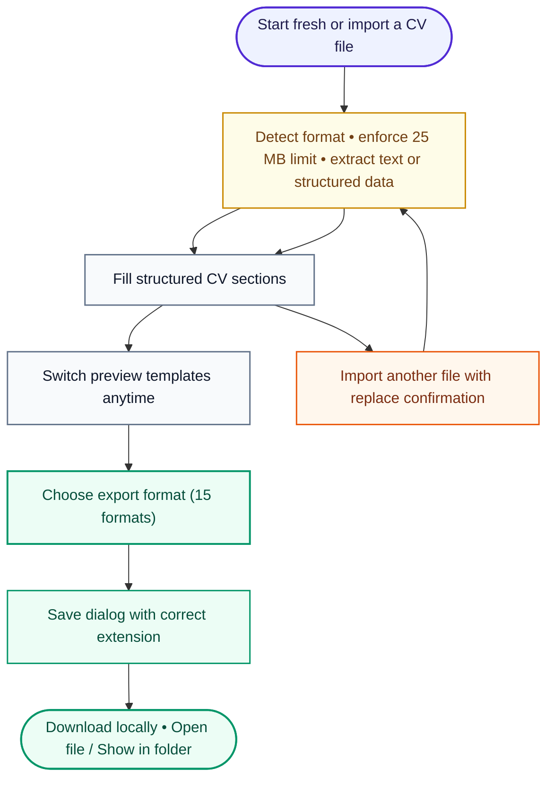

# ReVitae

[](https://github.com/01laky/ReVitae/releases)
[](https://dotnet.microsoft.com/)
[](https://avaloniaui.net/)
[](https://github.com/01laky/ReVitae)
[](https://github.com/01laky/ReVitae/releases)

ReVitae is a privacy-conscious desktop CV builder for creating, importing,
editing, previewing, and exporting professional CVs.

It keeps the CV content structured and editable, while templates handle only the
visual presentation. The goal is simple: spend time improving your CV, not
wrestling with formatting.



## Why ReVitae

Most CV workflows mix content and layout together. ReVitae separates them.

- Your CV data is the source of truth.
- Templates can change without losing content.
- Imported data stays editable.
- The app runs locally by default.
- Imported documents are treated as drafts, not as magic.

## Current Highlights

### Structured CV Builder

ReVitae includes dedicated form sections for the core CV content:

- Personal information (optional profile photo), professional summary, and contact fields
- Work experience
- Education
- Skills
- Languages
- Certificates
- Projects
- Additional custom links
- Additional information

Each section has focused validation, repeatable entries where needed, live
preview updates, localized UI text, and inline field-level error messages.

**Profile photo (optional):** upload JPEG, PNG, or WebP up to **15 MB** from the
top of Personal information. JPEGs are EXIF-orientation normalized on save. Click
the photo to replace it; sidebar templates show **initials** when no photo is set.
Photos appear in template preview and in PDF/HTML/DOCX export. ReVitae JSON/YAML
**v2** round-trips embedded photo bytes; document imports (PDF, DOCX, HTML, …)
do not extract photos.

### CV import (multi-format)

On startup, ReVitae lets you create a new CV or **import an existing document**.
You can import again later from the header toolbar; if the form already holds
data, the app asks for confirmation before replacing the current CV.

Imports run entirely **locally** behind `CvDocumentImporter`: the correct parser
is chosen from the file extension (with lightweight JSON/XML sniffing where
needed), a **25 MB** size guard applies before extraction, and structured or
flattened text is mapped into the same deterministic CV pipeline used for PDFs.

**Supported categories today** include PDF; plain text; Markdown and HTML;
DOC/DOCX; ODT and RTF; several additional legacy/desktop formats (AbiWord,
Pages, WPS, LaTeX); Json Resume and **native ReVitae JSON** (`*.revitae.json`);
YAML interchange; CSV/TSV header rows; and Europass / HR‑XML‑style resumes when
XML heuristics match. See [`docs/import-formats.md`](docs/import-formats.md) for
the full matrix, limits, XXE-safe XML handling, and exclusions.

Parsed sections expand for review, empty sections stay collapsed, and
low-confidence fields remain highlighted exactly like PDF drafts. The shared text
pipeline merges PDF layout artifacts such as institution names split across blank
lines (for example `High School of Electrical` / `and Training` / `Engineering`).

**Not supported:** scanned image-only PDFs without OCR, password-protected files,
and perfect layout fidelity from rich desktop publishing constructs.

### Template Preview and Multi-Format Export

You can switch between multiple built-in preview templates without changing your
CV content. **Export** opens a format picker modal, then a native save dialog for
the chosen type. **PDF** remains the primary template-aligned output; **DOCX**,
**HTML**, **Markdown**, structured JSON/YAML/XML, and other formats are also
available. See [`docs/export-formats.md`](docs/export-formats.md) for the full
matrix.

After a successful export, **Open file** and **Show in folder** actions help you
reach the saved file without hunting in Finder or Explorer.

Current template styles include:

- Classic Sidebar
- Modern Sidebar
- Clean Top Header
- Dark Sidebar Accent

The preview can be expanded into a larger modal and scrolls independently from
the form. Exported PDFs use A4 layout, support Unicode text (including Slovak and
Czech diacritics), paginate long CVs automatically, and suggest a filename from
the candidate name.

### Validation and Review

The app validates fields while you work and shows errors inline under the related
control:

- Required personal and section fields
- Date ranges (DatePicker fields in repeatable sections)
- URL formats
- Duplicate entries where relevant
- Maximum field lengths
- Section error badges when a collapsed section contains problems
- Scroll-to-first-error on failed export
- Imported low-confidence fields highlighted for review

## Product Status

ReVitae is an active early-stage desktop app. The structured CV form, inline
validation UI, template preview, **optional profile photo** (prompt **023**),
**multi-format export** (15 formats via `CvDocumentExporter`), and
**multi-format CV import** (prompt **021**) through `CvDocumentImporter` are in
place. Intro / replace flows cover PDF plus the additional structured and
text-native formats listed above. Next major themes remain **local persistence**
and smarter CV guidance / optional AI-assisted workflows.

### Versioning

ReVitae uses three different version concepts:

- **App version** (`0.1.0`): the ReVitae product release shown in Setup → About,
  README app badge, `Version.props`, and Git tags such as `v0.1.0`.
- **Tech-stack badges**: framework/platform versions such as `.NET 10` and
  `Avalonia 12`.
- **Dependency package versions**: NuGet package versions declared in `.csproj`
  files (QuestPDF, PdfPig, Material.Avalonia, etc.).

To cut a release, update `Version.props`, `CHANGELOG.md`, and the README app
badge, then run `./scripts/verify-version.sh` before tagging.

## Roadmap

Planned areas:

- Save and load local CV projects (native `.revitae.json` interchange is documented in [`docs/revitae-project-json.md`](docs/revitae-project-json.md); export already supports `.revitae.json`)
- OCR / scanned PDF improvements and richer layout-aware parsing
- Static CV quality hints
- Optional AI-assisted import and recommendations
- Installer/package builds for supported platforms

## Tech Stack

- .NET 10
- Avalonia UI
- Material.Avalonia
- PdfPig for local PDF text extraction
- DocumentFormat.OpenXml, NPOI, Markdig, HtmlAgilityPack, YamlDotNet, RtfPipe,
  and related libraries for multi-format CV import surfaces
- QuestPDF for template-based PDF export; DocumentFormat.OpenXml and custom writers for DOCX/ODT/RTF/HTML/MD/TXT/LaTeX and structured JSON/YAML/XML/CSV/TSV export
- xUnit for tests (including targeted import edge-case suites under `tests/ReVitae.Tests/Import/`)
- markdownlint and C# build checks

## Development

### Prerequisites

- .NET 10 SDK
- Node.js and npm for markdown/C# lint orchestration

### Build

```bash
./scripts/build.sh
```

### Run

```bash
./scripts/run.sh
```

### Test

```bash
./scripts/test.sh
```

### Lint

```bash
npm run lint
```

### Format CSharp

```bash
./scripts/format-cs.sh
```

### Format Markdown

```bash
./scripts/format-md.sh
```

## Repository Map

```text
src/
  ReVitae/          Avalonia desktop UI and validation presentation layer
  ReVitae.Core/     CV models, validation rules, import, localization

tests/
  ReVitae.Tests/    Unit, import, and UI validation tests

prompts/
  Implementation prompts and product increments (001–021)

docs/
  Product concept, interchange schemas (`import-formats.md`, `revitae-project-json.md`), planning notes
```

## Design Principles

- Keep user data local by default.
- Keep content separate from presentation.
- Make imported content editable immediately.
- Prefer deterministic behavior before AI.
- Add tests for edge cases, not only happy paths.

## License

This project currently uses the license declared in `package.json`.
