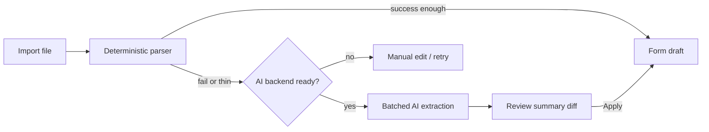
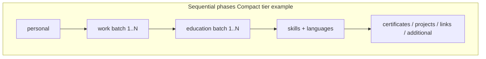
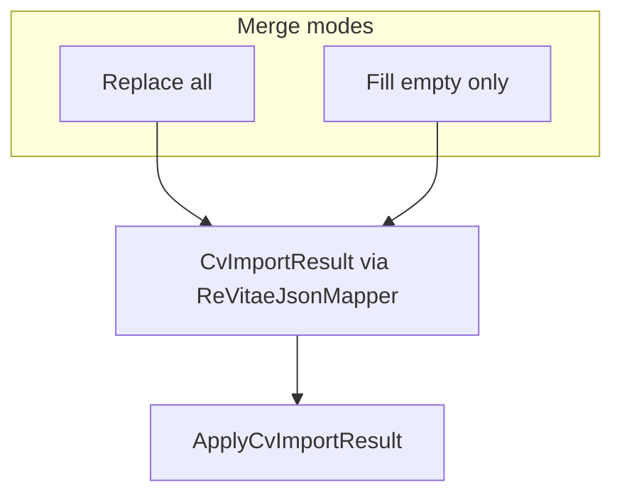

# AI-assisted CV import

ReVitae uses a **deterministic-first** import pipeline (PdfPig, OCR, heuristics,
structured mappers). When that path fails or produces a thin draft, you can
optionally run **batched AI extraction** through the same active backend as
**Improve with AI**.

AI import is **never silent**: you always review a section summary diff before
anything is applied to the form.

See also: [`import-formats.md`](import-formats.md) (format routing),
[`ai-setup.md`](ai-setup.md) (backend configuration).

## Overview



1. **Text-route files** (PDF, DOCX, TXT, images with OCR, …) run through
   `CvTextImportCoordinator`, which always retains **normalized plain text** even
   when field extraction fails.
2. When triggers match, the UI offers **Try AI import** (after failure) or
   **Enhance with AI** (after partial success).
3. `AiCvImportService` sends **small sequential JSON slices** to the model,
   merges fragments via `ReVitaeJsonMapper`, and shows a **review modal**.
4. Only after **Apply** does `ApplyCvImportResult` hydrate the form.

Structured imports (`.revitae.json`, JSON Resume, Europass, CSV with mapper success,
**≥ 5 populated sections**) skip the AI path.

**ReVitae-owned PDF exports:** when PdfPig + ReVitae-aware heuristics
recover a rich draft (typically **> 2** populated sections), the **Enhance with AI**
banner usually does not appear. AI remains available for scanned PDFs, third-party
layouts, and thin parses.

## When AI import is offered

All of the following must hold:

- Text-based import route (not a clean structured success),
- Normalized source text **≥ 80** non-whitespace characters,
- Active AI backend configured and reachable,
- At least one trigger below.

| Trigger              | User-facing situation                                        |
| -------------------- | ------------------------------------------------------------ |
| Deterministic failed | Import error “no structured data” but OCR/text was acquired  |
| Thin draft           | Import succeeded but **≤ 2** sections populated              |
| Low confidence       | OCR used or many low-confidence fields with **≤ 4** sections |
| User requested       | You click **Try AI import** or **Enhance with AI**           |

**Not offered** when the file is too short, unreadable with no text, or a
structured format already imported successfully with enough sections.

## Model batching

Input is **plain text only** (no PDF/image bytes to the model in v1). Batch sizes
depend on the resolved **model profile**:

| Tier       | Example models           | Max input / call | Work entries / batch |
| ---------- | ------------------------ | ---------------- | -------------------- |
| Compact    | Gemma 2 2B               | 1 200 chars      | 1                    |
| Small      | Phi-3 mini, Llama 3.2 3B | 2 400 chars      | 2                    |
| Medium     | Mistral 7B, Llama 3.1 8B | 5 000 chars      | 4                    |
| Large      | Mixtral 8×7B, GPT-4o     | 10 000 chars     | 8                    |
| ExtraLarge | Llama 3.1 70B            | 16 000 chars     | 12                   |

Compact profiles combine **skills + languages** in one phase and use overlapping
windows when section headers are missing.



Progress shows **Step X of Y** from the dynamic batch plan (not a fixed step count).

## Review before apply

The review modal shows:

- Active backend (local model or online provider),
- **Section summary** table (before vs after AI — counts / partial / complete),
- Warning: AI-generated — review before export,
- Note that **profile photos are not extracted**,
- **Apply to form**, **Fill empty fields only** (when merging into an edited draft),
  **Cancel**.

Partial batch failures add `ImportWarningAiPartial`.

## Merge modes



- **Try AI import** after deterministic **failure** → default **Replace all**.
- **Enhance with AI** on a clean partial import → default **Replace all**.
- **Enhance** when the form is **dirty** → prefer **Fill empty only** to avoid
  clobbering edits (041 unsaved guard).

Existing profile photo paths are **preserved** on Enhance; AI never writes photo fields.

## Language behavior

- Extracted field values keep **source spelling** (names, employers, places).
- UI locale (`en` / `sk`) affects instruction strings only — CV content is not
  translated by the import prompts.
- Slovak names with diacritics remain unchanged when the UI is in Slovak.

## Profile photos

AI import fills **text fields only**. Photos from PDF/scans are **not** extracted.
Upload a photo manually after import. On Enhance, an existing uploaded photo is kept.

## Privacy

- **Local Ollama:** CV text stays on your machine; no extra session confirm.
- **Online providers:** first multi-step send shows the same session confirm as
  **Improve with AI**; CV excerpts are sent sequentially in small batches.

## Debug logging

Set environment variable:

```bash
export REVITAE_IMPORT_DEBUG=1
# optional custom log path:
export REVITAE_IMPORT_DEBUG_LOG=/tmp/revitae-import-debug.log
```

Logged: phase, batch index, char counts, parse success, duration — **not** full CV
text or email addresses. AI batch lines use the `ai-import` step prefix alongside
existing `CvImportDiagnosticsLogger` import traces.

When debug is enabled, the review modal shows an optional **Details** expander with
sanitized parse errors.

## Related prompts

- **032** — OCR text feeds AI import when heuristics fail
- **039** — shared backend, online confirm, `uiCulture` in prompts
- **041** — dirty-project guard on Enhance replace
