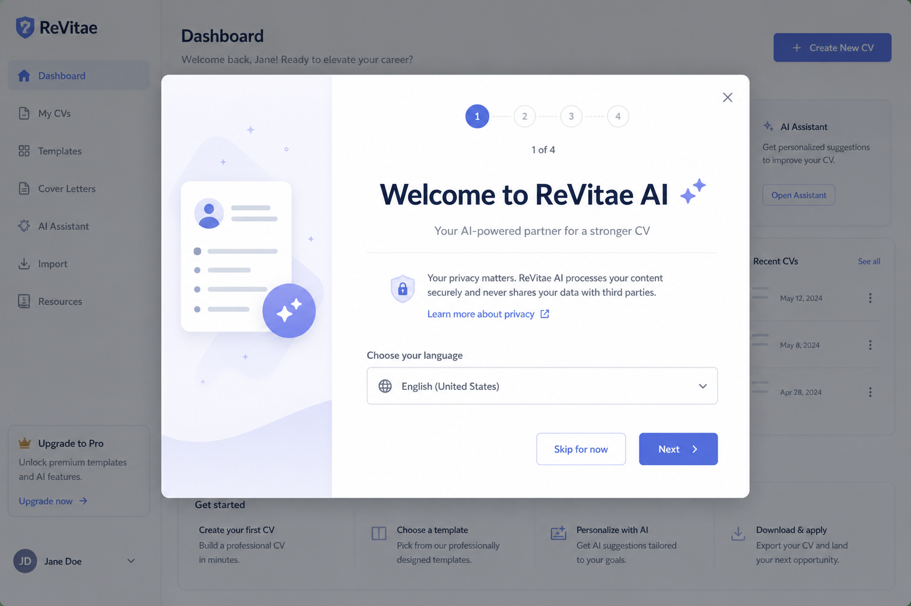
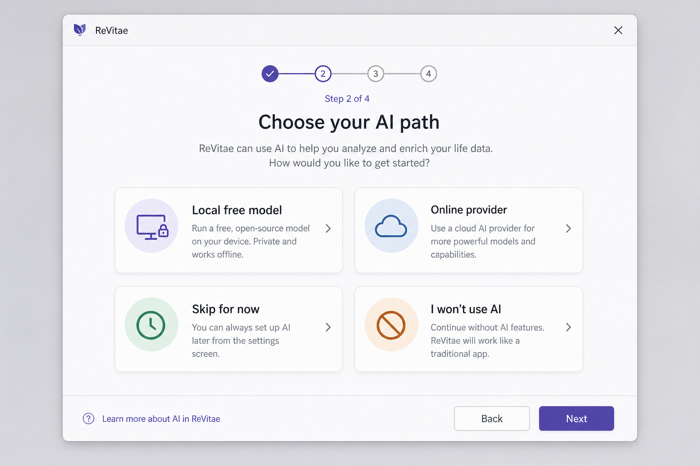
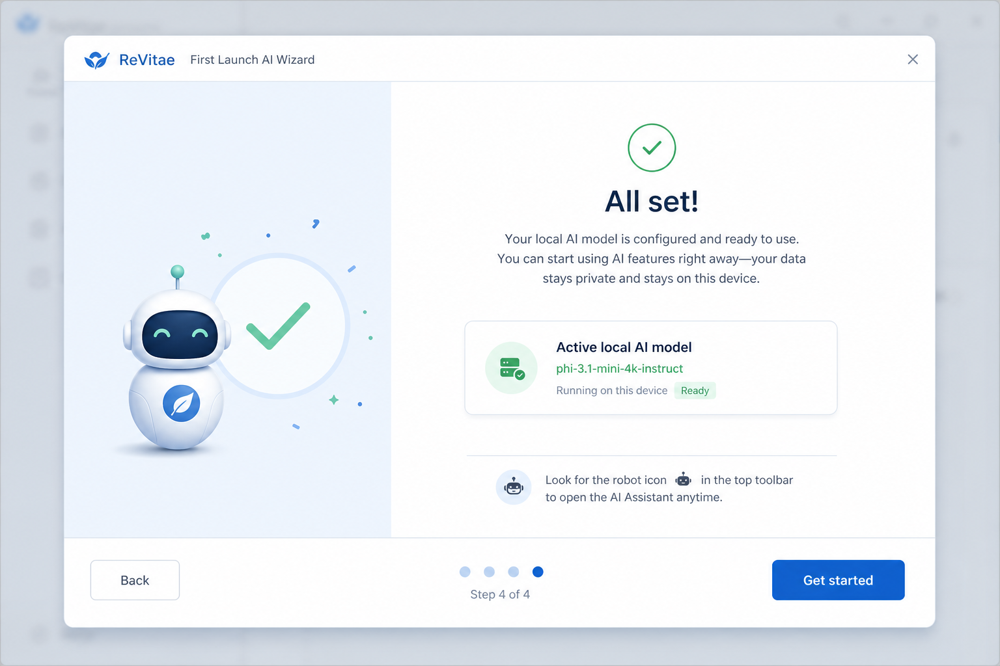
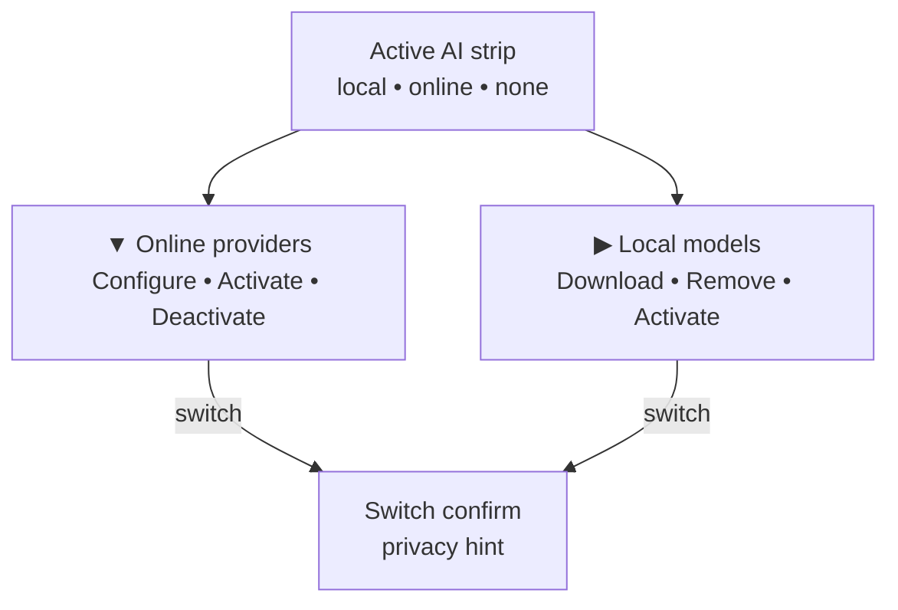
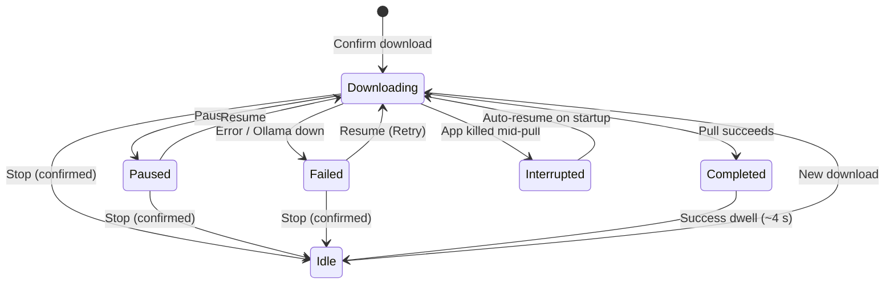
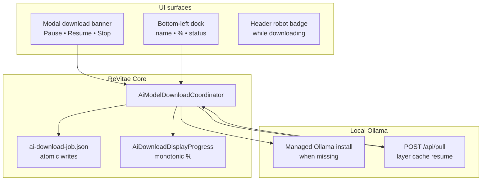
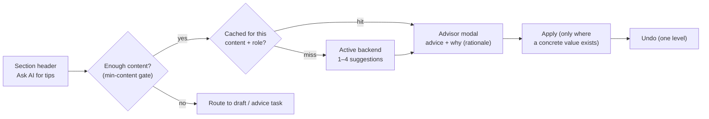

# AI setup (local and online providers)

ReVitae includes an **AI setup** modal for choosing a **local Ollama model** or
configuring an **online AI provider**. The active backend powers **Improve with AI**
(quality hints) and **AI-assisted CV import** when deterministic parsing is
insufficient — see [`ai-import.md`](ai-import.md).

At most **one** AI backend may be **active** at a time: a local Ollama model **or**
one online provider (OpenAI, Anthropic, Gemini, Groq, Azure OpenAI, Mistral,
DeepSeek, OpenRouter, or a self-hosted **Custom** OpenAI-compatible endpoint).

Downloads of local models run as a **background job**: you can close the modal,
keep editing your CV, pause for later, or restart the app — ReVitae picks up
where Ollama left off using cached layers.


## First launch AI setup wizard

On the **first cold start** (when no AI backend is active and the wizard has not
been completed), ReVitae shows a **multi-step setup wizard** before the intro
overlay. The wizard is skippable at any step (Escape or **Skip for now**).

### Steps

1. **Welcome** — privacy note, optional link to change language (opens **Setup**,
   then returns to the wizard).
2. **Choose path** — four cards:
   - **Local AI** — hardware detection and recommended Ollama model download.
   - **Online AI** — curated providers (OpenAI, Anthropic, Gemini, Groq) with
     **More providers…** opening the full AI setup modal.
   - **Remind me later** — dismisses until the next manual run from Setup.
   - **I won't use AI** — offline-only mode; hides **Try AI import** and
     **Enhance with AI** promotions (header robot icon stays available for later).
3. **Local setup** or **Online setup** — reuses the same detection, download, and
   provider configuration flows as the AI setup modal.
4. **Complete** — summary of active backend, download in progress, remind-later,
   or offline-only choice.







### Persistence

Preferences are stored in `%LocalAppData%/ReVitae/app-settings.json` (schema v2):

| Field                               | Purpose                                                                                     |
| ----------------------------------- | ------------------------------------------------------------------------------------------- |
| `firstLaunchAiWizardStatus`         | `NotStarted`, `RemindLater`, `Completed`, or `DeclinedOffline`                              |
| `hideAiPromotionsInUi`              | When true (offline-only path), AI promotion buttons are hidden until a backend is activated |
| `firstLaunchAiWizardCompletedAtUtc` | Timestamp when the user finished or skipped                                                 |

**Upgrade migration:** existing installs with an active AI backend in
`ai-settings.json`, or a resumable entry in `ai-download-job.json`, are treated
as wizard **Completed** automatically.

### Run the wizard again

Open **Setup** (gear icon) → **Show AI setup wizard again**. Manual reruns do not
auto-appear on every launch.

### Developer reset

Set environment variable `REVITAE_RESET_AI_WIZARD=1` (or `true`) before launch to
reset wizard state to defaults (useful for QA).

## Open the modal

1. Dismiss the intro overlay if it is still open.
2. Click the **robot icon** in the header toolbar (between **Upload CV** and
   **Setup**).
3. When no download is active, the modal runs **system detection** (loader, then
   results). While a download job is active, the modal opens straight to the
   **download banner**; use **Refresh system info** to re-run detection.

## Modal layout

The modal is split into two collapsible sections:

| Section              | Default state | Contents                                                               |
| -------------------- | ------------- | ---------------------------------------------------------------------- |
| **Online providers** | Expanded      | Privacy notice, provider list, inline configure forms                  |
| **Local models**     | Collapsed     | System detection, recommended model, catalog, download/remove/activate |

When no download banner is visible, an **Active AI** strip at the top summarizes
the current backend (local model name, online provider + model, or “none selected”).



## Online providers

Each provider row shows a name, short description, optional **Free tier available**
badge, configuration status, and last test result when known.

| Row action     | When shown                                   |
| -------------- | -------------------------------------------- |
| **Configure**  | Provider not yet fully configured            |
| **Activate**   | Configured but not the active backend        |
| **Deactivate** | This provider is the active backend          |
| **Edit**       | Configured or active — opens the inline form |

**Configure** reveals an inline form (API key, model, optional advanced fields).
**Save** persists non-secret settings; **Test** sends a neutral connectivity probe
(no CV data). **Reset** removes saved settings and stored API key after confirmation.

Activating a provider that has never passed **Test** shows a soft warning. Switching
from one active backend to another (local ↔ online, or between providers) asks for
confirmation and mentions that CV text sent to AI features may be processed on the
provider’s servers when an online backend is active.

Supported presets: **OpenAI**, **Anthropic**, **Google Gemini**, **Groq**,
**Azure OpenAI**, **Mistral**, **DeepSeek**, **OpenRouter**, and **Custom**
(LM Studio, local Ollama `/v1`, or any OpenAI-compatible URL).


### API key storage

API keys are **never** written to `ai-settings.json`. They are stored in an
encrypted file:

```text
%LocalAppData%/ReVitae/ai-secrets.enc
%LocalAppData%/ReVitae/ai-secrets.key
```

Settings schema **v2** in `ai-settings.json` tracks active backend, local model
metadata, and per-provider connection config (model id, base URL, last test result).

## What you see (local models)

### Your system

A summary card shows locally detected information:

- Operating system and CPU architecture
- CPU core count
- Total RAM (best effort; may show “unknown” on some setups)
- Free disk space on the ReVitae local-data volume
- Ollama status (running or not, and how many models are already installed)

Detection runs **only on this device**. ReVitae does not send your hardware
profile or CV data to ReVitae servers.

### Recommended model

One model is highlighted as the best fit for your RAM tier. You can still pick
any other allowed model from the list.

### All models

The catalog lists **11 curated Ollama instruct models** (Gemma, Phi-3, Llama,
Qwen, Mistral, Mixtral). Each row shows approximate download size, minimum
RAM, and a **status badge**:

| Badge               | Meaning                                              |
| ------------------- | ---------------------------------------------------- |
| **Downloaded**      | Model is installed in Ollama                         |
| **Downloading…**    | Active ReVitae job for this model                    |
| **Not downloaded**  | No local copy yet                                    |
| **Failed download** | Stale partial job — use **Clean up failed download** |

**Download rules:**

| Situation                                  | Behavior                                                     |
| ------------------------------------------ | ------------------------------------------------------------ |
| Fits your RAM                              | Download enabled                                             |
| **One tier larger** than your strict fit   | Download enabled with a **warning** (may run slowly or fail) |
| Two or more tiers above                    | Download disabled                                            |
| Already installed in Ollama                | “Already on this computer”; Download hidden                  |
| Not enough free disk (~110% of model size) | Error before download starts                                 |
| Another download already active            | Download disabled until the job finishes or you stop it      |

### Model management

Each catalog row can offer:

| Action                       | When available               | Effect                                                                               |
| ---------------------------- | ---------------------------- | ------------------------------------------------------------------------------------ |
| **Remove model**             | Model is installed in Ollama | Deletes the model via Ollama API; clears ReVitae settings if it was the saved choice |
| **Clean up failed download** | Stale or failed partial job  | Deletes partial Ollama blobs, clears `ai-download-job.json`, resets progress         |

Both actions ask for confirmation before proceeding.

Installed local models also offer **Activate** / **Deactivate** when you want the
local Ollama model to be the active backend (subject to the same single-backend
rule as online providers).

## Download lifecycle





## Background download and dock

After you confirm a download:

1. ReVitae ensures Ollama is reachable — **installing a managed copy** under
   `%LocalAppData%/ReVitae/ollama/` when none is present (macOS / Windows / Linux).
2. ReVitae starts a persistent job and calls Ollama `POST /api/pull`.
3. A **bottom-left dock** shows model name, progress bar, and **percent** when
   totals are known.
4. You may **close the AI modal** — the download continues.
5. Click the dock to reopen the modal with the download banner and controls.

The dock is hidden while the intro overlay or AI modal is open (the banner inside
the modal is the control surface then).

While a download is **active** and the modal is closed, the robot icon shows a
small **blue badge** so you know work is in progress.

When a **local** model is the active backend (and no download badge), a **green**
badge appears on the robot icon. When an **online** provider is active, a **blue**
badge appears (download badge takes priority over both).

### Progress percent

Ollama reports progress **per layer**; totals can reset between layers. ReVitae:

- shows **monotonic** percent (never jumps backward in the UI),
- blends layer progress with the catalog’s approximate model size for smoother
  overall percent,
- refreshes the dock and banner at least every **150 ms** during active download.

When Ollama has not yet reported byte totals, the UI shows **…** until the first
usable numbers arrive.

## Pause, resume, and stop

Ollama has no pause API. ReVitae implements user-facing pause/resume by
cancelling the HTTP stream and starting a **new** pull for the same tag — Ollama
skips layers already on disk.

| Control    | Effect                                                                                                   |
| ---------- | -------------------------------------------------------------------------------------------------------- |
| **Pause**  | Waits for the pull to stop safely; job saved as **Paused**; late progress events cannot revert the state |
| **Resume** | Re-checks disk space and Ollama (with recovery if the engine was removed); starts a new pull             |
| **Stop**   | Asks for confirmation, cancels the job, and clears ReVitae progress (Ollama may keep partial files)      |

If resume fails because Ollama is unreachable or the partial download is corrupt,
ReVitae can **delete the partial model** and restart the pull automatically.

## After restart

| Job state when app closed      | On next launch                                                                            |
| ------------------------------ | ----------------------------------------------------------------------------------------- |
| **Downloading** (unclean exit) | Dock appears; ReVitae waits for Ollama with backoff (2 s → 5 s → 10 s), then auto-resumes |
| **Paused**                     | Dock appears at last percent; waits for you to click **Resume**                           |
| **Failed**                     | Dock shows error + **Resume** (Retry)                                                     |

## Download complete

When the pull succeeds, the dock shows **Download complete** at 100 % for about
**4 seconds**, then hides. Your choice is saved to `ai-settings.json` — you do
not need to keep the modal open.

## Job and settings files

Both live under `%LocalAppData%/ReVitae/` (macOS:
`~/Library/Application Support/ReVitae/`):

**`ai-download-job.json`** — active job (state, progress, model tag). Removed
after success or stop; kept after failure until Retry or Stop.

**`ai-settings.json`** — schema v2: active backend, local model metadata, online
provider configs (no API keys):

```json
{
  "schemaVersion": 2,
  "activeBackend": "Local",
  "activeLocalModelId": "llama31-8b",
  "activeOnlineProviderId": null,
  "local": {
    "selectedModelId": "llama31-8b",
    "ollamaModelTag": "llama3.1:8b-instruct",
    "downloadedAtUtc": "2026-05-21T12:00:00Z"
  },
  "onlineProviders": {}
}
```

Legacy v1 files (selected model only) migrate automatically to local-active v2.

**`ai-secrets.enc`** — encrypted API keys per online provider id (see above).

**Managed Ollama** (when auto-installed):

```text
%LocalAppData%/ReVitae/ollama/
  Ollama.app/          (macOS) or platform equivalent
  serve.log
```

API keys live only in `ai-secrets.enc`, not in settings JSON.

## Troubleshooting

| Problem                                 | What to try                                                                            |
| --------------------------------------- | -------------------------------------------------------------------------------------- |
| Ollama not running                      | Click **Resume** — ReVitae tries to start or reinstall the managed engine              |
| Not enough disk space                   | Free space, then **Resume**                                                            |
| Download failed mid-way                 | Click **Resume** in the dock or modal banner                                           |
| Stuck partial / failed badge on a model | **Clean up failed download**, then start again                                         |
| Percent stuck at …                      | Wait a few seconds; if pull is active, percent should appear once Ollama reports bytes |
| Pause shows but Resume missing          | Restart the app — job file should load as **Paused** with **Resume** visible           |
| Corrupt job file                        | Delete `ai-download-job.json` and start a fresh download                               |

## Manual QA checklist

1. Start download → close modal → dock stays visible and percent updates.
2. Click dock → modal opens with banner at top.
3. Pause → **Resume** appears; Resume → pull continues from cached layers.
4. Pause during active download → state stays **Paused** (no stuck Pause button).
5. Stop → confirm → dock hides; new download allowed.
6. Force-quit during download → relaunch → auto-resume when Ollama is up.
7. Pause before quit → relaunch → stays paused (no auto-resume).
8. Success → dock shows complete ~4 s → `ai-settings.json` written.
9. Header badge visible while downloading with modal closed.
10. **Remove model** on an installed row → Ollama tag deleted; card shows **Not downloaded**.
11. **Clean up failed download** on stale row → job cleared; Download enabled again.
12. Fresh machine without Ollama → download triggers managed install, then model pull.
13. Configure OpenAI → Test → Activate → Active strip and header badge update.
14. Switch from local active to online → confirm dialog → only one backend active.
15. Reset provider config → API key removed from secrets file; row returns to Configure.

### First-launch wizard

1. Fresh profile (`REVITAE_RESET_AI_WIZARD=1`) → wizard before intro; intro hidden.
2. **Skip for now** on Welcome → intro; relaunch → no wizard; Try AI still visible on failed import.
3. **I won't use AI** → Complete → Get started → Try AI / Enhance with AI hidden.
4. **Local path** → detection → download confirm → dock → Complete → intro.
5. **Online path** → Test → Activate → Complete shows provider name.
6. **More providers…** → full AI modal → close → back on wizard Online step.
7. Welcome **Change language** → Setup → pick SK → return → Slovak strings.
8. **Escape** on Welcome → skip confirm → intro.
9. Upgrade user with active backend → no wizard on launch.
10. Autosave recovery → intro recovery first; after discard → wizard when eligible.
11. **Ollama missing** on local path → managed install messaging (macOS + Windows spot-check).
12. SK locale — all wizard strings present.
13. After **Remind later** → robot icon opens full AI modal.
14. Setup → **Show AI setup wizard again** → manual rerun; completing clears offline-only hide.
15. Keyboard: Tab through Welcome → Next; Choose path card via Space.
16. Offline-only cleared when user activates any backend from robot icon.

## Related docs

- Product concept (Phase 2): [`concept.md`](concept.md)
- AI-assisted import (batching, triggers, review): [`ai-import.md`](ai-import.md)

## Not in scope yet

- Parallel downloads of multiple models
- Download bandwidth throttling

## Using AI on your CV

Once you have an **active backend** (local Ollama model or configured online
provider), ReVitae can suggest improvements for selected **quality
hints** — without auto-applying text or blocking export.

### Improve with AI

1. Open a section quality-hint badge (or export review link).
2. On supported hints (work/project descriptions, professional summary), click
   **Improve with AI**.
3. Review the suggestion in the **AI suggestion** modal — backend label shows
   **Local · {model}** or **Online · {provider}**.
4. **Accept** writes the text into the field; **Edit in form** navigates with the
   suggestion prefilled; **Cancel** closes without changes.

If no backend is active, hints show **Set up AI** instead, which opens the AI
setup modal.

### Privacy

- **Local Ollama** — field text stays on your device; no extra confirm dialog.
- **Online providers** — before the **first** CV send in an app session, ReVitae
  asks you to confirm that field text will be sent to the active provider.
  Subsequent tasks in the same session skip the dialog (not persisted across
  restarts).

### Assistant, not author

AI suggestions **augment** deterministic quality hints — they do not replace
validation rules or remove hints automatically. Export remains blocked only by
**validation errors**, not by open suggestion modals or unresolved hints.

See also [`concept.md`](concept.md) (Phase 2).

### Section advisor (v0.2.12)

Beyond the original hints, every editable section in scope — **Professional summary,
Work experience, Skills, Education, Languages, Projects** — exposes **Ask AI for tips**
when a backend is active. The advisor is **proactive**: it works even when no static
hint fired (e.g. a populated-but-weak Skills section).



- **Advice, not author** — suggestions are review-only; **Apply** appears only when a
  suggestion carries a concrete value. Empty sections get **guidance** (what to add and
  how), never fabricated degrees, institutions, dates, or language levels.
- **Per-suggestion rationale** — each tip may include a short **Why:** line.
- **Target role context (optional)** — paste a **target role** and/or **job description**
  to bias every AI task toward relevance. It is **session-only**, never saved to the CV,
  and never copies skills/titles/employers from the job description into your CV as if
  they were your own.
- **Entity guard** — for rewrite tasks (improve/shorten), a deterministic post-check
  flags any number, year, percentage, email, or name the model added that is **not in
  your CV**. The warning is non-blocking — you can still accept, but you are told.
- **CV-content language** — rewritten field text stays in the **CV's own language**
  (detected from the field), while the advice text follows your **UI language**.
- **Undo** — every AI write (advisor Apply, Improve-with-AI Accept, import field repair)
  is reversible once.
- **Caching** — repeating **Ask AI for tips** on unchanged content returns instantly from
  a session cache; use **Refresh** to force a new call.

Online sends honor the same first-send session confirm as Improve with AI; local Ollama
stays on-device.

### Model tier and import batch size

**AI-assisted import** reuses the same active backend but sends **many small
extraction batches** instead of one large prompt. Compact local models (e.g.
**Gemma 2 2B**) use ~1 200 characters per call; larger catalog tiers and online
models scale up automatically. Details: [`ai-import.md`](ai-import.md).
