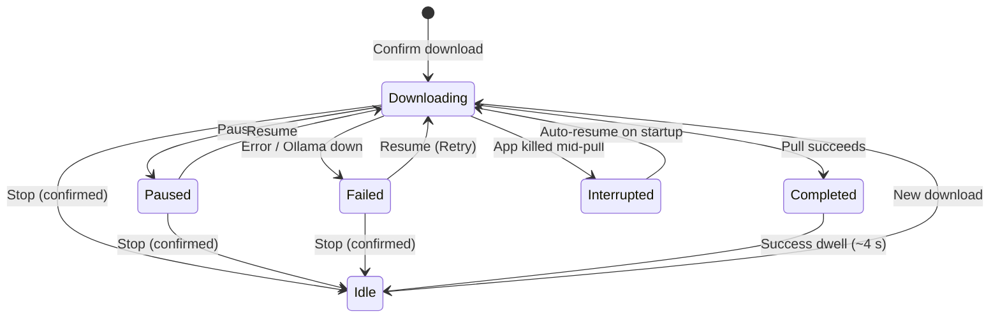
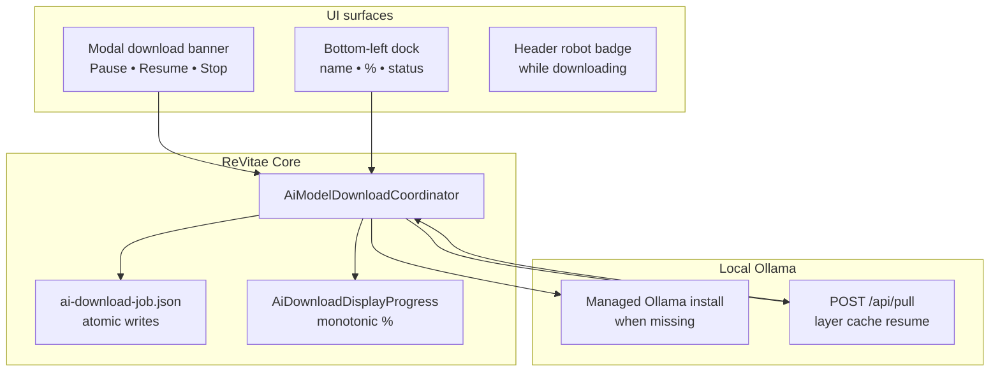

# AI setup (local models)

ReVitae includes an **AI setup** modal for choosing and downloading a **local
Ollama model** on your computer. This is the first Phase 2 building block — the
app does **not** yet use AI to rewrite CV content or run import extraction.

Downloads run as a **background job**: you can close the modal, keep editing your
CV, pause for later, or restart the app — ReVitae picks up where Ollama left off
using cached layers.

## Open the modal

1. Dismiss the intro overlay if it is still open.
2. Click the **robot icon** in the header toolbar (between **Upload CV** and
   **Setup**).
3. When no download is active, the modal runs **system detection** (loader, then
   results). While a download job is active, the modal opens straight to the
   **download banner**; use **Refresh system info** to re-run detection.

## What you see

### Your system

A summary card shows locally detected information:

- Operating system and CPU architecture
- CPU core count
- Total RAM (best effort; may show “unknown” on some setups)
- Free disk space on the ReVitae local-data volume
- Ollama status (running or not, and how many models are already installed)

Detection runs **only on this device**. ReVitae does not send your hardware
profile or CV data to ReVitae servers.

### Recommended model

One model is highlighted as the best fit for your RAM tier. You can still pick
any other allowed model from the list.

### All models

The catalog lists **11 curated Ollama instruct models** (Gemma, Phi-3, Llama,
Qwen, Mistral, Mixtral). Each row shows approximate download size, minimum
RAM, and a **status badge**:

| Badge               | Meaning                                              |
| ------------------- | ---------------------------------------------------- |
| **Downloaded**      | Model is installed in Ollama                         |
| **Downloading…**    | Active ReVitae job for this model                    |
| **Not downloaded**  | No local copy yet                                    |
| **Failed download** | Stale partial job — use **Clean up failed download** |

**Download rules:**

| Situation                                  | Behavior                                                     |
| ------------------------------------------ | ------------------------------------------------------------ |
| Fits your RAM                              | Download enabled                                             |
| **One tier larger** than your strict fit   | Download enabled with a **warning** (may run slowly or fail) |
| Two or more tiers above                    | Download disabled                                            |
| Already installed in Ollama                | “Already on this computer”; Download hidden                  |
| Not enough free disk (~110% of model size) | Error before download starts                                 |
| Another download already active            | Download disabled until the job finishes or you stop it      |

### Model management

Each catalog row can offer:

| Action                       | When available               | Effect                                                                               |
| ---------------------------- | ---------------------------- | ------------------------------------------------------------------------------------ |
| **Remove model**             | Model is installed in Ollama | Deletes the model via Ollama API; clears ReVitae settings if it was the saved choice |
| **Clean up failed download** | Stale or failed partial job  | Deletes partial Ollama blobs, clears `ai-download-job.json`, resets progress         |

Both actions ask for confirmation before proceeding.

## Download lifecycle





## Background download and dock

After you confirm a download:

1. ReVitae ensures Ollama is reachable — **installing a managed copy** under
   `%LocalAppData%/ReVitae/ollama/` when none is present (macOS / Windows / Linux).
2. ReVitae starts a persistent job and calls Ollama `POST /api/pull`.
3. A **bottom-left dock** shows model name, progress bar, and **percent** when
   totals are known.
4. You may **close the AI modal** — the download continues.
5. Click the dock to reopen the modal with the download banner and controls.

The dock is hidden while the intro overlay or AI modal is open (the banner inside
the modal is the control surface then).

While a download is **active** and the modal is closed, the robot icon shows a
small **blue badge** so you know work is in progress.

### Progress percent

Ollama reports progress **per layer**; totals can reset between layers. ReVitae:

- shows **monotonic** percent (never jumps backward in the UI),
- blends layer progress with the catalog’s approximate model size for smoother
  overall percent,
- refreshes the dock and banner at least every **150 ms** during active download.

When Ollama has not yet reported byte totals, the UI shows **…** until the first
usable numbers arrive.

## Pause, resume, and stop

Ollama has no pause API. ReVitae implements user-facing pause/resume by
cancelling the HTTP stream and starting a **new** pull for the same tag — Ollama
skips layers already on disk.

| Control    | Effect                                                                                                   |
| ---------- | -------------------------------------------------------------------------------------------------------- |
| **Pause**  | Waits for the pull to stop safely; job saved as **Paused**; late progress events cannot revert the state |
| **Resume** | Re-checks disk space and Ollama (with recovery if the engine was removed); starts a new pull             |
| **Stop**   | Asks for confirmation, cancels the job, and clears ReVitae progress (Ollama may keep partial files)      |

If resume fails because Ollama is unreachable or the partial download is corrupt,
ReVitae can **delete the partial model** and restart the pull automatically.

## After restart

| Job state when app closed      | On next launch                                                                            |
| ------------------------------ | ----------------------------------------------------------------------------------------- |
| **Downloading** (unclean exit) | Dock appears; ReVitae waits for Ollama with backoff (2 s → 5 s → 10 s), then auto-resumes |
| **Paused**                     | Dock appears at last percent; waits for you to click **Resume**                           |
| **Failed**                     | Dock shows error + **Resume** (Retry)                                                     |

## Download complete

When the pull succeeds, the dock shows **Download complete** at 100 % for about
**4 seconds**, then hides. Your choice is saved to `ai-settings.json` — you do
not need to keep the modal open.

## Job and settings files

Both live under `%LocalAppData%/ReVitae/` (macOS:
`~/Library/Application Support/ReVitae/`):

**`ai-download-job.json`** — active job (state, progress, model tag). Removed
after success or stop; kept after failure until Retry or Stop.

**`ai-settings.json`** — last successfully downloaded model:

```json
{
  "selectedModelId": "llama31-8b",
  "ollamaModelTag": "llama3.1:8b-instruct",
  "downloadedAtUtc": "2026-05-21T12:00:00Z"
}
```

**Managed Ollama** (when auto-installed):

```text
%LocalAppData%/ReVitae/ollama/
  Ollama.app/          (macOS) or platform equivalent
  serve.log
```

No API keys or secrets are stored.

## Troubleshooting

| Problem                                 | What to try                                                                            |
| --------------------------------------- | -------------------------------------------------------------------------------------- |
| Ollama not running                      | Click **Resume** — ReVitae tries to start or reinstall the managed engine              |
| Not enough disk space                   | Free space, then **Resume**                                                            |
| Download failed mid-way                 | Click **Resume** in the dock or modal banner                                           |
| Stuck partial / failed badge on a model | **Clean up failed download**, then start again                                         |
| Percent stuck at …                      | Wait a few seconds; if pull is active, percent should appear once Ollama reports bytes |
| Pause shows but Resume missing          | Restart the app — job file should load as **Paused** with **Resume** visible           |
| Corrupt job file                        | Delete `ai-download-job.json` and start a fresh download                               |

## Manual QA checklist

1. Start download → close modal → dock stays visible and percent updates.
2. Click dock → modal opens with banner at top.
3. Pause → **Resume** appears; Resume → pull continues from cached layers.
4. Pause during active download → state stays **Paused** (no stuck Pause button).
5. Stop → confirm → dock hides; new download allowed.
6. Force-quit during download → relaunch → auto-resume when Ollama is up.
7. Pause before quit → relaunch → stays paused (no auto-resume).
8. Success → dock shows complete ~4 s → `ai-settings.json` written.
9. Header badge visible while downloading with modal closed.
10. **Remove model** on an installed row → Ollama tag deleted; card shows **Not downloaded**.
11. **Clean up failed download** on stale row → job cleared; Download enabled again.
12. Fresh machine without Ollama → download triggers managed install, then model pull.

## Related docs

- Product concept (Phase 2): [`concept.md`](concept.md)
- Implementation prompts: [`../prompts/036-ai-setup-modal-system-detection.md`](../prompts/036-ai-setup-modal-system-detection.md), [`../prompts/037-resumable-ai-model-download.md`](../prompts/037-resumable-ai-model-download.md)

## Not in scope yet

- Cloud / OpenAI-compatible providers
- AI-assisted import or field rewrite
- Automatic first-launch wizard
- Parallel downloads of multiple models
- Download bandwidth throttling
