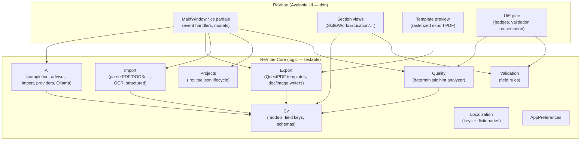

# ReVitae architecture

A module map of the codebase: the layers, their responsibilities, and where new code
belongs. Two projects — **`ReVitae.Core`** (all logic, testable, no UI) and **`ReVitae`**
(Avalonia desktop UI, thin wiring) — plus the **`ReVitae.Tests`** xUnit suite.

## `ReVitae.Core` modules

| Module | Responsibility |
| ------ | -------------- |
| `Cv/` | CV domain models, per-section field-key constants, schemas (max lengths, validation shapes). |
| `Import/` | Multi-format import: text extraction (`Import/Pdf`, OCR under `Import/Ocr`), section/field extraction (`Import/Extraction`), structured mappers (`Import/Structured` — JSON Resume, Europass, native). |
| `Export/` | Output: QuestPDF template rendering (`Export/Pdf/Templates` + `CvThemedTemplateRegistry`), document writers, page-image export (`Export/Images`), the demo fixtures, and the render-signature oracle (`CvTemplateRenderSignature`). |
| `Ai/` | Backend-agnostic AI: `Ai/Cv` (completion + section advisor), `Ai/Import` (assisted import + field repair), `Ai/Providers` (online providers, secrets), `Ai/Ollama` + `Ai/Download` (local models). |
| `Quality/` | Deterministic `CvQualityAnalyzer` producing review hints (no AI). |
| `Validation/` | Field validation rules and presentation-agnostic results. |
| `Projects/` | `.revitae.json` save/load/autosave lifecycle. |
| `Localization/` | `TranslationKeys` (string keys) + `AppLocalizer` (English base + per-language overlays). |
| `AppPreferences/` | App-settings persistence (including the first-launch AI wizard state). |

## `ReVitae` (UI) layout

- **`MainWindow.*.cs`** — one partial per feature area (AI setup/providers/download,
  AI CV completion/advisor/repair, import-AI, export, projects, quality hints, template
  previews). Partials should stay **thin**: wire AXAML events to Core/UI-glue; business
  logic belongs in Core.
- **Section views** (`Skills/`, `WorkExperience/`, …) — editable form sections; implement
  `IValidationNavigableSection`, `IQualityHintSection`, and (for advisor-capable sections)
  `IAiAdvisorSection`.
- **`Ui/`** — shared UI glue: section header badges, validation-error presentation,
  quality-hint flyouts.
- **`MainWindow.TemplatePreviewRender.cs` + `CvTemplatePreviewImage`** — the live preview
  **rasterizes the actual export PDF** (QuestPDF → Docnet → per-page PNG), so the preview
  always matches the export. Updates are debounced, run off the UI thread, and are cached by
  document content hash (`CvExportDocumentHash`). `Preview/` holds the small template-picker
  thumbnails.

## Where does new code go?

- **Logic, parsing, formatting, AI, rules** → `ReVitae.Core` (with tests). The UI must stay
  thin enough that the logic is testable without Avalonia.
- **New user-facing strings** → a `TranslationKeys` constant + English entry (+ Slovak
  overlay), kept in `RequiredKeys`.
- **A new export template** → a QuestPDF template (`Export/Pdf/Templates` or a
  `CvThemedTemplateRegistry` definition) plus a golden signature
  (`tests/.../Goldens/template-render-signatures.txt`, regenerate via
  `scripts/GenerateTemplatePreviews --signatures`).

## Testing & guards

- **Core-first:** business logic lives in Core and is unit-tested; Avalonia section views are
  not headless-tested — extend Core before adding UI tests.
- **Golden render oracle (QG1):** `CvTemplateRenderGoldenTests` pins every template's layout
  signature so refactors that touch rendering are provably behaviour-preserving.
- **Import regression:** the John Doe import matrix + extraction fuzz suites guard the import
  pipeline.
- **Build is warning-free** (`TreatWarningsAsErrors`); the full suite + `npm run lint` gate
  every change.
