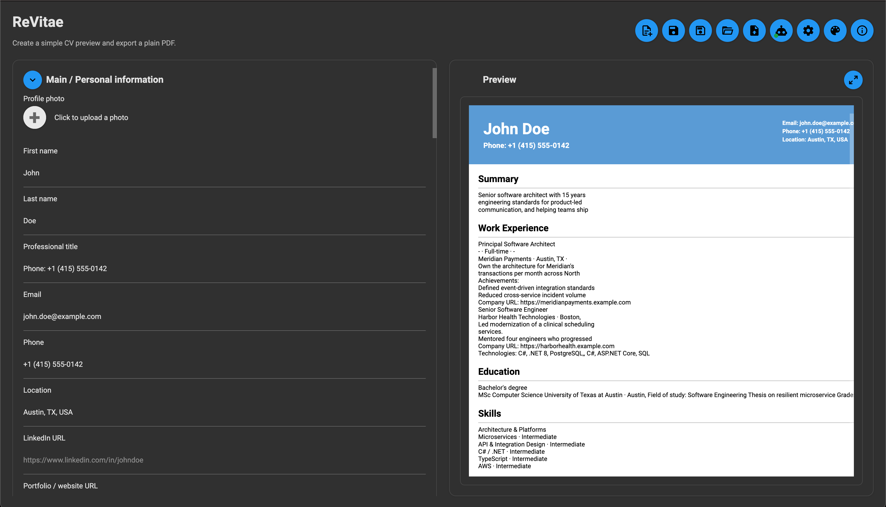
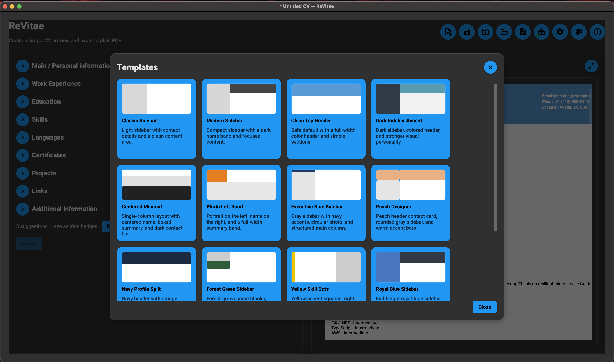
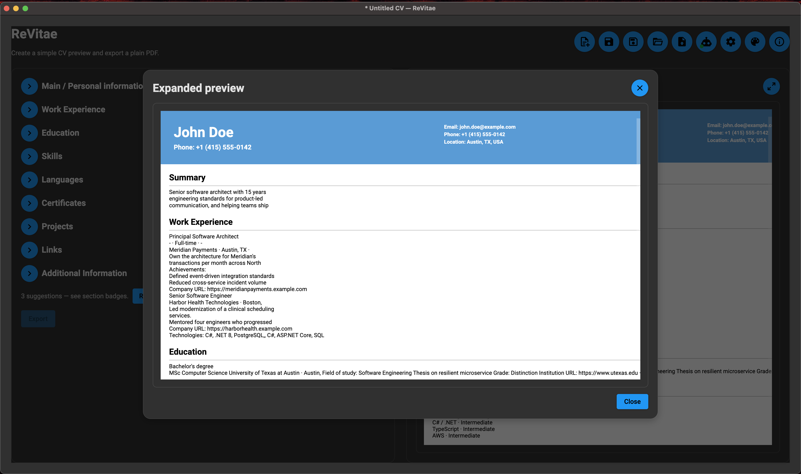
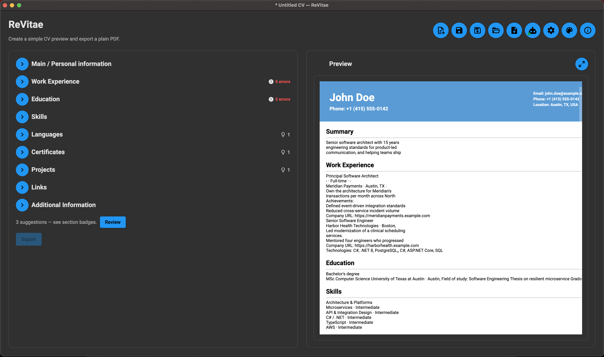
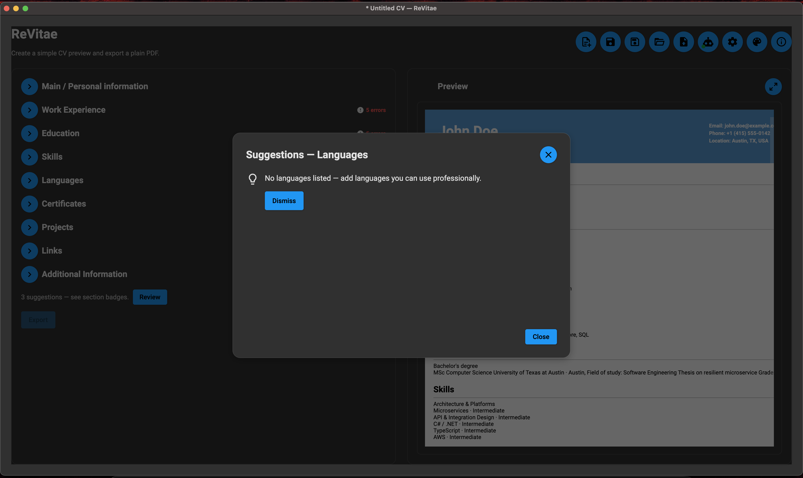

# ReVitae - Application Concept

## Overview

ReVitae is a desktop application for Windows, macOS, and Linux that helps users create, edit, preview, and export professional CVs.

The application combines a structured CV form, a wide collection of HTML CV templates, live preview, PDF export, and optional AI assistance. The main goal is to let users focus on the content of their CV instead of manually handling layout, formatting, and repetitive editing.

User data should be treated as the source of truth. Templates should only define presentation. This allows the same CV data to be rendered through many different visual styles without losing or duplicating content.

## Product Principles

ReVitae should be practical, clear, and privacy-conscious.

The application should:

- run on Windows, macOS, and Linux,
- provide an installer or packaged binary for each supported system,
- store user CV data locally by default,
- separate CV data from visual templates,
- allow the user to manually edit all generated or imported content,
- never silently download large AI models without user approval,
- clearly explain when AI is used and what data it processes,
- support both users who already have a CV and users who are starting from scratch.

## Phase 1 - Core CV Builder

The first phase should focus on the core product without making local AI model management a blocker.

Phase 1 should deliver a usable CV builder with structured data entry, template selection, preview, and multi-format export (PDF plus structured and document interchange formats — see [`docs/export-formats.md`](export-formats.md)).

### Structured CV Form

The application should provide an editable form that stores all CV information in a structured format.

Initial form sections should include:

- personal information (optional profile photo upload),
- contact information,
- professional summary,
- work experience,
- education,
- skills,
- languages,
- certificates,
- projects,
- links,
- additional information.

The form should be the main source of truth for the CV. Users should be able to edit every field manually at any time.

Optional profile photos (JPEG/PNG/WebP, max 15 MB) are stored locally, normalized
for EXIF orientation, shown in template preview and visual exports, and embedded in
ReVitae JSON/YAML v2 interchange. Sidebar templates show initials when no photo is
uploaded. Document imports do not extract photos from PDF/DOCX/HTML.

### Create a New CV From Scratch

Users should be able to create a completely new CV without importing an existing document.

The application should guide the user through the form and provide default hints about what information is usually useful in a strong CV.

Examples of built-in hints:

- missing sections that may be worth adding,
- overly generic descriptions,
- missing measurable results,
- unclear or inconsistent wording,
- duplicated or unnecessary content,
- work experience that could be explained more clearly.

In Phase 1, these hints can be implemented as static rules or predefined guidance. They do not need to depend on an AI model yet.

### HTML CV Templates

The application should include a broad selection of HTML-based CV templates.

Users should be able to:

- choose a template,
- preview the CV,
- switch to another template without losing data,
- keep the same CV content while changing only the visual style.

Templates should be separated from user data. A template should receive structured CV data and render it into a printable layout.

### Preview and PDF Export

The main output of the application should be a polished PDF CV.

Basic workflow:

1. The user enters or edits CV data in the form.
2. The user selects a CV template.
3. The application renders a preview.
4. The user adjusts content or changes the template.
5. The user exports the final CV to PDF.

Beyond PDF, the app now also exports DOCX, ODT, RTF, TXT, Markdown, HTML, LaTeX,
structured JSON / YAML / XML / CSV / TSV, and page images (PNG / JPEG / WebP) — 16
formats in total (see [`docs/export-formats.md`](export-formats.md)).

Still open: multiple language versions of the same CV (CV **content** localization,
distinct from the already-supported multi-language UI — see [Open Questions](#open-questions)).

## Current Implementation Status

As of mid‑2026, the desktop app covers most Phase 1 builder scope plus expanded import:

- All structured CV sections in the form with validation and badges,
- Live preview across **106 built-in templates** — the preview **rasterizes the actual
  QuestPDF export PDF**, so what you see always matches what you export,
- **Multi-format export** (16 formats, including **page images** PNG/JPEG/WebP) and
  **multi-format import** via `CvDocumentImporter`,
- Startup intro modal (**create new** or **import CV**) and header **replace import**
  confirmation when data already exists,
- Shared **25 MB** guardrails and **XXE-safe XML** parsing via `SecureXmlReaderFactory`,
- Inline field validation with export scroll-to-first-error,
- Internationalization across supported UI languages,
- Import confidence hints on uncertain parsed fields.
- **Static CV quality hints** — deterministic rules in Core (`CvQualityAnalyzer`),
  section badges with a **large in-window modal**, session dismiss, import-aware
  review hints, export-area summary; optional **Improve with AI** on supported hints.
- **AI section advice & proactive import assist (v0.2.12, prompt 045)** — broadened
  AI coverage across more sections, a proactive **per-section advisor** (Ask AI for
  tips), optional **target-role context**, an **entity guard** against hallucinated
  facts, CV-content-language-aware rewrites, one-level undo, and **targeted import
  field repair** for low-confidence fields. AI remains assistant-not-author: nothing
  auto-applies, everything is reviewed first. See [`ai-setup.md`](ai-setup.md) and
  [`ai-import.md`](ai-import.md).

- **Page image export**: PNG/JPEG/WebP via `CvImageExporter`; ZIP or
  folder delivery; page range; size estimate; export progress; opaque white background.
- **John Doe import regression matrix** — **51** generated stress CVs assert parser
  fidelity and post-import form validation (`JohnDoeImportRegressionMatrixTests`).
- **Core-first test strategy (v0.2.11+):** business logic extracted to Core services
  (`CvProjectLifecycleService`, `FirstLaunchAiWizardController`, import section
  extractors under `Import/Extraction/`). Avalonia UI remains thin wiring; **2395**
  automated tests with drift guard (`scripts/verify-test-count.sh`). UI section views
  are not headless-tested — extend Core before adding UI tests.
- **Code-refactor pass (prompt 047):** unified template rendering (preview rasterizes the
  export PDF — single pipeline, no drift), split the import-extraction god file, shared
  `SectionEntryReorder` / `CvPdfRenderHelper.RenderPage` / `CvPdfPalette` helpers, a golden
  render oracle, a warning-free build, and a module map (see [`architecture.md`](architecture.md)).
- **Local CV project save/load**: Save / Save As / Open toolbar
  actions; `CvProjectSerializer` + optional `projectSettings`; recent projects;
  dirty title indicator; unsaved-changes guard; autosave recovery — see
  [`docs/revitae-project-json.md`](revitae-project-json.md).
- **AI setup:** resumable background Ollama model download with
  dock, pause/resume/stop, startup recovery, managed engine install, model
  lifecycle (remove / clean stale), monotonic progress, and **online provider
  list with configure / test / activate** (single active backend, encrypted API
  keys) — see [`docs/ai-setup.md`](ai-setup.md).
- Robust education parsing for PDF layout artifacts (institution names split
  across blank lines merge into a single entry).

Documentation:

- [`docs/export-formats.md`](export-formats.md) export matrix,
- [`docs/import-formats.md`](import-formats.md) format matrix & exclusions,
- [`docs/revitae-project-json.md`](revitae-project-json.md) native interchange schema.

Still open for later phases:

- installers or packaged binaries for each supported platform.

**Implemented:** optional [AI-assisted CV import](ai-import.md) —
batched extraction fallback when deterministic import fails or is incomplete;
review-before-apply; model-aware batch profiles for compact local models.

## Phase 2 - AI Assistance and Model Management

The second phase should add AI-powered features after the core CV builder is stable.

This phase focuses on importing existing CVs, extracting structured information, providing smarter recommendations, and supporting both local and online AI models.

### First Launch AI Setup

**Implemented:** optional **first-launch AI setup wizard** on cold start (before
the intro) with Welcome → Choose path → Local/Online setup → Complete; four paths
(local download, curated online providers, remind later, offline-only); persistence
in `app-settings.json` (schema v2); Setup link **Show AI setup wizard again**; EN +
SK localization. See [`docs/ai-setup.md`](ai-setup.md#first-launch-ai-setup-wizard).

**Implemented:** the header **AI icon** opens an on-demand setup
modal with **online provider configuration** (OpenAI, Anthropic, Gemini, Groq,
Azure OpenAI, Mistral, DeepSeek, OpenRouter, Custom), a single active backend
(local model or one online provider), local hardware detection, a recommended
Ollama model, a downloadable catalog, **managed Ollama install** when no engine
is present, **background resumable download** (dock, pause/resume/stop, startup
recovery), and **model lifecycle** actions (remove installed models, clean stale
partial downloads). See [`docs/ai-setup.md`](ai-setup.md). The first-launch
wizard reuses these flows.

**Implemented:** universal **CV completion** layer — whichever active
backend the user chose powers **Improve with AI** on selected quality hints.
Suggestions appear in a review modal; the user **Accepts**, **Edits**, or **Dismisses**
— ReVitae never auto-applies AI text. Online sends require a one-time session
confirm; local Ollama stays on-device. See [`docs/ai-setup.md`](ai-setup.md).

On first launch (full vision), the application should detect the user's operating system and relevant hardware capabilities.

Based on this detection, it should offer a list of suitable free local AI models for the user's system. The user should also be able to choose an online AI provider instead.

The user should have two main options:

- use a local free AI model,
- connect to a supported online AI model.

If the user chooses a local model, the application should show:

- model name,
- approximate download size,
- expected hardware requirements,
- why the model is recommended,
- where it will be stored.

Only after confirmation should the application download, initialize, and use the selected model.

If the user chooses an online model, the application should provide a setup flow for authentication, such as an API key or another supported connection method.

### Changing the AI Model

The application settings should allow the user to change the selected AI model.

When changing from one local model to another, the application should warn the user that the old local model will be removed and the new one will be downloaded and initialized.

Basic model change flow:

1. The user opens settings.
2. The user selects a different local or online model.
3. The application explains the consequences of the change.
4. If a local model is selected, the old local model is removed.
5. The new model is downloaded.
6. The new model is initialized.
7. Future AI features use the new model.

### Import an Existing CV

Users should be able to upload an existing CV document.

The application should convert the document into text and use AI to extract relevant information into the structured CV form. The extracted data should always be editable before it is used for preview or export.

Initial import formats should include:

- PDF,
- DOCX,
- TXT or another simple text-based format.

### AI Recommendations

**Implemented (v0.2.12, prompt 045):** the per-section advisor and broadened
hint coverage deliver this — measurable-results prompts, skill grouping, empty-section
guidance, and tailored tips via optional target-role context. AI acts as an assistant,
not an author: suggestions are review-only, every write is undoable, and an entity guard
flags facts the model adds that are not in the CV.

AI should act as an assistant, not as an automatic author.

It may suggest improvements such as:

- missing sections,
- weak or generic descriptions,
- places where measurable results could be added,
- unclear wording,
- inconsistent tone,
- duplicated information,
- content that does not fit the selected CV style.

The user must stay in control. AI suggestions should be presented as recommendations that the user can accept, edit, or ignore.

## Open Questions

Still open:

- Should users be able to add custom HTML templates of their own?
- Should CV version history be supported?
- Should the same CV support multiple **content** language versions (CV content
  localization, beyond the already-supported multi-language UI)?

Resolved:

- ~~Which local AI models should be supported first?~~ A curated catalog of 11
  Ollama instruct models with RAM-aware recommendations and disk-space checks.
- ~~Should the first AI version support multiple model sizes based on hardware?~~
  Yes — `SystemProfileDetector` drives the recommended model and the catalog spans sizes.
- ~~Which online AI providers should be supported?~~ OpenAI, Anthropic, Gemini, Groq,
  Azure OpenAI, Mistral, DeepSeek, OpenRouter, and a custom endpoint.
- ~~Should PDF export use an internal renderer or an HTML-to-PDF engine?~~ An internal
  renderer — QuestPDF, with the preview rasterizing the actual export PDF.
- ~~Should the application store each CV as a local project?~~ Yes — native
  `*.revitae.json` projects with Save / Save As / Open, recent projects, and autosave recovery.
- ~~Should the first version support one language or multiple languages?~~ Multiple UI
  languages are supported; CV content localization remains open (above).
