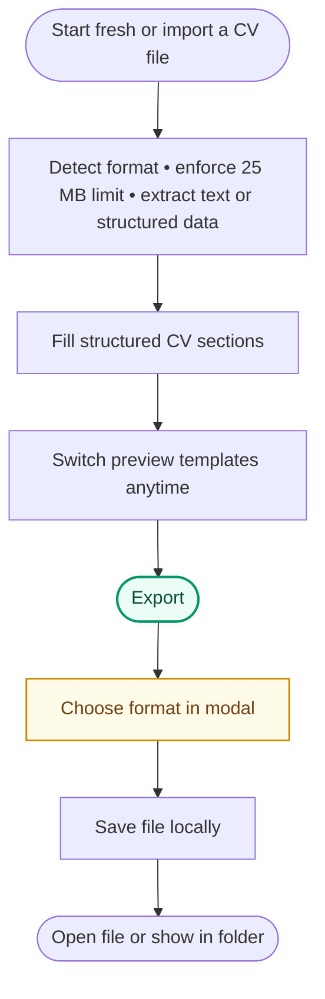

# Prompt 022 - Multi-Format CV Export with Format Picker Modal

Extend ReVitae export so users can download their CV in many common document and
structured data formats — not only PDF. All new formats must reuse the existing
structured CV data, validation-gated export flow, template selection (where
visual layout applies), and localized status messaging from prompts 018–019.

This prompt intentionally excludes **image/raster export**. PNG, JPEG, WebP, TIFF,
HEIC, and similar bitmap outputs remain out of scope.

## Goal

Support the full set of practical non-image CV export formats while keeping one
consistent user experience:

1. User edits CV data and selects a preview template as today.
2. User clicks **Export**.
3. If validation passes, an **in-window export format modal** opens.
4. User picks a format card (with an official file-type icon).
5. A native save dialog opens with the correct extension and file-type filter.
6. ReVitae generates the file locally and shows a localized success message.

Export quality expectations:

- **Visual formats** (PDF, HTML, DOCX, ODT, RTF) produce a polished, readable CV
  document aligned with the selected template where reasonable.
- **Structured formats** (JSON, YAML, XML) produce deterministic, re-importable
  data using the same schemas as prompt **021** import.
- **Plain/markup text** (TXT, Markdown, LaTeX) produce human-readable CV text,
  not debug dumps.

Generation stays **deterministic and local** — no AI and no cloud conversion in
this prompt.

## Current State (Before This Prompt)

Already implemented from prompts 018–021:

- **Export PDF** button in the header toolbar,
- validation-gated export with scroll-to-first-error (`FormValidationService`,
  prompt 018),
- shared export document model `CvExportDocument` built via private
  `MainWindow.BuildExportDocument()` and `CvExportSectionLabelsFactory` (prompt 019
  described a dedicated factory type — extract to `CvExportDocumentFactory` in the
  UI layer if it keeps `MainWindow` thin),
- template-aligned PDF export via QuestPDF (`ICvPdfExporter`,
  four template families),
- localized save dialog title, file type label, success/failure status text,
- filename suggestion via `CvExportFilenameHelper.SuggestFilename(...)` →
  `{FirstName}_{LastName}_CV.pdf`,
- multi-format **import** via `CvDocumentImporter` (prompt 021) with structured
  mappers for JSON Resume, ReVitae JSON, YAML, Europass XML, HR-XML, CSV/TSV.

Current limitations to remove:

- export button label and handler assume PDF-only (`ExportPdfButton`,
  `OnExportPdfClicked`, `action.exportPdf`),
- no format selection step — save dialog opens directly as PDF,
- no DOCX/HTML/JSON/YAML/RTF/ODT/TXT/Markdown/LaTeX/XML/CSV export paths,
- `CvExportFilenameHelper` hardcodes `.pdf` extension,
- success message key is PDF-specific (`export.exportedPdfTo`),
- validation message mentions PDF only (`export.fixValidation`),
- README roadmap still lists “More export formats such as DOCX or HTML” as future
  work.

## Supported Export Formats

All formats below are in scope. Image/raster formats are explicitly out of scope
(see **Out of Scope**).

### Category A — Visual document formats (template-aware where applicable)

| Format                    | Extension(s) | Support level | Template parity                                   | Notes                                                                          |
| ------------------------- | ------------ | ------------- | ------------------------------------------------- | ------------------------------------------------------------------------------ |
| PDF                       | `.pdf`       | Full          | **Required** — existing QuestPDF path             | Primary polished output; A4; Unicode                                           |
| Microsoft Word (Open XML) | `.docx`      | Full          | High — sidebar/header layout preserved            | Use DocumentFormat.OpenXml                                                     |
| OpenDocument Text         | `.odt`       | Full          | High                                              | ODF ZIP + content.xml generation                                               |
| Rich Text Format          | `.rtf`       | Full          | Medium — structure preserved, styling approximate | Cross-platform legacy interchange                                              |
| HTML                      | `.html`      | Full          | High — single self-contained file                 | Embedded CSS; no external asset deps required for basic open-in-browser        |
| Markdown                  | `.md`        | Full          | Medium — semantic sections as headings            | GitHub/developer friendly                                                      |
| Plain text                | `.txt`       | Full          | Low — structured plain text                       | Section headers + readable blocks                                              |
| LaTeX source              | `.tex`       | Best effort   | Low — `article`/`moderncv`-style stub             | Valid compilable stub preferred; fall back to structured `.tex` text           |
| Legacy Word binary        | `.doc`       | Best effort   | Medium                                            | Only if NPOI write path is reliable; otherwise hide card + document limitation |
| AbiWord                   | `.abw`       | Limited       | Low                                               | Only if a maintainable writer exists; otherwise card disabled with tooltip     |
| WPS Office                | `.wps`       | Out / Limited | —                                                 | Prefer **not shown** in modal unless reliable writer exists                    |
| Apple Pages               | `.pages`     | Out / Limited | —                                                 | Do **not** claim export; Pages is import-only today                            |

### Category B — Structured data formats (round-trip with import)

| Format               | Extension(s)               | Support level | Round-trip expectation                                |
| -------------------- | -------------------------- | ------------- | ----------------------------------------------------- |
| ReVitae project JSON | `.revitae.json`, `.json`\* | Full          | Re-import via `ReVitaeJsonMapper` without data loss   |
| JSON Resume          | `.json`\*                  | Full          | Re-import via `JsonResumeMapper` for exported subset  |
| YAML CV              | `.yaml`, `.yml`            | Full          | Same logical content as JSON export                   |
| Europass CV XML      | `.xml`\*                   | Full          | Re-import via `EuropassXmlMapper` for mapped fields   |
| HR-XML-like CV XML   | `.xml`\*                   | Best effort   | Common resume nodes when schema matches import mapper |
| CSV / TSV            | `.csv`, `.tsv`             | Limited       | Single-row personal + flattened summary columns only  |

\* When multiple JSON/XML flavors share an extension, the **export format choice**
(not filename sniffing alone) determines serializer output. Save-dialog defaults
must disambiguate:

| Export card  | Default extension | Default filename example   | Import recognition                     |
| ------------ | ----------------- | -------------------------- | -------------------------------------- |
| ReVitae JSON | `.revitae.json`   | `Jane_Doe_CV.revitae.json` | suffix or `revitaeVersion` root key    |
| JSON Resume  | `.json`           | `Jane_Doe_CV.json`         | `$schema` / canonical Json Resume keys |
| Europass XML | `.xml`            | `Jane_Doe_CV_europass.xml` | Europass namespace / root sniff        |
| HR-XML       | `.xml`            | `Jane_Doe_CV_hrxml.xml`    | HR-XML-like root/token sniff           |

Do **not** rely on a single generic `.json` or `.xml` save filter for all structured
variants — each card opens a save dialog scoped to that exporter's expected shape.
Native interchange default remains **`*.revitae.json`**.

### Category C — Explicitly excluded

Do **not** implement export for:

- `.png`, `.jpg`, `.jpeg`, `.gif`, `.webp`, `.bmp`, `.tiff`, `.tif`, `.heic`,
  `.svg` as final CV deliverables,
- OCR or image rendering pipelines,
- email attachments (`.eml`, `.msg`),
- ZIP bundles of multiple formats,
- cloud upload / share sheet integrations,
- password-protected or encrypted output files,
- embedded photo binary export (photo path may be omitted or exported as URL/text
  only).

## Product Behavior Summary

### Happy path

1. User fills valid CV data and selects a template in the Templates modal.
2. Preview updates live as today.
3. User clicks **Export** (renamed from **Export PDF**).
4. App runs existing combined validation (`ValidateForm()`).
5. If validation **fails**:
   - export modal does **not** open,
   - keep prompt 018 behavior unchanged (inline errors, scroll-to-first invalid
     field, `ExportFixValidation` status text).
6. If validation **passes**:
   - open the **Export format modal** inside the main window,
   - user sees a grid/list of supported formats, each with an official file-type
     icon and localized label,
   - user clicks one format card,
   - modal closes,
   - native save dialog opens with correct default extension, suggested filename,
     and file-type filter for the chosen format,
   - app generates bytes/text via the selected exporter,
   - file is written locally,
   - localized success message appears in `ExportStatusTextBlock`,
   - optional **Open file** and **Show in folder** actions appear next to the success
     message (see **Post-export success actions** below).
7. User cancels save dialog → silent return (no error), same as today.

### Post-export success actions

After a **successful** export, show lightweight follow-up actions near
`ExportStatusTextBlock` so the user can reach the saved file without hunting in
Finder/Explorer.

Requirements:

- Show two optional actions (hyperlinks or small secondary buttons):
  - **Open file** — open the exported file with the OS default application for that
    format (PDF reader, browser for HTML, Word for DOCX, etc.).
  - **Show in folder** — reveal the containing directory and highlight the file
    (Finder “Reveal in Finder”, Explorer “Show in folder”, Linux file manager best
    effort).
- Actions appear **only after success**; hide them on the next export attempt,
  validation failure, or new status message.
- Failed shell launch must **not** overwrite the success text — fail silently or
  show a non-blocking secondary error only if a pattern already exists in the app.
- Do not auto-open the file without user action (no surprise PDF launch on save).
- Implementation: small cross-platform helper in `src/ReVitae/Export/`, for example
  `CvExportShellHelper.OpenFile(string path)` and
  `CvExportShellHelper.RevealInFolder(string path)` using `Process.Start` /
  platform-specific reveal APIs where available.
- Store the last exported absolute path in memory for the session only (no
  persistence required).

### Export format modal UX (required)

This is a first-class product feature, not an afterthought.

#### Opening/closing rules

| Rule              | Requirement                                                                                                                                                                                                                             |
| ----------------- | --------------------------------------------------------------------------------------------------------------------------------------------------------------------------------------------------------------------------------------- |
| Trigger           | **Export** toolbar button after successful validation                                                                                                                                                                                   |
| Modal type        | In-window overlay modal (same family as Setup / Templates / Intro)                                                                                                                                                                      |
| Backdrop          | Semi-transparent dim overlay                                                                                                                                                                                                            |
| Close methods     | Close button, `Escape`, backdrop click (if consistent with other modals)                                                                                                                                                                |
| State isolation   | Separate overlay state from Setup, Templates, Intro, Preview expand                                                                                                                                                                     |
| Concurrent modals | Follow existing modal exclusivity: opening Export closes Setup/Templates/Preview expand (same pattern as `SetSetupModalVisible` / `SetTemplatesModalVisible`); block Export while Intro or replace-import progress overlays are visible |
| Escape key        | Add Export modal to the existing Escape dismissal stack in `MainWindow` (after Export, before Setup/Templates or in consistent priority order)                                                                                          |
| Data mutation     | Opening/closing/canceling must not mutate CV form data                                                                                                                                                                                  |
| Re-open           | User may export again immediately; modal opens fresh each time                                                                                                                                                                          |

#### Layout

Suggested structure:

```text
┌─────────────────────────────────────────────────────────────┐
│  Export CV                                              [×] │
│  Choose a file format for your download.                    │
│                                                             │
│  Documents                                                  │
│  ┌────────┐ ┌────────┐ ┌────────┐ ┌────────┐               │
│  │ [PDF]  │ │ [DOCX] │ │ [ODT]  │ │ [RTF]  │               │
│  │  PDF   │ │ Word   │ │ ODT    │ │ RTF    │               │
│  └────────┘ └────────┘ └────────┘ └────────┘               │
│                                                             │
│  Web & text                                                 │
│  ┌────────┐ ┌────────┐ ┌────────┐ ┌────────┐               │
│  │ [HTML] │ │ [MD]   │ │ [TXT]  │ │ [TeX]  │               │
│  └────────┘ └────────┘ └────────┘ └────────┘               │
│                                                             │
│  Structured data                                            │
│  ┌──────────────┐ ┌──────────────┐ ┌────────┐               │
│  │ [revitae.json│ │ [JSON Resume]│ │ [YAML] │ ...          │
│  └──────────────┘ └──────────────┘ └────────┘               │
└─────────────────────────────────────────────────────────────┘
```

Implementation requirements:

- Responsive grid: **3–4 columns** on wide windows, **2 columns** on narrow widths.
- Each format is a **clickable card** (`Button` or `Button`-styled `Border`).
- Cards show:
  1. **Official file-type icon** (see **Part 4 — File Format Icon Assets**),
  2. localized **short format name** (for example `PDF`, `Word`, `HTML`),
  3. optional localized **subtitle** (for example `Best for sharing`, `Re-import later`).
- **PDF** card may show a subtle **Recommended** badge (localized).
- Disabled/unavailable formats (if any) appear visually muted with tooltip explaining
  why (for example legacy `.doc` unsupported on this platform).
- Hover/focus states must be visible in light and dark theme.
- Keyboard navigation: arrow keys or tab through cards; `Enter`/`Space` selects.
- Accessibility:
  - modal title exposed to assistive tech,
  - each card has `AutomationProperties.Name` = format name + category,
  - icon is decorative (`Alt text` empty) when label is present.

#### Official file-type icons (required UX)

Every export format card must display a recognizable **official or de-facto standard
file icon** for that format — not a generic download glyph.

Examples of expected visual identity:

| Format                  | Icon identity                                                            |
| ----------------------- | ------------------------------------------------------------------------ |
| PDF                     | Adobe PDF document icon (red/white stylized pages)                       |
| DOCX / DOC              | Microsoft Word document icon (blue, “W”)                                 |
| ODT                     | OpenDocument / LibreOffice Writer document icon                          |
| RTF                     | Rich Text document icon (distinct from plain TXT)                        |
| HTML                    | HTML / browser document badge (orange `<>` motif or W3C-style mark)      |
| Markdown                | Markdown logo (M↓ or common MD file badge)                               |
| TXT                     | Plain text document sheet icon                                           |
| LaTeX                   | TeX/LaTeX logo or `.tex` document badge                                  |
| JSON / `.revitae.json`  | Curly-brace JSON document icon; native JSON may add small ReVitae accent |
| YAML                    | YAML file badge                                                          |
| XML (Europass / HR-XML) | XML/code document icon; Europass card may use EU CV branding colors      |
| CSV / TSV               | Spreadsheet/table document icon                                          |

Asset rules:

- Store icons as **SVG** under `src/ReVitae/Assets/ExportFormats/`.
- Naming convention: `export-format-{id}.svg` where `{id}` matches
  `CvExportFormat` enum slug (`pdf`, `docx`, `html`, …).
- Prefer **Simple Icons** (MIT) or hand-crafted SVGs that match widely recognized
  file associations on Windows/macOS/Linux.
- Include `src/ReVitae/Assets/ExportFormats/ATTRIBUTION.md` when third-party SVG
  sources are used.
- Icons must remain legible at **48×48 dp** and **32×32 dp** sizes.
- Provide light/dark variants **or** single SVGs with sufficient contrast on both
  theme backgrounds used by Material.Avalonia surfaces.
- Load via Avalonia `Svg`/`SvgImage` (or project-approved equivalent); do not
  depend on OS-installed file icons (not cross-platform deterministic).
- Unit/UI tests are not required for pixel parity, but manual QA must verify every
  in-scope format card shows the correct icon asset (no missing-image placeholder).

### Toolbar / button changes

| UI element                | Change                                                                 |
| ------------------------- | ---------------------------------------------------------------------- |
| Export button label       | `Export` (localized), not `Export PDF`                                 |
| Export button tooltip     | `Export CV` / localized equivalent                                     |
| Handler name              | rename to `OnExportClicked` (or keep control name but update behavior) |
| Validation disabled state | unchanged — invalid form disables Export                               |
| Status area               | keep `ExportStatusTextBlock`; success message becomes format-aware     |

### Filename suggestion

Extend `CvExportFilenameHelper`:

```csharp
public static string SuggestFilename(string? firstName, string? lastName, CvExportFormat format)
```

Keep a temporary overload or update all call sites when migrating from PDF-only export.

Rules:

- preferred: `{FirstName}_{LastName}_CV.{ext}`
- fallback when name missing: `ReVitae_CV.{ext}`
- reuse existing sanitization logic from prompt 019,
- extension comes from selected `CvExportFormat`, not hardcoded `.pdf`,
- for native JSON default extension `.revitae.json` (for example
  `Jane_Doe_CV.revitae.json`).

### Save dialog per format

Mirror import picker patterns from `CvImportFilePickerOptions` with a new
`CvExportFilePickerOptions` helper in `src/ReVitae/Export/`.

Each format defines:

- `DefaultExtension`
- localized `FileTypeChoices` label
- `Patterns` (for example `*.docx`)
- `MimeTypes` when known

Save dialog title becomes format-aware:

- generic: `Export CV`
- optional specific: `Export CV as PDF` — either is acceptable if localized

## Part 1 - Architecture

Introduce a unified export facade parallel to `CvDocumentImporter`.

Suggested structure:

```text
src/ReVitae.Core/
  Export/
    CvExportFormat.cs
    CvExportFormatMetadata.cs          extension, mime, category, icon id slug
    CvExportFormatCatalog.cs           ordered descriptors for modal + tests (Core)
    ICvFormatExporter.cs
    CvDocumentExporter.cs              facade: pick exporter by format
    CvExportResult.cs                  unify with or rename from CvPdfExportResult
    CvExportFilenameHelper.cs          extend for multi-extension
    CvExportDocument.cs                existing shared model — reuse
    CvExportPreviewContentBuilder.cs   existing — reuse for TXT/MD/plain projections
    CvExportTemplateId.cs              existing — reuse
    FormatExporters/
      PdfFormatExporter.cs             wraps QuestPdfCvExporter
      DocxFormatExporter.cs
      OdtFormatExporter.cs
      RtfFormatExporter.cs
      HtmlFormatExporter.cs
      MarkdownFormatExporter.cs
      PlainTextFormatExporter.cs
      LatexFormatExporter.cs
      LegacyDocFormatExporter.cs       optional / best effort
    Structured/
      ReVitaeJsonExporter.cs           inverse of ReVitaeJsonMapper
      JsonResumeExporter.cs            inverse of JsonResumeMapper
      YamlCvExporter.cs
      EuropassXmlExporter.cs
      HrXmlExporter.cs
      TabularCvExporter.cs             CSV/TSV single-row limited shape
    Html/
      CvHtmlTemplateRenderer.cs        shared HTML/CSS layout by template id
    Docx/
      CvDocxTemplateRenderer.cs        shared OpenXML layout by template id

src/ReVitae/
  Export/
    CvExportFilePickerOptions.cs
    CvExportFormatIconLoader.cs        resolves Core icon slug → AvaloniaResource SVG
  Assets/
    ExportFormats/
      export-format-pdf.svg
      export-format-docx.svg
      ...
      ATTRIBUTION.md
```

Requirements:

- `MainWindow` orchestrates validation, modal, save dialog, and status text only.
- Exporters must be testable without launching Avalonia UI.
- PDF/HTML/DOCX visual exporters consume **`CvExportDocument`** (same factory as
  today).
- Structured exporters serialize from **`CvExportDocument`** or underlying form
  models via a shared mapping layer — do not duplicate field lists per format.
- Keep PdfPig **import** separate from export generation.
- Do **not** introduce headless browser / HTML-to-PDF conversion in this prompt.

### Facade behavior (`CvDocumentExporter`)

```csharp
public static CvExportResult Export(CvExportDocument document, CvExportFormat format, Stream output)
```

`CvExportResult` may replace the existing `CvPdfExportResult` record if the shape
stays `{ Success, ErrorMessageKey }`; update `ICvPdfExporter` call sites through
`PdfFormatExporter` rather than leaving two result types.

Responsibilities:

- resolve `ICvFormatExporter` for `format`,
- enforce format-specific preconditions (for example template required for PDF),
- catch unexpected exporter exceptions → standardized failure result,
- never throw to UI layer for expected generation failures.

## Part 2 - Format-Specific Export Rules

### PDF (existing — integrate, do not regress)

- Keep QuestPDF implementation from prompt 019.
- All four templates must remain supported.
- PDF export remains the **recommended** default in the modal (badge only; user
  still chooses explicitly).

### DOCX

- Generate valid `.docx` via DocumentFormat.OpenXml.
- Include: personal info, summary, all non-empty sections, hyperlinks as external
  relationships where practical.
- Preserve section order matching preview/PDF.
- Unicode / Slovak-Czech diacritics must survive open in Word and LibreOffice.
- Page breaks optional in v1; continuous flow acceptable.

### ODT

- Generate valid ODF text document (ZIP with `content.xml`, `styles.xml`, manifest).
- No first-class ODT NuGet is required — manual ODF ZIP + XML generation is acceptable
  when kept deterministic and tested.
- Content parity target: same sections as DOCX export.
- Use secure XML writing (`XmlWriterSettings`: no DTD, no external entities).

### RTF

- Generate RTF via a **writer** (string builder or dedicated emitter). **RtfPipe is
  import-only** — do not use it for export.
- Unicode escape support (`\u` sequences) for non-ASCII.
- Section headings bold; basic spacing; URLs as plain text if hyperlink fields are
  too costly in v1.

### HTML

- Single `.html` file with **embedded CSS** (no required CDN fonts).
- Render using selected `CvExportTemplateId` visual family (sidebar/header colors,
  section order).
- Must open correctly in a local browser via `file://` without a server.
- Accessible heading hierarchy (`h1` name, `h2` sections).

### Markdown

- Use `#`/`##` headings for sections.
- Work/education/projects as nested lists or subheadings.
- Include front-matter block **optional** in v1; plain Markdown body is sufficient.
- Links as `[label](url)`.

### Plain text

- Not a dump of internal object strings.
- Human-readable sections with blank-line separators and `-` bullets where preview
  uses bullets.
- Wrap long lines reasonably (~100 chars soft target).

### LaTeX

- Best-effort valid `.tex` stub using `article` or similar standard class.
- Escape special characters (`&`, `%`, `$`, `#`, `_`, `{`, `}`).
- Document in tests that output is compilable **or** clearly labeled best-effort
  if full compilation is not guaranteed.

### Structured exports

#### ReVitae native JSON

- Must match [`docs/revitae-project-json.md`](../docs/revitae-project-json.md).
- Always write `"revitaeVersion": 1`.
- Camel-case property names aligned with import mapper expectations.
- Omit empty sections or emit empty arrays — pick one strategy and test it; prefer
  **omit keys for wholly empty sections** (import mappers already treat missing
  arrays as `[]` via null-coalescing) for cleaner files.
- Default filename extension `.revitae.json`.

#### JSON Resume

- Export subset supported by `JsonResumeMapper` import path.
- Include `$schema` or canonical top-level keys import detection expects.
- Omit unsupported ReVitae-only fields rather than inventing non-standard nodes.

#### YAML

- Same logical data as JSON export; use YamlDotNet.
- Stable key ordering not required; deterministic output preferred for tests.

#### Europass XML / HR-XML

- Reverse/map from `CvExportDocument` using the same field mapping tables as import
  mappers (shared mapping helpers preferred).
- Write XML with secure `XmlWriterSettings` (no DTD, no external entities). Do not
  reuse `SecureXmlReaderFactory` — that type is for **reading** only.

#### CSV / TSV

- **Limited** export: header row + **one data row** (mirror import limitation).
- Flatten personal fields + optional summary column; document ignored multi-entry
  sections in export warning metadata if exposed.
- UTF-8 with BOM optional; test Excel open behavior.

## Part 3 - Export Format Modal Implementation

Add to `MainWindow.axaml`:

- `ExportModalOverlay` (`Grid`, collapsed by default),
- `ExportModalPanel` (`Border`, centered, ~80% width, max height ~80%, scrollable body),
- category headers (localized),
- `ItemsControl` or explicit grid of format cards.

Add to `MainWindow.axaml.cs`:

- `OpenExportModal()`, `CloseExportModal()`,
- `OnExportFormatSelected(CvExportFormat format)` async,
- wire **Export** button → validate → `OpenExportModal()` (not direct save dialog),
- reuse `UpdateModalSizes()` pattern from other modals for responsive sizing.

Suggested catalog location (**Core**, not UI):

```csharp
// ReVitae.Core/Export/CvExportFormatCatalog.cs
public static IReadOnlyList<CvExportFormatDescriptor> GetAvailableFormats()
```

where descriptor includes: `CvExportFormat`, category enum, **icon slug** (not
Avalonia path), localization keys, `IsEnabled`, optional disabled tooltip key.
The UI `CvExportFormatIconLoader` maps slug → `avares://.../export-format-{slug}.svg`.

Do **not** hardcode the format list only in XAML; drive from catalog so tests can
assert completeness.

## Part 4 - File Format Icon Assets

Create one SVG per **enabled** export format.

Minimum required icon files:

- `export-format-pdf.svg`
- `export-format-docx.svg`
- `export-format-odt.svg`
- `export-format-rtf.svg`
- `export-format-html.svg`
- `export-format-markdown.svg`
- `export-format-txt.svg`
- `export-format-latex.svg`
- `export-format-revitae-json.svg`
- `export-format-json-resume.svg`
- `export-format-yaml.svg`
- `export-format-europass-xml.svg`
- `export-format-hr-xml.svg`
- `export-format-csv.svg`
- `export-format-tsv.svg` (or shared CSV/TSV icon with distinct card labels)

Optional (only if exporter shipped):

- `export-format-doc.svg`
- `export-format-abw.svg`

Register SVG assets as `AvaloniaResource` in `ReVitae.csproj` if not already
covered by existing asset includes.

Provide a small helper:

```csharp
// src/ReVitae/Export/CvExportFormatIconLoader.cs
public static IImage? LoadIcon(CvExportFormat format);
```

## Part 5 - MainWindow Workflow Refactor

Replace `OnExportPdfClicked` flow:

1. `ValidateForm()` — unchanged failure path.
2. `OpenExportModal()`.
3. On card click:
   - `CloseExportModal()`,
   - `document = BuildExportDocument()` (existing private builder; optional refactor to
     `CvExportDocumentFactory.Create(...)` in `src/ReVitae/Export/`),
   - `SaveFilePickerAsync(CvExportFilePickerOptions.For(format, localizer, filename))`,
   - `CvDocumentExporter.Export(document, format, stream)`,
   - on success: set status text and show **Open file** / **Show in folder** actions
     bound to the saved absolute path,
   - on failure: hide post-export actions.

Guard export entry the same way as Templates/Setup:

- return early when `IntroModalOverlay` or `ReplaceCvImportProgressModalOverlay`
  is visible.

Remove PDF-only assumptions from:

- button content binding / localization refresh,
- validation message copy (use generic “before exporting”),
- success message (new format-aware key with `{0}` = file name, `{1}` = optional
  format label).

Keep export blocked while form invalid — modal never opens on invalid form.

Optional: lightweight busy state on Export button or modal while generating large
DOCX/HTML files; do not add progress bars in v1 unless generation exceeds ~1s in
manual QA.

## Part 6 - Localization

Add translation keys for export modal and multi-format flow.

### New keys (minimum)

| Key                            | English default (example)                              |
| ------------------------------ | ------------------------------------------------------ |
| `action.export`                | Export                                                 |
| `export.modalTitle`            | Export CV                                              |
| `export.modalSubtitle`         | Choose a file format for your download.                |
| `export.modalClose`            | Close                                                  |
| `export.category.documents`    | Documents                                              |
| `export.category.webAndText`   | Web & text                                             |
| `export.category.structured`   | Structured data                                        |
| `export.format.pdf`            | PDF                                                    |
| `export.format.pdfHint`        | Best for sharing and printing                          |
| `export.format.docx`           | Word                                                   |
| `export.format.odt`            | OpenDocument                                           |
| `export.format.rtf`            | Rich Text                                              |
| `export.format.html`           | HTML                                                   |
| `export.format.markdown`       | Markdown                                               |
| `export.format.txt`            | Plain text                                             |
| `export.format.latex`          | LaTeX                                                  |
| `export.format.revitaeJson`    | ReVitae JSON                                           |
| `export.format.jsonResume`     | JSON Resume                                            |
| `export.format.yaml`           | YAML                                                   |
| `export.format.europassXml`    | Europass XML                                           |
| `export.format.hrXml`          | HR-XML                                                 |
| `export.format.csv`            | CSV                                                    |
| `export.format.tsv`            | TSV                                                    |
| `export.format.recommended`    | Recommended                                            |
| `export.format.unavailable`    | Not available on this platform                         |
| `export.saveDialogTitleFormat` | Export CV as {0}                                       |
| `export.failedFormat`          | The CV could not be exported as {0}. Please try again. |
| `export.exportedTo`            | Exported to {0}.                                       |
| `export.openFile`              | Open file                                              |
| `export.showInFolder`          | Show in folder                                         |

Add per-format save-dialog file type labels (for example `export.docxFileType`,
`export.tsvFileType`, `export.revitaeJsonFileType`).

### Update existing keys (do not duplicate)

| Existing key             | Update English copy to                                                              |
| ------------------------ | ----------------------------------------------------------------------------------- |
| `action.exportPdf`       | migrate callers to `action.export`; remove or alias old key after UI migration      |
| `export.saveDialogTitle` | `Export CV` (generic; format-specific title may use `export.saveDialogTitleFormat`) |
| `export.fixValidation`   | `Fix validation errors before exporting.` (remove “PDF”)                            |
| `export.failed`          | `The CV could not be exported. Please try again.` (remove “PDF”)                    |
| `export.exportedPdfTo`   | migrate to `export.exportedTo`; keep alias only if needed temporarily               |
| `export.pdfFileType`     | keep for PDF save filter; add sibling keys per format                               |

Deprecate PDF-only naming in docs/comments after migration.

Add all new and updated keys to:

- `TranslationKeys.cs`
- `TranslationKeys.RequiredKeys`
- `AppLocalizer.cs` English defaults

## Part 7 - Validation and Export Failure Integration

Do not weaken validation for export.

Export must still require the same active-entry validation as today across all
sections (prompt 018).

Preserve:

- inline field errors as primary feedback,
- scroll-to-first invalid field on export attempt,
- generic validation status message (updated to format-neutral wording).

New rule:

- invalid form → **Export** click never opens the format modal.

## Part 8 - Error Handling

| Case                              | Expected behavior                                                                    |
| --------------------------------- | ------------------------------------------------------------------------------------ |
| invalid form                      | block export; modal does not open; existing validation UX                            |
| user closes format modal          | silent; no status message                                                            |
| file picker unavailable           | `export.filePickerUnavailable`                                                       |
| user cancels save dialog          | silent                                                                               |
| exporter throws                   | localized `export.failed` or `export.failedFormat`; no crash                         |
| stream write / I/O failure        | localized export failure message                                                     |
| OS shell open/reveal fails        | keep success message; post-export action fails silently (no crash)                   |
| disabled format clicked           | no-op or tooltip only; card should be disabled in UI                                 |
| empty document after sanitization | still allowed if personal info exists; do not write completely empty structured file |
| unsupported format enum value     | throw in debug; user-facing `export.failed` in release facade                        |

Do not show stack traces in UI.

## Part 9 - Tests (exhaustive edge-case coverage required)

**Extend** existing suites under `tests/ReVitae.Tests/Export/` (`QuestPdfCvExporterTests`,
`CvExportFilenameHelperTests`, `CvExportPreviewContentBuilderTests`,
`CvExportTestFixtures`) — do not replace or shrink prompt 019 coverage.

The prompt is **not complete** unless every scenario listed in Part 9A–9J has a
corresponding automated test (unit or integration). Prefer many focused `[Theory]`
cases over skipping listed rows.

### Test layout (required files)

Organize new tests under `tests/ReVitae.Tests/Export/`:

| File / folder                                             | Responsibility                                            |
| --------------------------------------------------------- | --------------------------------------------------------- |
| `CvDocumentExporterEdgeCaseTests.cs`                      | facade routing, failures, determinism                     |
| `CvExportFormatCatalogEdgeCaseTests.cs`                   | descriptors, enabled/disabled formats                     |
| `CvExportFilenameHelperEdgeCaseTests.cs`                  | extend existing — all extensions                          |
| `CvExportFilePickerOptionsEdgeCaseTests.cs`               | save dialog patterns per format                           |
| `CvExportShellHelperEdgeCaseTests.cs`                     | open/reveal path validation (mock `Process` where needed) |
| `CvStructuredExportMapperEdgeCaseTests.cs`                | shared projection from `CvExportDocument`                 |
| `FormatExporters/PdfFormatExporterEdgeCaseTests.cs`       | PDF wrapper + regression                                  |
| `FormatExporters/DocxFormatExporterEdgeCaseTests.cs`      | DOCX package/content                                      |
| `FormatExporters/OdtFormatExporterEdgeCaseTests.cs`       | ODF ZIP/XML                                               |
| `FormatExporters/RtfFormatExporterEdgeCaseTests.cs`       | RTF Unicode                                               |
| `FormatExporters/HtmlFormatExporterEdgeCaseTests.cs`      | self-contained HTML                                       |
| `FormatExporters/MarkdownFormatExporterEdgeCaseTests.cs`  | MD structure                                              |
| `FormatExporters/PlainTextFormatExporterEdgeCaseTests.cs` | readable TXT                                              |
| `FormatExporters/LatexFormatExporterEdgeCaseTests.cs`     | escaping / compilable stub                                |
| `Structured/ReVitaeJsonExporterEdgeCaseTests.cs`          | native JSON                                               |
| `Structured/JsonResumeExporterEdgeCaseTests.cs`           | JSON Resume subset                                        |
| `Structured/YamlCvExporterEdgeCaseTests.cs`               | YAML serialization                                        |
| `Structured/EuropassXmlExporterEdgeCaseTests.cs`          | Europass XML                                              |
| `Structured/HrXmlExporterEdgeCaseTests.cs`                | HR-XML best effort                                        |
| `Structured/TabularCvExporterEdgeCaseTests.cs`            | CSV/TSV single row                                        |
| `RoundTrip/ExportImportRoundTripTests.cs`                 | export → import for structured formats                    |
| `CrossFormat/CvExportCrossFormatConsistencyTests.cs`      | same document, multiple formats                           |
| `ExportModal/CvExportFormatCatalogUiEdgeCaseTests.cs`     | modal catalog, icons, localization wiring                 |
| `CvExportTestFixtures.cs`                                 | extend with minimal, full, diacritics, long-CV builders   |

Reuse and extend `CvExportTestFixtures` — export tests should build
`CvExportDocument` in code (deterministic), not depend on Avalonia UI state.

Optional golden-byte files under `tests/ReVitae.Tests/Export/Golden/` are
nice-to-have for PDF/HTML smoke hashes; not required if assertions inspect structure
instead.

### Part 9A - Shared infrastructure and fixtures

#### `CvExportTestFixtures` / document builders

| Scenario                                               | Expected outcome                                   |
| ------------------------------------------------------ | -------------------------------------------------- |
| Minimal document (personal info only)                  | valid `CvExportDocument`, exports without throw    |
| Full document (all sections populated)                 | every section non-empty in projection              |
| Diacritics fixture (`Kostolný`, `Košice`, `súčasnosť`) | preserved in all Full formats                      |
| Long CV fixture (many jobs, long summary)              | exporters complete without timeout/throw           |
| Currently-working job entry                            | end date hidden consistently in date-range strings |
| Draft/inactive repeatable entries excluded             | same count as active preview entries               |
| All four `CvExportTemplateId` values                   | each produces distinct PDF/HTML smoke marker       |
| Empty optional strings vs null-like defaults           | exporters receive stable empty strings             |

#### `CvExportFilenameHelper`

| Scenario                                                    | Expected outcome                                |
| ----------------------------------------------------------- | ----------------------------------------------- |
| `{FirstName}_{LastName}_CV.{ext}` for each `CvExportFormat` | correct extension                               |
| Missing first name                                          | `ReVitae_CV.{ext}`                              |
| Missing last name                                           | `ReVitae_CV.{ext}`                              |
| Whitespace-only names                                       | fallback filename                               |
| Invalid path characters in name (`/`, `:`, `\0`)            | sanitized to `_`                                |
| Unicode letters in name                                     | preserved in filename                           |
| `.revitae.json` extension for native JSON                   | full suffix, not `.json` only                   |
| JSON Resume uses `.json`                                    | correct                                         |
| Europass / HR-XML suggested suffix                          | `_europass.xml` / `_hrxml.xml` per prompt rules |
| Double spaces / leading-trailing spaces in names            | trimmed/sanitized                               |

### Part 9B - `CvDocumentExporter` (facade)

| Scenario                                  | Expected outcome                                 |
| ----------------------------------------- | ------------------------------------------------ |
| Happy path per **shipped** format         | `Success = true`, non-empty stream               |
| Unknown / unsupported `CvExportFormat`    | failure result, no throw to caller               |
| Null document                             | failure or throw — document chosen behavior once |
| Null output stream                        | failure, no crash                                |
| Same document + format exported twice     | byte-identical output (deterministic)            |
| Exporter throws internally                | caught → `export.failed` / failure result        |
| Exporter returns after partial write      | stream not reported as success                   |
| PDF requires template id on document      | exports with each template                       |
| Structured export with only personal info | valid minimal file, re-importable where Full     |
| Concurrent export calls (sequential test) | no shared mutable state corruption               |

### Part 9C - `CvExportFormatCatalog` and `CvExportFilePickerOptions`

#### Catalog

| Scenario                                                       | Expected outcome            |
| -------------------------------------------------------------- | --------------------------- |
| Every shipped exporter appears in catalog                      | 1:1 mapping                 |
| WPS / Pages absent when not implemented                        | not in enabled list         |
| Disabled format has `IsEnabled = false` + tooltip key          | descriptor populated        |
| Categories group formats (Documents / Web & text / Structured) | stable ordering             |
| PDF marked recommended                                         | flag/badge metadata present |
| Icon slug non-empty for every enabled format                   | slug matches SVG asset name |
| Localization keys exist for every catalog entry                | keys non-empty              |

#### File picker options

| Scenario                                     | Expected outcome                    |
| -------------------------------------------- | ----------------------------------- |
| `For(Pdf)`                                   | `*.pdf`, `application/pdf`          |
| `For(Docx)`                                  | `*.docx`                            |
| `For(Odt)`                                   | `*.odt`                             |
| `For(Rtf)`                                   | `*.rtf`                             |
| `For(Html)`                                  | `*.html`                            |
| `For(Markdown)`                              | `*.md`                              |
| `For(Txt)`                                   | `*.txt`                             |
| `For(Latex)`                                 | `*.tex`                             |
| `For(RevitaeJson)`                           | `*.revitae.json`                    |
| `For(JsonResume)`                            | `*.json`                            |
| `For(Yaml)`                                  | `*.yaml` / `*.yml`                  |
| `For(EuropassXml)`                           | `*.xml`                             |
| `For(HrXml)`                                 | `*.xml`                             |
| `For(Csv)` / `For(Tsv)`                      | `*.csv` / `*.tsv`                   |
| Localized file type label resolved           | non-empty via test double localizer |
| Suggested filename passed through to options | matches helper output               |

### Part 9D - Shared export projection (`CvExportPreviewContentBuilder` / `CvStructuredExportMapper`)

Extend **`CvExportPreviewContentBuilderTests`** and add **`CvStructuredExportMapper`**
tests. These suites already exist partially — extend, do not shrink.

| Scenario                                                 | Expected outcome                |
| -------------------------------------------------------- | ------------------------------- |
| Work experience meta line (company, location, dates)     | matches preview rules           |
| Education date range formatting                          | matches preview                 |
| Skills grouped by category                               | order preserved                 |
| Language sub-skill lines                                 | included when present           |
| Certificate/project detail lines                         | multiline preserved             |
| Links with notes                                         | label + URL + note              |
| Additional information multiline                         | line breaks preserved           |
| Empty section → empty string / omitted in structured map | consistent policy               |
| Section labels from `CvExportSectionLabels`              | localized labels used in TXT/MD |
| `BuildSummary` with empty summary                        | `"-"` or documented fallback    |

#### Per-section export content (extend — mirror import parity expectations)

#### Work experience

| Scenario                                     | Expected outcome                          |
| -------------------------------------------- | ----------------------------------------- |
| Title + company + location + date range line | all appear in visual + structured exports |
| `Present` / currently working                | end date omitted consistently             |
| Description + achievements + technologies    | separate lines/blocks, not merged         |
| Company URL                                  | exported as URL text or link              |
| Multiple jobs                                | all active entries, correct order         |
| Employment type label                        | present when preview shows it             |

#### Education

| Scenario                                        | Expected outcome                         |
| ----------------------------------------------- | ---------------------------------------- |
| Degree + institution + field + location + dates | mapped in all Full formats               |
| High School inferred degree type label          | present in PDF/HTML/DOCX/TXT             |
| Grade + description + institution URL           | optional fields when filled              |
| Multiple education entries                      | all exported, no merge/split regressions |

#### Skills

| Scenario                         | Expected outcome                 |
| -------------------------------- | -------------------------------- |
| Multiple categories              | category names preserved         |
| Skill name + proficiency + years | exported when preview shows them |
| Empty category excluded          | not exported                     |

#### Languages

| Scenario                                          | Expected outcome    |
| ------------------------------------------------- | ------------------- |
| Main line + sub-skills (reading/writing/speaking) | sub-lines preserved |
| CEFR / native proficiency labels                  | human-readable text |

#### Certificates / projects / links

| Scenario                        | Expected outcome       |
| ------------------------------- | ---------------------- |
| Certificate issuer + year lines | detail lines preserved |
| Project URL + tech + highlights | detail lines preserved |
| Custom link label + URL + note  | all three when present |

#### Personal / summary

| Scenario                                       | Expected outcome                                   |
| ---------------------------------------------- | -------------------------------------------------- |
| All contact URLs (LinkedIn, GitHub, portfolio) | exported                                           |
| Professional title + summary                   | present                                            |
| Empty optional URL fields                      | omitted, not `null` literals in structured formats |

### Part 9E - Per-format exporter edge cases

Each exporter gets its own test class. Minimum scenarios below are **required**.

#### PDF (`PdfFormatExporter` / `QuestPdfCvExporter` — extend prompt 019)

| Scenario                                                    | Expected outcome                     |
| ----------------------------------------------------------- | ------------------------------------ |
| Valid full document                                         | non-empty PDF, `%PDF` header         |
| Each of four templates                                      | distinct layout smoke markers        |
| Unicode diacritics in body                                  | extractable from PDF text            |
| Long CV                                                     | multiple pages                       |
| Empty optional sections                                     | omitted from PDF body                |
| Currently-working job                                       | no end date in output                |
| Many skill groups                                           | readable, not clipped on page 1 only |
| Custom links + additional info                              | present                              |
| Imported real-CV-shaped document (Ladislav fixture pattern) | major sections present               |
| Photo path on document                                      | no crash; photo not required in PDF  |

#### DOCX

| Scenario                                    | Expected outcome                                   |
| ------------------------------------------- | -------------------------------------------------- |
| Valid Open XML package                      | opens as ZIP + `word/document.xml`                 |
| Unicode body text                           | XML contains diacritics (UTF-8)                    |
| Hyperlink fields or plain URLs              | at least one URL preserved                         |
| Section headings for each non-empty section | heading paragraphs exist                           |
| Empty sections skipped                      | no orphan headings                                 |
| All four templates mapped                   | layout smoke differs per template (styles/markers) |
| Very long description                       | no throw; document.xml grows                       |

#### ODT

| Scenario                                 | Expected outcome                                   |
| ---------------------------------------- | -------------------------------------------------- |
| Valid ODF ZIP                            | `mimetype`, `content.xml`, `META-INF/manifest.xml` |
| Unicode in `content.xml`                 | diacritics present                                 |
| Same section coverage as DOCX smoke test | personal + work + education at minimum             |
| Invalid XML characters in input          | escaped or stripped safely                         |
| Empty document (personal only)           | valid minimal ODT                                  |

#### RTF

| Scenario                                        | Expected outcome           |
| ----------------------------------------------- | -------------------------- |
| Valid RTF header `{\rtf`                        | file parseable             |
| `Kostolný` encoded                              | `\u` or `\'` hex Unicode   |
| Section titles bold or distinct                 | structural markers present |
| URLs as plain text                              | visible in output          |
| Special RTF chars `{`, `}`, `\` in user content | escaped                    |

#### HTML

| Scenario                                      | Expected outcome                 |
| --------------------------------------------- | -------------------------------- |
| Single file, no external CSS href required    | embedded `<style>`               |
| Valid HTML5-ish structure                     | `<html>`, `<head>`, `<body>`     |
| `file://` safe (no mandatory CDN)             | no `https://fonts` required      |
| Template family affects layout classes/colors | 4 templates differ in smoke test |
| Accessible headings                           | one `h1`, section `h2`s          |
| Links clickable                               | `<a href="...">`                 |
| Empty sections omitted                        | no empty `h2` blocks             |
| Slovak/Czech content                          | charset UTF-8 meta               |

#### Markdown

| Scenario                                       | Expected outcome      |
| ---------------------------------------------- | --------------------- |
| `#` name/title, `##` section headers           | hierarchy correct     |
| Work/education entries as lists or subsections | readable              |
| `[label](url)` links                           | markdown link syntax  |
| Bullets in achievements                        | `-` lines             |
| No raw `Type=` debug dumps                     | human-readable        |
| Pipe `\|` in user text                         | escaped or safe in MD |

#### Plain text

| Scenario                                   | Expected outcome              |
| ------------------------------------------ | ----------------------------- |
| Section labels present                     | localized or English defaults |
| Blank line between sections                | readable separation           |
| Line wrap ~100 chars soft target           | no single 10k-char line       |
| Bullets use `-` where preview uses bullets | consistent                    |
| Not JSON/XML serialized dump               | no `{` document root          |

#### LaTeX

| Scenario                                                         | Expected outcome                            |
| ---------------------------------------------------------------- | ------------------------------------------- |
| Starts with `\documentclass` or documented stub                  | valid opener                                |
| `&`, `%`, `$`, `#`, `_`, `{`, `}` in user text                   | escaped                                     |
| Unicode names                                                    | `\usepackage[utf8]{inputenc}` or equivalent |
| Empty optional sections                                          | no empty `\section{}` only titles           |
| Best-effort compilable OR test documents known unsupported chars | documented in test name                     |

### Part 9F - Structured exporters

#### ReVitae native JSON

| Scenario                                       | Expected outcome                            |
| ---------------------------------------------- | ------------------------------------------- |
| `revitaeVersion: 1` always                     | asserted                                    |
| Camel-case property names                      | matches import mapper                       |
| Full document round-trip → `ReVitaeJsonMapper` | all sections restored                       |
| Personal info only round-trip                  | import succeeds                             |
| Missing optional sections omitted              | import treats as empty arrays               |
| `additionalInformation.content` multiline      | preserved                                   |
| Skills snapshot shape                          | re-import builds groups                     |
| Invalid revision not emitted                   | always `1` in export                        |
| Pretty-printed stable JSON                     | deterministic key order preferred for tests |

#### JSON Resume

| Scenario                            | Expected outcome               |
| ----------------------------------- | ------------------------------ |
| `$schema` or canonical keys present | import detects JSON Resume     |
| Round-trip → `JsonResumeMapper`     | supported fields restored      |
| ReVitae-only fields omitted         | no non-standard top-level keys |
| `basics.name` from first + last     | combined name                  |
| Work/education arrays               | mapped entries                 |
| Present job end date                | JSON Resume `endDate` rules    |

#### YAML

| Scenario                            | Expected outcome            |
| ----------------------------------- | --------------------------- |
| Parses as valid YAML                | YamlDotNet round-trip       |
| Same data as ReVitae JSON export    | structural equivalence test |
| Unicode scalars unquoted where safe | diacritics preserved        |
| Import via YAML bridge              | same as JSON path           |

#### Europass XML

| Scenario                                      | Expected outcome        |
| --------------------------------------------- | ----------------------- |
| Valid XML declaration + root                  | parseable               |
| Europass namespace / root sniffable by import | re-import succeeds      |
| Personal + education + experience nodes       | mapped smoke fields     |
| Secure writer (no DTD/entities)               | no `<!ENTITY` in output |
| Unicode in elements                           | preserved               |

#### HR-XML

| Scenario                                     | Expected outcome       |
| -------------------------------------------- | ---------------------- |
| Root/token sniffable by `HrXmlMapper` import | best-effort round-trip |
| Unsupported fields omitted                   | no invalid nodes       |
| Valid XML                                    | parseable              |

#### CSV / TSV

| Scenario                                  | Expected outcome                          |
| ----------------------------------------- | ----------------------------------------- |
| Header row + exactly one data row         | asserted                                  |
| Comma vs tab delimiter                    | separate tests                            |
| Personal columns populated                | first name, last name, email, …           |
| Multi-entry sections flattened or omitted | documented; import warning if re-imported |
| UTF-8 diacritics in cells                 | preserved                                 |
| Commas inside quoted fields               | RFC-style quoting if implemented          |

### Part 9G - Post-export shell helper and UI-adjacent helpers

| Scenario                                              | Expected outcome                      |
| ----------------------------------------------------- | ------------------------------------- |
| `OpenFile` with existing absolute path                | invokes launcher (mock in unit tests) |
| `OpenFile` with missing path                          | false / no throw                      |
| `RevealInFolder` with existing file                   | invokes reveal (mock)                 |
| `RevealInFolder` with missing path                    | false / no throw                      |
| Relative path rejected or resolved safely             | document behavior                     |
| Post-export actions hidden after second export starts | state cleared                         |
| Post-export actions hidden on validation failure      | not visible                           |
| Success message remains if shell action fails         | no overwrite                          |

Full Avalonia modal UI tests are optional; catalog + helper coverage is mandatory.

### Part 9H - Cross-format consistency

| Scenario                                               | Expected outcome                                             |
| ------------------------------------------------------ | ------------------------------------------------------------ |
| Same `CvExportDocument` → PDF + HTML + TXT             | same section count/name presence                             |
| Same document → ReVitae JSON → import → re-export JSON | stable logical equality                                      |
| Template switch between two exports                    | PDF/HTML differ, JSON unchanged (template not in JSON)       |
| Diacritics name in all Full visual formats             | present everywhere                                           |
| Currently-working flag                                 | consistent across PDF, DOCX, HTML, TXT, JSON                 |
| Empty skills section                                   | omitted in visual; omitted or empty in structured per policy |
| Maximum field lengths (boundary values)                | no throw mid-export                                          |
| 10+ work experience entries                            | all formats complete                                         |

### Part 9I - Validation gate (export entry)

| Scenario                                                     | Expected outcome                          |
| ------------------------------------------------------------ | ----------------------------------------- |
| Invalid personal field → Export blocked                      | modal does not open                       |
| Invalid active work entry → Export blocked                   | modal does not open                       |
| Invalid education entry → blocked                            | modal does not open                       |
| Invalid skills/languages/etc. → blocked                      | modal does not open                       |
| Valid form → modal opens                                     | catalog populated                         |
| Fix error after failed export attempt → modal opens on retry | allowed                                   |
| Export button disabled when invalid                          | `IsEnabled = false` (existing prompt 018) |

### Part 9J - Export format modal, icons, and localization wiring

Prefer helper/catalog tests; full Avalonia visual tests optional.

| Scenario                                          | Expected outcome                                    |
| ------------------------------------------------- | --------------------------------------------------- |
| Enabled format count matches shipped exporters    | no orphan cards                                     |
| Each category contains expected formats           | Documents / Web & text / Structured                 |
| PDF descriptor has recommended flag               | true                                                |
| Disabled format not selectable                    | `IsEnabled = false`                                 |
| Icon slug resolves to embedded `AvaloniaResource` | loader returns non-null for each enabled format     |
| Missing SVG asset for enabled format              | fail fast in debug/tests                            |
| `CvExportFormatIconLoader` unknown slug           | null / fallback policy documented                   |
| All `export.format.*` keys in `RequiredKeys`      | localization completeness test                      |
| Modal close does not clear form data              | N/A at unit level; manual QA                        |
| Export blocked when Intro overlay visible         | guard returns early (code path test if extractable) |

### End-to-end smoke (minimum)

| Scenario                                                                     | Expected outcome       |
| ---------------------------------------------------------------------------- | ---------------------- |
| Build full `CvExportDocument` → export each shipped format to `MemoryStream` | all succeed            |
| ReVitae JSON → temp file → `CvDocumentImporter.Import`                       | `Success = true`       |
| JSON Resume round-trip                                                       | supported fields equal |
| PDF bytes → PdfPig text extract → contains candidate name                    | smoke                  |

### Test-count guidance (minimum floors)

| Area                                  | Minimum new/extended tests |
| ------------------------------------- | -------------------------- |
| Fixtures + filename helper            | 25+                        |
| Facade + catalog + file picker        | 35+                        |
| Shared projection / structured mapper | 25+                        |
| PDF regression (extend 019)           | existing + 10              |
| DOCX + ODT + RTF                      | 45+ combined               |
| HTML + Markdown + TXT + LaTeX         | 35+ combined               |
| Structured + round-trip               | 50+                        |
| Shell helper + post-export state      | 10+                        |
| Cross-format consistency              | 15+                        |
| Validation gate (unit-level)          | 10+                        |
| Modal / icon / localization wiring    | 10+                        |

**Total new/extended export tests: 220+** (floor, not ceiling). Full suite must
remain green.

### Part 9 — completion rule

Mirror prompt 021: **every row in Part 9A–9J must map to at least one automated
test**. Gaps in coverage block prompt completion.

## Part 10 - Documentation Updates (required)

Treat missing documentation as an incomplete prompt. **Missing doc updates block
completion the same way missing Part 9 tests do.**

### README.md

- Replace “Export PDF” wording with **Export** + format modal narrative.
- Update **Current Highlights** with multi-format export (modal, icons, structured
  round-trip formats).
- Update prompts repository map line to `001–022`.
- Replace main workflow mermaid — export is no longer a direct PDF hop:



- Move “More export formats such as DOCX or HTML” from roadmap **done** to current
  highlights; rephrase roadmap remainder as **image/raster export**, batch export,
  or export presets if needed.
- Update **Tests** badge count after implementation.
- Add link to [`docs/export-formats.md`](docs/export-formats.md).
- Tech stack: mention export facades/exporters alongside import; list new NuGet
  packages only if added beyond existing OpenXml/YamlDotNet.
- Mention export edge-case suites under `tests/ReVitae.Tests/Export/`.

### docs/export-formats.md (create — required reference)

Create a contributor/user reference **mirroring the depth of**
[`docs/import-formats.md`](import-formats.md). Required sections:

#### 1. Overview

- One-paragraph summary: local export via `CvDocumentExporter`, format picker modal,
  validation-gated flow, no cloud conversion.

#### 2. Export format matrix

Full table — every **shipped** format must appear:

| Format | Extension | Category | Template parity | Round-trip import | Support level | Notes |
| ------ | --------- | -------- | --------------- | ----------------- | ------------- | ----- |

Include PDF, DOCX, ODT, RTF, HTML, MD, TXT, LaTeX, ReVitae JSON, JSON Resume,
YAML, Europass XML, HR-XML, CSV, TSV. Mark Pages/WPS/ABW/DOC as absent or limited
if not shipped.

#### 3. Export pipeline

```text
ValidateForm() → Export format modal → user picks format →
BuildExportDocument() → CvDocumentExporter.Export(format) →
SaveFilePickerAsync → write stream → success status + Open file / Show in folder
```

Note: validation failure never opens the modal.

#### 4. Format picker modal

- In-window overlay; official SVG icons in `src/ReVitae/Assets/ExportFormats/`.
- Categories: Documents / Web & text / Structured data.
- PDF recommended badge; disabled cards for unavailable formats.
- Modal exclusivity with Setup/Templates/Intro (same rules as import modals).

#### 5. Filename and save dialog rules

- `{FirstName}_{LastName}_CV.{ext}` / `ReVitae_CV.{ext}` fallback.
- JSON/XML disambiguation table (`.revitae.json` vs `.json`, `_europass.xml` vs
  `_hrxml.xml`).
- Per-format save filters via `CvExportFilePickerOptions`.

#### 6. Template parity (visual formats)

- PDF/HTML/DOCX/ODT: four template families from `CvExportTemplateId`.
- TXT/MD/LaTeX: semantic layout, lower fidelity.
- Structured formats: no template embedding (template id omitted or documented).

#### 7. Structured export schemas

- Link to [`revitae-project-json.md`](revitae-project-json.md) — preferred
  interchange / future save target.
- JSON Resume: exported subset only; fields not in Json Resume are omitted.
- YAML: logical equivalent of native JSON.
- CSV/TSV: single-row limitation (symmetric with import).

#### 8. Post-export actions

- **Open file** / **Show in folder** after success (`CvExportShellHelper`).
- Silent failure if OS shell action unavailable; success message preserved.

#### 9. Known limitations

- No PNG/JPEG/WebP/TIFF/HEIC export.
- LaTeX best effort; legacy `.doc` / ABW optional.
- CSV/TSV loses multi-entry sections on re-import.
- No password-protected output; no embedded photo binary expansion.

#### 10. Icon assets and attribution

- Path: `src/ReVitae/Assets/ExportFormats/export-format-{slug}.svg`
- `ATTRIBUTION.md` when third-party SVG sources used (Simple Icons, etc.).

#### 11. Related docs

- Import matrix: [`import-formats.md`](import-formats.md)
- Native JSON schema: [`revitae-project-json.md`](revitae-project-json.md)
- Product prompt: [`../prompts/022-multi-format-cv-export.md`](../prompts/022-multi-format-cv-export.md)

### docs/import-formats.md

- Add **Export symmetry** section with link to `export-formats.md`.
- For each round-trip format (ReVitae JSON, JSON Resume, YAML, Europass, HR-XML,
  CSV/TSV), note that export is available and which filename/extension rules apply.
- Add cross-link in **Related docs** footer.

### docs/revitae-project-json.md

Add **Export** section:

- Native JSON is the **preferred export target** for save/interchange (prompt 022).
- Export always writes `revitaeVersion: 1`.
- Omit empty section keys policy (document chosen behavior).
- Round-trip: export → import via `ReVitaeJsonMapper` without data loss for Full
  field coverage.
- Example: export from app → `Jane_Doe_CV.revitae.json` → re-import on another
  machine.

### docs/concept.md

- Update **Current Implementation Status** with multi-format export + format modal.
- Update **Preview and PDF Export** / Phase 1 bullets: export is multi-format;
  PDF remains primary visual output.
- Add documentation bullet linking `export-formats.md`.
- Keep image export and AI-assisted export as future work.

### CHANGELOG.md

Add `[Unreleased]` entry with complete sentences:

- export format modal with official file-type icons,
- unified `CvDocumentExporter` facade,
- newly supported export formats (list categories),
- post-export Open file / Show in folder actions,
- exhaustive export edge-case test suites (220+ new/extended),
- README + `docs/export-formats.md` + cross-doc updates.

### Documentation quality bar

After implementation:

- no README section still written as PDF-only export,
- main README mermaid includes format modal + save step,
- every **shipped** format appears in `docs/export-formats.md` **and** has a modal
  card with icon,
- `docs/import-formats.md` links to export doc; export doc links back,
- `docs/revitae-project-json.md` documents export path,
- docs do not claim PNG/JPEG/raster export,
- prompt **022** listed in docs Related sections where appropriate,
- `npm run lint` passes (markdownlint on all updated docs).

Keep docs concise, accurate, and aligned with what was actually implemented — do
not document formats or support levels that were intentionally left unshipped.

## Code Reuse Rules

Prefer extending existing export/import code over rewriting it.

Reuse:

- `CvExportDocument`, `BuildExportDocument()` / optional `CvExportDocumentFactory`,
  `CvExportSectionLabelsFactory`, `CvExportTemplateId`,
- `CvExportPreviewContentBuilder` for plain-text/Markdown section bodies,
- `QuestPdfCvExporter` / `ICvPdfExporter` for PDF (via `PdfFormatExporter`),
- import structured mappers **in reverse** (`ReVitaeJsonMapper`, `JsonResumeMapper`,
  `EuropassXmlMapper`, `HrXmlMapper`, `TabularCvMapper` field mapping tables),
- secure XML **write** settings (`XmlWriterSettings`; DTD prohibit, no external
  entities) — separate from `SecureXmlReaderFactory` (read-only),
- modal overlay sizing and mutual-exclusion patterns from Setup/Templates modals,
- `StorageProvider.SaveFilePickerAsync` patterns from current PDF export,
- localization and validation refresh patterns.

Do not duplicate CV field serialization logic per format when a shared
`CvStructuredExportMapper` (new) can project once from `CvExportDocument`.

## Dependency Guidance

Reuse packages already added for import where possible:

| Package                  | Export use                  |
| ------------------------ | --------------------------- |
| `QuestPDF`               | PDF (existing)              |
| `DocumentFormat.OpenXml` | DOCX                        |
| `YamlDotNet`             | YAML                        |
| `NPOI`                   | legacy DOC best effort only |

`Markdig` is **import-only** (Markdown → text). Markdown export is generated
manually from `CvExportDocument` / `CvExportPreviewContentBuilder`.

ODF/RTF export does not require new NuGet packages if implemented as deterministic
ZIP/XML (ODT) or RTF string emission (RTF).

Add new packages only when justified and cross-platform.

Avoid:

- headless Chrome / Playwright HTML-to-PDF,
- cloud conversion APIs,
- image rendering libraries (SkiaSharp snapshot export, etc.),
- native Office binaries.

Document any new dependency licenses in README only if required.

## Out of Scope

Do not implement in this prompt:

- PNG/JPEG/WebP/TIFF/HEIC/SVG raster export,
- OCR or screenshot-based export,
- email send / cloud upload / share extensions,
- batch export of multiple formats at once,
- export password protection,
- embedded photo binary rendering in visual exports (unless already supported in PDF
  today — do not expand photo features here),
- print dialog integration,
- user-defined export templates separate from existing four CV templates,
- AI layout optimization or AI rewriting on export,
- ZIP archives containing multiple files,
- export preview modal (user already has live preview),
- remembering last chosen export format across sessions (optional nice-to-have — skip in v1),
- Pages / WPS export unless a reliable writer is already available without disproportionate effort.

## Acceptance Criteria

The prompt is complete when all of the following are true:

1. **Export** toolbar button opens a format picker modal after validation passes.
2. Every shipped format has a modal card with an **official file-type icon** asset.
3. PDF export regresses no behavior from prompt 019 (templates, Unicode, validation gate).
4. At least **Category A full** formats ship: PDF, DOCX, ODT, RTF, HTML, MD, TXT.
5. At least **Category B full** formats ship: ReVitae JSON, JSON Resume, YAML,
   Europass XML.
6. Save dialog extension/filter matches the chosen format.
7. Filename suggestion uses the correct extension per format.
8. Export logic lives in `ReVitae.Core` facades/exporters, not scattered in `MainWindow`.
9. Round-trip tests pass for native JSON (and other structured formats claimed as Full).
10. New export tests meet Part 9 minimum counts (**220+** new/extended); full
    `./scripts/test.sh` passes.
11. **Every Part 9A–9J scenario has an automated test** — same completion bar as
    prompt 021.
12. `./scripts/format-cs.sh`, `./scripts/lint-cs.sh`, and `npm run lint` pass.
13. README, `docs/export-formats.md`, `docs/import-formats.md` cross-links,
    `docs/revitae-project-json.md`, `docs/concept.md`, and CHANGELOG updated.
14. After successful export, **Open file** and **Show in folder** actions are visible
    and work on the current OS (manual QA on at least macOS; best effort elsewhere).

## Manual QA Checklist

1. Fill valid sample CV → click **Export** → format modal appears with icons for all
   shipped formats.
2. Press `Escape` on modal → closes silently; form unchanged.
3. Select **PDF** → save dialog suggests `.pdf` → exported file opens with template
   layout and diacritics.
4. Select **ReVitae JSON** → save dialog suggests `.revitae.json` → re-import file →
   form repopulates.
5. Select **HTML** → single file opens offline in browser with readable layout.
6. Select **DOCX** → opens in Word/LibreOffice with sections.
7. Leave required field invalid → Export blocked; modal does not open.
8. Cancel save dialog → no error message.
9. After successful export → **Open file** opens the saved document; **Show in folder**
   reveals it in the system file manager.
10. Switch template → export HTML/PDF → output reflects new template family.
11. Dark theme → icon cards remain visible with hover/focus states.
12. Keyboard: tab to a format card → Enter selects and opens save dialog.
13. Verify **no** PNG/JPEG export cards exist.

## Suggested Implementation Order

1. Add `CvExportFormat`, metadata/catalog in Core, extended filename helper, facade
   skeleton (`CvExportResult` unification).
2. Add export format modal UI shell + SVG icon assets + localization keys.
3. Wire Export button → validate → modal; guard Intro/replace-progress like other
   header actions; add modal to Escape stack.
4. Integrate existing PDF exporter behind facade (parity checkpoint).
5. Implement structured exporters + round-trip tests (ReVitae JSON first).
6. Implement HTML/Markdown/TXT (shared section projection helper).
7. Implement DOCX/ODT/RTF visual exporters.
8. Implement LaTeX + CSV + XML best-effort exporters.
9. Add `CvExportFilePickerOptions` and format-aware success/error messages.
10. Documentation pass + full test/lint sweep.

Validate before marking complete:

- `./scripts/test.sh` (all tests including 220+ export cases),
- `npm run lint`,
- manual QA checklist below,
- docs quality bar in Part 10.

## Expected Result

ReVitae users click **Export**, pick a recognizable file format from an icon grid,
save locally in that format, and get template-aligned visual output or re-importable
structured data — all without leaving the app or using cloud conversion. Image
export remains explicitly future work.
