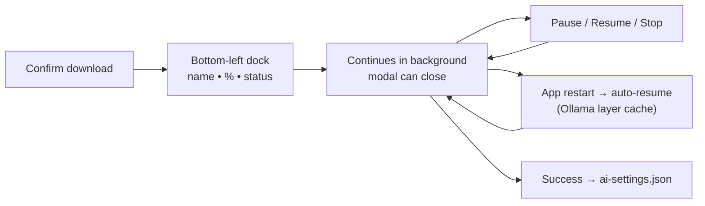

# Prompt 037 - Resumable AI Model Download with Global Progress Dock

Upgrade the Phase 2 **Ollama model download** from a modal-only, fire-and-forget pull
into a **persistent background download job** the user can pause, resume, or stop.
Progress stays visible in a **bottom-left dock** while the AI modal is closed; clicking
the dock reopens the AI modal with the active download banner at the top.

Builds on prompt **036** (AI setup modal, catalog, `OllamaPullClient`, disk gate,
`ai-settings.json`). Refactors download orchestration out of `MainWindow.AiSetup.cs`
into a dedicated coordinator service.

## Goal

After the user confirms a model download:

1. the pull **continues while the AI modal is closed**,
2. a **bottom-left progress dock** shows model name, determinate progress bar, and
   **percentage** when Ollama reports `completed` / `total`,
3. **Pause** cancels the active HTTP pull and saves job state; **Resume** starts a new
   pull for the same tag (Ollama reuses cached layers),
4. **Stop** cancels the pull and clears the job (user must confirm),
5. if the app is **force-quit** or crashes during download, the next launch **attempts
   to resume** the in-progress job automatically when Ollama is reachable,
6. clicking the dock **opens the AI modal**; when a job is active, a **download banner**
   appears at the **top of the modal content** (above system details) with the same
   progress plus **Pause / Resume / Stop** controls.

## Non-Goals (This Prompt)

- Cloud / online AI providers (prompt **038**),
- Using the downloaded model for CV features (prompt **039+**),
- Parallel downloads of multiple models,
- Byte-range HTTP resume independent of Ollama (Ollama layer cache is the resume
  mechanism),
- Removing partial Ollama blobs on Stop (Ollama owns on-disk model storage),
- Bundled Ollama installer,
- Download queue or scheduled/off-peak downloads,
- Notifications outside the main window (system tray / OS notifications),
- Wi‑Fi / metered-network warnings.

## Resume Model (Important)

Ollama does **not** expose a pause API. ReVitae implements user-facing pause/resume as:

| User action                 | Implementation                                                                                                                                      |
| --------------------------- | --------------------------------------------------------------------------------------------------------------------------------------------------- |
| **Pause**                   | Cancel current `POST /api/pull` HTTP stream via `CancellationToken`; persist job as `Paused` with last known `completed` / `total` / `status` text. |
| **Resume**                  | Issue a **new** `POST /api/pull` with the same `ollamaModelTag`. Ollama skips layers already on disk and continues — functionally a resume.         |
| **Stop**                    | Cancel HTTP if running; delete job file after user confirmation; do **not** call Ollama delete APIs in v1.                                          |
| **App killed mid-download** | Job file stays `Downloading`; startup shows dock, sets `Interrupted`, auto-resumes with backoff when Ollama is up.                                  |

**Progress nuance:** Ollama stream progress is **per layer**; `completed` / `total` may
reset or jump between layers. Persist the **latest** values from the stream; percent may
move backward briefly — acceptable in v1.

**Cancelled vs failed:** `OllamaPullOutcome.Cancelled` from user Pause/Stop must **not**
be treated as `Failed`. Only unexpected errors or non-success HTTP → `Failed`.

Document this behavior in code comments and [`docs/ai-setup.md`](../docs/ai-setup.md).

## Breaking Changes from Prompt 036 (Must Refactor)

Current `MainWindow.AiSetup.cs` ties pull lifetime to the modal:

- `SetAiSetupModalVisible(false)` calls `CancelAiSetupOperations()`, which cancels
  `_aiPullCts` and **aborts the download**.
- Opening the modal always calls `ResetAiSetupModalUi()` + full detection loader.

**037 requires:**

1. Split cancellation: **`CancelAiDetectionOnly()`** on modal close — never cancel the
   download coordinator's pull token.
2. When opening the modal while a download job is active, **skip** the full reset +
   detection loader; show the download banner first, bind existing coordinator state,
   then optionally offer **Refresh system info** (re-run detection below the banner).
3. Remove `_aiPullCts` and inline pull logic from `MainWindow.AiSetup.cs`; delegate to
   coordinator.

Update [`docs/ai-setup.md`](../docs/ai-setup.md) — remove the incorrect sentence that
closing the modal cancels download (036 behavior).

## Product Behavior

### Starting a download

Unchanged gates from prompt **036**:

- confirmation dialog (including oversized-model warning),
- disk-space check (`IDiskSpaceChecker`, same 1.1× rule),
- Ollama reachable.

On confirm:

1. Create / persist download job (see schema below),
2. Start pull via **`AiModelDownloadCoordinator`** (not tied to modal visibility),
3. Show global dock immediately (unless AI modal already open — see dock visibility),
4. User may close AI modal — download and dock remain.

### Global progress dock (bottom-left)

Add `AiDownloadDockOverlay` to `MainWindow.axaml` inside **`RootGrid`**, `Grid.RowSpan="2"`,
aligned **bottom-left**, **above the form/preview content** but **below modal overlays**
(`AiSetupModalOverlay`, intro, export, etc.) so modals stay usable.

**Visibility:**

| Condition                                            | Dock visible?                                                        |
| ---------------------------------------------------- | -------------------------------------------------------------------- |
| Job `Downloading`, `Paused`, `Interrupted`, `Failed` | Yes                                                                  |
| Job `Completed` (success dwell — see below)          | Yes, briefly (~4 s)                                                  |
| Job `Idle`, `Stopped`                                | No                                                                   |
| `IntroModalOverlay` visible                          | **No** (avoid noise on first run)                                    |
| `AiSetupModalOverlay` visible                        | **No** (banner in modal is the control surface; avoids duplicate UI) |

**Content:**

| Element          | Behavior                                               |
| ---------------- | ------------------------------------------------------ |
| Model short name | localized display name from `DisplayNameKey` / catalog |
| ProgressBar      | determinate when `TotalBytes > 0`, else indeterminate  |
| Percent text     | `{0}%` when computable; else localized `…`             |
| Status subtext   | truncated Ollama `statusText` when present             |

**Interaction:**

- **Click anywhere** on the dock → `SetAiSetupModalVisible(true)` (respect
  `IsBlockingOverlayOpen()` — no-op during intro/import progress),
- Tooltip: localized “AI model download — click for details”,
- Compact footprint (~max-width 320 px, margin 16 px from window edges); must not cover
  the export button or form primary actions.

**Accessibility:** `AutomationProperties.Name` includes model name + percent when known.

### Download complete dwell (success feedback)

When pull succeeds:

1. Coordinator → `Completed`; write `ai-settings.json`; keep dock visible,
2. Show **success state** in dock for **~4 seconds** (localized “Download complete”,
   progress bar at 100 %, subtle success styling — e.g. primary accent, no error red),
3. Then hide dock and delete `ai-download-job.json` (if not already deleted),
4. If user opens AI modal during dwell, banner shows same success state.

Do not require the user to open the modal to know the download finished.

### Header AI icon activity indicator

While a job is **`Downloading`** or **`Interrupted`** (recovering) and the AI modal is
**closed**, show a subtle indicator on `OpenAiSetupButton`:

- v1: small **badge dot** or **pulsing border** on the robot icon (pick one; keep
  accessible — badge included in `AutomationProperties.Name`: “AI model download in
  progress”),
- Hidden when modal is open (banner is enough) or when job is `Paused` / `Failed` /
  `Completed` dwell,
- Clicking the icon still opens the modal (same as today).

### AI modal download banner (top)

When coordinator has an active job (`Downloading`, `Paused`, `Interrupted`, `Failed`, or
`Completed` dwell), show **`AiSetupDownloadJobBanner`** as the **first** child inside
the modal content stack (above system-details card):

- same progress bar + percent + status as dock,
- **Pause** when `Downloading`,
- **Resume** when `Paused`, `Interrupted`, or `Failed` (Retry),
- **Stop** always (with confirm),
- inline error text when `Failed` or Ollama unreachable on recover.

Closing the modal via Escape / X does **not** pause or stop the job.

When no active job, banner hidden; normal 036 detection flow applies on open.

### Pause / Resume / Stop

| Control | When enabled                         | Effect                                                        |
| ------- | ------------------------------------ | ------------------------------------------------------------- |
| Pause   | `Downloading`                        | Cancel HTTP; state → `Paused`; persist job; dock updates      |
| Resume  | `Paused`, `Interrupted`, or `Failed` | Re-check disk space + Ollama; state → `Downloading`; new pull |
| Stop    | any active job state above           | Confirm; cancel HTTP; delete job file; coordinator → `Idle`   |

Stop confirm must warn that ReVitae job progress is discarded; Ollama may retain partial
layers on disk.

**Disk space during download:** if pull fails because free space dropped below threshold
mid-download, set `Failed` with `AiDownloadInsufficientDiskSpace` (reuse or alias 036
disk message). **Resume** re-runs disk check; only proceeds when space is sufficient.

### Startup recovery with exponential backoff

Hook from `MainWindow` after `InitializeComponent()` — **not** while `IntroModalOverlay`
is visible:

1. `AiDownloadJobStorage.TryLoad()` — if missing, or `Completed` / `Stopped`, no-op.
2. If state is **`Downloading`** (app was killed mid-pull):
   - show dock with last persisted percent,
   - set transient `Interrupted`,
   - attempt auto-resume with **exponential backoff** when Ollama is unreachable:
     delays **2 s → 5 s → 10 s** (max **3 attempts**), then → `Failed` with
     `AiDownloadOllamaRequired` + dock + **Resume** (Retry),
   - on first successful probe, call **Resume** immediately (same as manual Resume).
3. If state is **`Paused`** (user paused before exit):
   - show dock with last percent,
   - **do not** auto-resume; wait for user **Resume**.
4. If state is **`Failed`** from previous session:
   - show dock with error + **Resume** (Retry).

When intro overlay is dismissed later, run recovery if not yet attempted.

### Single job invariant

Only **one** download job at a time. While a job is active, disable **Download** on all
catalog cards until Stop completes or job reaches terminal success dwell.

## Architecture

### New / refactored components

```text
MainWindow
  ├─ AiDownloadDockOverlay (AXAML, bottom-left)
  ├─ MainWindow.AiDownload.cs (partial) — dock + banner + header badge UI
  └─ MainWindow.AiSetup.cs — start download via coordinator only

AiModelDownloadCoordinator (ReVitae.Core/Ai/Download/)
  ├─ StartAsync(AiModelCatalogEntry, requiresOversizedWarning)
  ├─ Pause()
  ├─ ResumeAsync()
  ├─ StopAsync() / ClearJob()
  ├─ TryRecoverOnStartupAsync()  // backoff + Ollama probe
  └─ SnapshotChanged event (AiDownloadJobSnapshot)

AiDownloadJobStorage (Core) — atomic writes
  └─ ReVitaeLocalDataPaths.GetAiDownloadJobFilePath()
     → %LocalAppData%/ReVitae/ai-download-job.json

IOllamaPullClient (extract from OllamaPullClient)
AiDownloadProgress (Core static helper — percent)
```

**Separation:** coordinator, storage, and pull abstraction live in **Core** (no Avalonia).
`MainWindow` partials subscribe to `SnapshotChanged` and marshal updates to the UI thread.

Add to `ReVitaeLocalDataPaths`:

```csharp
public static string GetAiDownloadJobFilePath() =>
    Path.Combine(GetReVitaeRootDirectory(), "ai-download-job.json");
```

### Atomic job file persistence

`AiDownloadJobStorage.Save()` must use **write-to-temp-then-rename**:

1. Write JSON to `ai-download-job.json.tmp` in the same directory,
2. `File.Move(tmp, path, overwrite: true)` (or platform-safe equivalent),
3. On read failure (corrupt JSON), treat as **no job** and optionally quarantine bad file
   to `ai-download-job.json.bak` (log-free; test with corrupt fixture).

Throttle progress saves to **≤ 2 writes/s**; always flush immediately on state
transitions (Pause, Failed, Completed, Stop).

### Job file schema (`ai-download-job.json`)

```json
{
  "jobId": "8f3c2e1a-...",
  "selectedModelId": "llama31-8b",
  "ollamaModelTag": "llama3.1:8b-instruct",
  "displayNameKey": "aiModel.llama31_8b.name",
  "state": "Downloading",
  "requiresOversizedWarning": false,
  "completedBytes": 2147483648,
  "totalBytes": 4724464025,
  "statusText": "downloading",
  "errorMessageKey": null,
  "startedAtUtc": "2026-05-21T10:00:00Z",
  "lastUpdatedAtUtc": "2026-05-21T10:05:00Z"
}
```

```csharp
public enum AiDownloadJobState
{
    Idle = 0,
    Downloading = 1,
    Paused = 2,
    Interrupted = 3,   // transient: startup detected unclean shutdown
    Completed = 4,
    Failed = 5,
    Stopped = 6,
}

public sealed record AiDownloadJobSnapshot(
    Guid JobId,
    string SelectedModelId,
    string OllamaModelTag,
    string DisplayNameKey,
    AiDownloadJobState State,
    bool RequiresOversizedWarning,
    long? CompletedBytes,
    long? TotalBytes,
    string? StatusText,
    DateTimeOffset StartedAtUtc,
    DateTimeOffset LastUpdatedAtUtc,
    string? ErrorMessageKey);
```

On **`Completed`**: write `ai-settings.json` via existing `AiSettingsStorage`, show success
dwell, then **delete** `ai-download-job.json`.

On **`Stopped`**: delete job file (terminal).

On **`Failed`**: keep job file until user Resume or Stop (enables Retry after restart).

### Progress percent

```csharp
public static int? TryGetPercent(long? completedBytes, long? totalBytes)
{
    if (completedBytes is null or < 0 || totalBytes is null or <= 0)
    {
        return null;
    }

    return (int)Math.Clamp(completedBytes.Value * 100 / totalBytes.Value, 0, 100);
}
```

### Coordinator state machine

Map `OllamaPullOutcome`:

| Outcome     | Context    | New state   |
| ----------- | ---------- | ----------- |
| `Succeeded` | —          | `Completed` |
| `Cancelled` | user Pause | `Paused`    |
| `Cancelled` | user Stop  | `Stopped`   |
| `Failed`    | —          | `Failed`    |

## UI Structure (AXAML)

Remove or hide legacy `AiSetupPullProgressBar` in modal footer when coordinator owns
progress (banner + dock).

## Localization

Add keys (EN + SK). Register in `TranslationKeys.RequiredKeys`.

| Key constant                      | Key string                         | Example EN                                                                             |
| --------------------------------- | ---------------------------------- | -------------------------------------------------------------------------------------- |
| `AiDownloadDockTooltip`           | `aiDownload.dockTooltip`           | AI model download — click for details                                                  |
| `AiDownloadBannerTitle`           | `aiDownload.bannerTitle`           | Downloading {0}                                                                        |
| `AiDownloadBannerPaused`          | `aiDownload.bannerPaused`          | Download paused — {0}                                                                  |
| `AiDownloadPercent`               | `aiDownload.percent`               | {0}%                                                                                   |
| `AiDownloadPercentUnknown`        | `aiDownload.percentUnknown`        | …                                                                                      |
| `AiDownloadPause`                 | `aiDownload.pause`                 | Pause                                                                                  |
| `AiDownloadResume`                | `aiDownload.resume`                | Resume                                                                                 |
| `AiDownloadStop`                  | `aiDownload.stop`                  | Stop download                                                                          |
| `AiDownloadStopConfirm`           | `aiDownload.stopConfirm`           | Stop downloading {0}? Progress will be lost in ReVitae; Ollama may keep partial files. |
| `AiDownloadResumeOnStartup`       | `aiDownload.resumeOnStartup`       | Resuming model download…                                                               |
| `AiDownloadOllamaRequired`        | `aiDownload.ollamaRequired`        | Start Ollama to continue the download.                                                 |
| `AiDownloadFailed`                | `aiDownload.failed`                | Download failed.                                                                       |
| `AiDownloadCompleted`             | `aiDownload.completed`             | Download complete.                                                                     |
| `AiDownloadRefreshSystem`         | `aiDownload.refreshSystem`         | Refresh system info                                                                    |
| `AiDownloadInsufficientDiskSpace` | `aiDownload.insufficientDiskSpace` | Not enough free disk space to continue. Free space and try again.                      |
| `AiDownloadHeaderInProgress`      | `aiDownload.headerInProgress`      | AI model download in progress                                                          |

## Tests (Required — Edge Case Matrix)

Add under `tests/ReVitae.Tests/Ai/Download/`. **No real Ollama or network in CI** —
use `FakeOllamaPullClient`, fake disk checker, fake Ollama probe, temp job directories.

Target: **~25–40 focused tests**; full suite must stay green.

### Storage & persistence

| Test                                                         | Assert                                                                     |
| ------------------------------------------------------------ | -------------------------------------------------------------------------- |
| `AiDownloadJobStorage_RoundTrips`                            | all fields survive JSON cycle                                              |
| `AiDownloadJobStorage_AtomicWrite_NoPartialFileOnCrash`      | simulate exception mid-write → original or absent, never corrupt main file |
| `AiDownloadJobStorage_CorruptFile_ReturnsNullAndQuarantines` | `.bak` or delete; coordinator idle                                         |
| `AiDownloadJobStorage_ThrottlesProgressWrites`               | ≤ 2 saves/sec under rapid progress spam                                    |
| `AiDownloadJobStorage_FlushesImmediatelyOnStateChange`       | Pause/Failed/Completed always persisted                                    |

### Progress & coordinator core

| Test                                                | Assert                                               |
| --------------------------------------------------- | ---------------------------------------------------- |
| `TryGetPercent_ComputesAndClamps`                   | 0, 100, null total, negative guard                   |
| `TryGetPercent_HandlesLayerReset`                   | completed drops → percent recalculates without throw |
| `Coordinator_Pause_MapsCancelledToPaused`           | not Failed                                           |
| `Coordinator_Stop_MapsCancelledToStopped`           | job file deleted                                     |
| `Coordinator_Resume_IssuesSecondPull`               | same tag, two HTTP calls                             |
| `Coordinator_Resume_RechecksDiskSpace`              | blocks when insufficient                             |
| `Coordinator_Resume_AllowedAfterDiskSpaceRecovered` | succeeds when space returns                          |
| `Coordinator_Failed_KeepsJobForRetry`               | job file + Failed state                              |
| `Coordinator_Completing_WritesAiSettings`           | settings updated, job deleted after dwell hook       |
| `Coordinator_Start_BlockedWhenJobActive`            | second start rejected                                |
| `Coordinator_ProgressUpdates_RaiseSnapshotChanged`  | subscribers receive ordered snapshots                |

### Startup recovery & backoff

| Test                                                                 | Assert                                     |
| -------------------------------------------------------------------- | ------------------------------------------ |
| `Coordinator_StartupRecover_AutoResumesDownloading`                  | Ollama up → pull starts                    |
| `Coordinator_StartupRecover_DoesNotAutoResumePaused`                 | Paused stays Paused                        |
| `Coordinator_StartupRecover_BackoffRetriesOllama`                    | probe fails 2× then succeeds → pull on 3rd |
| `Coordinator_StartupRecover_BackoffExhausted_SetsFailed`             | 3 failures → Failed + OllamaRequired key   |
| `Coordinator_StartupRecover_FailedJobFromPreviousSession_ShowsRetry` | Failed persisted                           |

### Pull outcomes & errors

| Test                                                          | Assert                 |
| ------------------------------------------------------------- | ---------------------- |
| `Coordinator_PullHttpError_SetsFailed`                        | non-2xx → Failed       |
| `Coordinator_PullException_SetsFailed`                        | network error → Failed |
| `Coordinator_DiskSpaceFailureMidPull_SetsInsufficientDiskKey` | Failed + disk key      |
| `Coordinator_OllamaPullCancelled_NotTreatedAsFailedOnPause`   | explicit Pause path    |

### UI / integration (lightweight — no full Avalonia UI test suite required)

| Test                                                                   | Assert                                  |
| ---------------------------------------------------------------------- | --------------------------------------- |
| `AiDownloadUiStateMapper_DockHiddenWhenModalOpen`                      | visibility rules                        |
| `AiDownloadUiStateMapper_DockHiddenDuringIntro`                        | visibility rules                        |
| `AiDownloadUiStateMapper_HeaderBadgeOnlyWhenDownloadingAndModalClosed` | badge rules                             |
| `AiDownloadUiStateMapper_CompletedDwellDuration`                       | ~4 s before hide (use injectable clock) |

Optional: one manual QA checklist in `docs/ai-setup.md` (modal close, force-quit, pause).

## Documentation Updates (Required — README Is the Showcase)

Documentation for this feature is **product-facing**, not an afterthought. The README
is ReVitae’s **vitrina** — AI download resilience should be visible **early** and
described with the same prominence as import/export.

### [`README.md`](../README.md) — mandatory structure changes

1. **Move / expand AI content** into a dedicated top-level section **`## Local AI —
download that survives interruptions`** placed **immediately after `## Why ReVitae`**
   and **before `## Current Highlights`** (or as the **first subsection** under Current
   Highlights if you keep one block — prefer standalone section for visibility).

2. Include a **short hero paragraph** (2–3 sentences) explaining the user benefit in plain
   language — not implementation jargon.

3. Add a **mermaid or ASCII flow** for the download lifecycle:



Also include in README:

- Bullet **key guarantees** (use checkmarks or bold lead-ins):
  - **Background download** — close the AI modal; progress stays in the corner.
  - **Pause and resume** — stop the stream safely; Ollama continues from cached layers.
  - **Survives restarts** — force-quit or crash; ReVitae picks up on next launch.
  - **Local-only** — no cloud; detection and files stay on your device.
  - **11 curated models** — link to [`docs/ai-setup.md`](../docs/ai-setup.md).
- Update the **test badge** count after adding tests.
- Update prompts map to **`001–037`**.
- Keep a shorter AI bullet under Current Highlights that links to the new section
  (avoid duplicate prose).

**Example hero copy (adapt, do not paste blindly):**

> ReVitae helps you bring a local AI model onto your machine without babysitting a
> modal. Start a download from the **AI setup** panel, keep editing your CV, pause for
> lunch, or close the app — when you return, the bottom-left progress dock and automatic
> recovery pick up where Ollama left off.

### [`docs/ai-setup.md`](../docs/ai-setup.md) — full rewrite of download sections

Replace the 036 “Download flow” / “You can close the modal… requests are cancelled”
with:

| Section                        | Content                                            |
| ------------------------------ | -------------------------------------------------- |
| **Background download & dock** | What the dock shows; click to open modal           |
| **Pause, resume, stop**        | User actions + Ollama layer resume explanation     |
| **After restart**              | Auto-resume vs paused; backoff when Ollama is down |
| **Download complete**          | 4 s success state in dock                          |
| **Header indicator**           | Robot icon badge while downloading                 |
| **Job files**                  | `ai-download-job.json` + `ai-settings.json` roles  |
| **Disk space errors**          | Mid-download and on resume                         |
| **Troubleshooting**            | Ollama not running, corrupt job file, Retry        |
| **Manual QA checklist**        | 8–10 steps for release verification                |

Cross-link prompt **037** and **036**.

### [`CHANGELOG.md`](../CHANGELOG.md)

Unreleased **Added** entry: resumable download coordinator, dock, pause/resume/stop,
startup backoff, atomic job file, header badge, success dwell, edge-case test matrix.

### [`docs/concept.md`](../docs/concept.md)

One paragraph under Phase 2: background resumable local model download implemented (037).

### [`prompts/036-ai-setup-modal-system-detection.md`](036-ai-setup-modal-system-detection.md)

Note: inline modal pull superseded by **037** coordinator.

## Out of Scope (Follow-Up Prompts)

- **038** — Cloud provider (OpenAI-compatible) configuration,
- **039** — First AI feature (improve work description / quality hint assist),
- **040** — AI-assisted import fallback,
- Explicit Ollama model delete on Stop,
- Download bandwidth throttling,
- Multiple queued downloads.

## Acceptance Criteria

1. Closing the AI modal **does not cancel** an in-progress download.
2. **Bottom-left dock** during active/failed/paused jobs; hidden during intro and while
   AI modal is open; **~4 s success dwell** after complete.
3. Dock shows model name, progress bar, and **percent** when Ollama reports totals.
4. Clicking dock opens AI modal with download banner at **top**.
5. **Pause** → `Paused`; **Resume** → new pull + disk recheck; **Stop** → confirm + clear.
6. Force-quit during `Downloading`: next start **auto-resumes with backoff**; `Paused`
   does not auto-resume.
7. **`Failed`** keeps job file; dock + Retry; disk-full uses dedicated message key.
8. **Atomic job file** writes; corrupt file does not crash app.
9. **Header robot badge** while downloading and modal closed.
10. On success, `ai-settings.json` written; job file removed after dwell.
11. Single active job enforced.
12. **Edge-case test matrix** implemented (~25+ tests).
13. **README showcase section** and **docs/ai-setup.md** updated per spec above.
14. `./scripts/format-cs.sh`, `npm run lint`, and `./scripts/test.sh` pass.

## Suggested Implementation Order

1. Core: job types, **atomic** storage, percent helper, `GetAiDownloadJobFilePath()`,
2. Extract `IOllamaPullClient`; refactor existing pull tests,
3. `AiModelDownloadCoordinator` (backoff, disk failure, dwell timer abstraction),
4. Edge-case unit tests for coordinator + storage (iterate until matrix green),
5. Refactor `MainWindow.AiSetup.cs` (detection-only cancel),
6. `MainWindow.AiDownload.cs` + dock + banner + header badge,
7. Startup recovery + intro-dismiss hook,
8. Localization,
9. **Documentation pass** (README showcase first, then ai-setup.md, CHANGELOG, concept),
10. Remove legacy modal pull UI.

## Expected Result

ReVitae offers a **trustworthy local AI onboarding experience**: large models download
in the background, progress is always visible, pause/resume/stop behave predictably,
crashes do not silently lose work, and the **README presents this as a flagship Phase 2
capability** — not a hidden developer feature.
