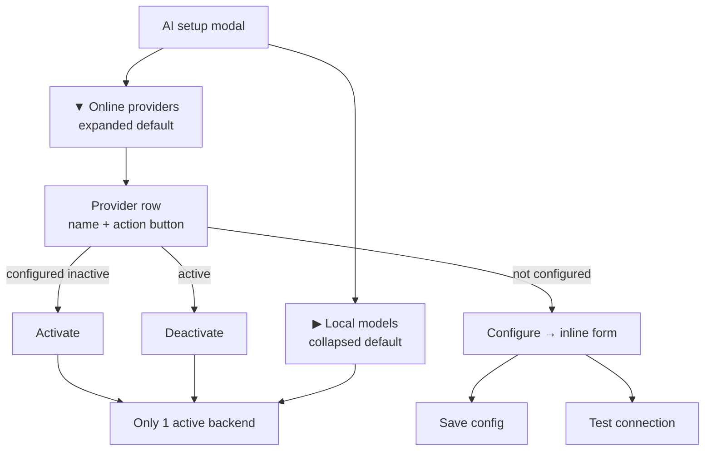
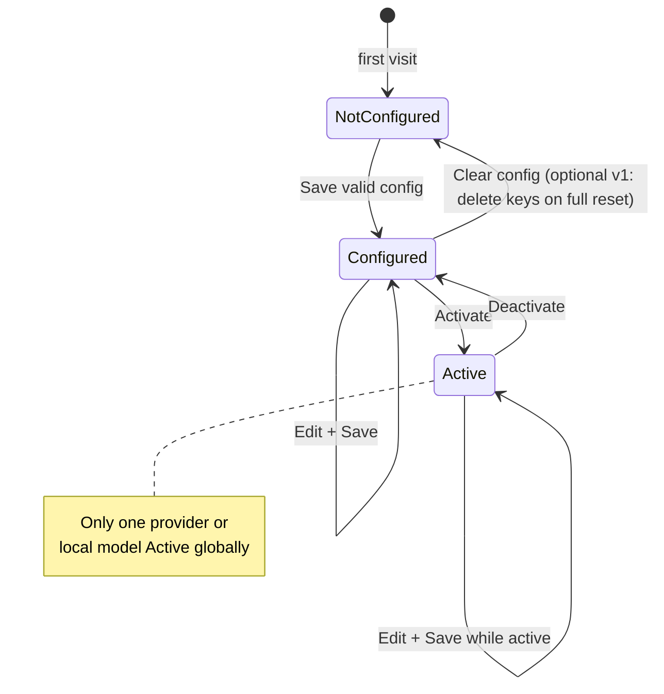

# Prompt 038 - AI Provider List, Configure Forms, and Single Active Backend

Restructure the **AI setup** modal into two collapsible sections and introduce a
**unified active-backend model**: at most **one** AI source (local Ollama model **or**
online provider) may be **active** at a time.

The **online** section is a flat list of supported cloud/remote providers. Each row
shows the provider name and a single action button:

- **Configure** — when the provider is not configured, or the user wants to edit settings,
- **Activate** — when configured but inactive,
- **Deactivate** — when this provider is the active backend.

Clicking **Configure** reveals an inline configuration form for that provider. After
required fields are filled, **Save** and **Test** become available.

Builds on prompts **036** (AI setup modal, catalog, detection) and **037**
(resumable download, dock, model lifecycle). Does **not** call AI on CV content yet
(that is prompt **039+**).

## Goal

1. **Local models** section is an **expander**, **collapsed by default**.
2. **Online providers** section is an **expander**, **expanded by default**.
3. Online section lists curated providers; each row has **Configure** or
   **Activate** / **Deactivate**.
4. **Exactly one** active AI backend globally — local model **or** one online provider.
5. **Configure** opens a provider-specific form with required attributes; **Save**
   persists config; **Test** verifies connectivity.
6. API keys stored securely (never plain text in `ai-settings.json`).
7. Privacy notice visible in the online section.
8. **Active backend summary** at the top of the modal (when not obscured by download banner).
9. Provider rows show **descriptions**, optional **free tier** badges, and **last test** status.
10. **Azure OpenAI** as a first-class enterprise preset; **Custom** documents self-hosted endpoints.

## Non-Goals (This Prompt)

- Using AI for CV rewrite, import extraction, or quality hints (**039+**),
- Streaming chat UI,
- Usage metering / billing,
- Automatic provider failover chains,
- OAuth browser flows (API key only in v1),
- Changing download dock behavior from **037**,
- Removing or replacing the local model download flow,
- Together AI, xAI Grok, Cohere as separate presets (use **OpenRouter** or **Custom** instead),
- Wi‑Fi / metered-network warnings before online Test or Activate.

## Product Behavior

### Modal layout

```text
┌─ AI setup ─────────────────────────────────────────────┐
│  [Download banner when job active — unchanged from 037] │
│  [Active AI: Google Gemini (gemini-2.0-flash)  Edit]   │
│                                                         │
│  ▶ Local models                    (collapsed default)  │
│  ┌─ when expanded ───────────────────────────────────┐  │
│  │  System details, recommended card, model catalog   │  │
│  │  (existing 036/037 content)                        │  │
│  │  Local rows: status + Download / Remove / Activate │  │
│  └────────────────────────────────────────────────────┘  │
│                                                         │
│  ▼ Online providers                (expanded default)   │
│  ┌─ privacy banner ──────────────────────────────────┐  │
│  │  CV text may be sent to the provider when active.  │  │
│  └────────────────────────────────────────────────────┘  │
│  OpenAI          [ Configure ]                            │
│  Anthropic       [ Activate ]  ← configured, inactive   │
│  Google Gemini   [ Deactivate ] ← active                │
│  Groq            [ Configure ]                            │
│  …                                                      │
└─────────────────────────────────────────────────────────┘
```



### Active backend summary strip

When no download banner occupies the top slot, show a compact **Active AI** strip
below the modal title:

| Active state | Strip content                                                                   |
| ------------ | ------------------------------------------------------------------------------- |
| `None`       | “No AI selected — configure a provider or activate a local model.” (muted)      |
| `Local`      | “Active: {model name} (local)” + link **Change** (scroll/focus local expander)  |
| `Online`     | “Active: {provider name} · {modelId}” + link **Edit** (open that provider form) |

Strip updates immediately on Activate / Deactivate / Save. Hidden when download
banner is visible (banner takes priority).

### Provider state machine



### Expander behavior

| Section              | Default state | Content                           |
| -------------------- | ------------- | --------------------------------- |
| **Local models**     | Collapsed     | Full 036/037 local flow unchanged |
| **Online providers** | Expanded      | Provider list + configure forms   |

- Expander headers are localized and keyboard-accessible.
- Opening one section does **not** auto-close the other (both may be open).
- When a **download job** is active, local expander may auto-expand or show a hint
  badge — optional; do not block online configuration.

### Provider list (online section)

**Display order** (top → bottom): OpenAI, Anthropic, Google Gemini, Groq, Azure OpenAI,
Mistral, DeepSeek, OpenRouter, Custom (OpenAI-compatible). Popular/free options appear
higher in the list.

Each row is a **horizontal card** or list item:

| Column / area  | Content                                                          |
| -------------- | ---------------------------------------------------------------- |
| Provider name  | Localized display name                                           |
| Subtitle       | One-line localized description (`DescriptionKey`)                |
| Badges         | Optional `Free tier` chip; `Last test: OK` / `Last test: failed` |
| Status chip    | `Not configured` / `Configured` / `Active`                       |
| Primary action | **Configure**, **Activate**, or **Deactivate** (see rules below) |
| Secondary      | **Edit** link when configured or active                          |

**Free tier badge** (informational only, no billing integration) on:

| Provider      | Badge text (EN)       | Note                                    |
| ------------- | --------------------- | --------------------------------------- |
| Google Gemini | Free tier available   | Link to Google AI Studio in description |
| Groq          | Free tier available   | Rate limits apply                       |
| OpenRouter    | Free models available | Some models are $0 on OpenRouter        |

**Last test status:** after Test or Save+Test, show timestamp + success/fail on the row
even when form is collapsed. Failed test does **not** block Save; see Activate warning below.

**Action button rules:**

| Provider state                            | Button label                               | Click behavior                                                     |
| ----------------------------------------- | ------------------------------------------ | ------------------------------------------------------------------ |
| No saved config (missing required fields) | **Configure**                              | Expand inline form (collapse other open forms)                     |
| Config saved, not active                  | **Activate**                               | Set as active backend; deactivate any other                        |
| Config saved, user wants to edit          | **Configure** (secondary link or same row) | Expand form; row still shows **Activate** when form closed         |
| Currently active                          | **Deactivate**                             | Clear active flag; no provider active until user activates another |

**v1 simplification:** one primary button per row following priority:

1. If **active** → show **Deactivate** only (plus a text link **Edit** or small
   **Configure** icon that opens the form without deactivating).
2. Else if **not configured** → **Configure**.
3. Else → **Activate** (+ **Configure** as secondary **Edit** link).

Recommended UX: active row shows `[ Deactivate ]  Edit`.

### Configure form (inline expand)

Clicking **Configure** / **Edit** expands a panel **directly under that row**
(collapse any other open provider form).

**Form contents:**

- Provider-specific fields (see catalog below),
- Inline validation for required fields,
- **Save** — persists config to secure storage + non-secret fields to
  `ai-settings.json`; disabled until all required fields valid,
- **Test** — calls provider test endpoint; disabled until required fields valid
  (may run against unsaved draft values in memory before Save, or require Save first —
  **prefer: Test works on current form values without Save**, then Save on success is
  encouraged),
- **Cancel** — collapses form without saving draft,
- Success/error message area below buttons.

**Test behavior:**

- Send minimal non-PII prompt (e.g. “Reply with exactly OK”) via the provider adapter,
- Show localized success or error (HTTP status, auth failure, model not found),
- Do **not** send CV data during Test,
- Timeout **30 s**; disable button while in flight,
- Map common HTTP codes to friendly keys: `401/403` → invalid API key; `404` → model or
  deployment not found; `429` → rate limited; `5xx` → provider unavailable,
- On success: set `LastTestedAtUtc` + `LastTestSucceeded = true` on config (persist on Save or auto-save test metadata).

**Save behavior:**

- Validate all required fields,
- Write secrets to secure storage, non-secrets to `ai-settings.json`,
- Keep form open after Save with success message; do not auto-Activate,
- Mark row as **Configured**.

### Single active backend

**Invariant:** `ActiveAiBackend` is exactly one of:

- `Local` + `selectedModelId` (Ollama model installed and chosen), **or**
- `Online` + `providerId`, **or**
- `None` (nothing active — allowed after Deactivate).

**Activate local model:**

- Requires model **installed** in Ollama (existing lifecycle check),
- Deactivates any online provider,
- Persists active mode in settings.

**Activate online provider:**

- Requires provider **configured** (required fields saved),
- If `LastTestSucceeded != true`, show **soft warning** dialog before Activate:
  “Connection has not been tested successfully. Activate anyway?” — **Cancel** / **Activate anyway**,
- Deactivates local active model selection (does not uninstall Ollama models),
- If local download job is **in progress**, allow activation but show non-blocking
  info: “Download continues in background; active AI is online.”

**Deactivate online provider:**

- Sets `ActiveBackend = None` (not delete config),
- User can re-activate same provider without re-entering key if config was saved.

**Clear provider config** (optional **Reset** in form footer):

- Removes non-secret config + stored API key for that provider only,
- If that provider was active, deactivate first or auto-deactivate on clear,
- Confirm: “Remove saved configuration for {provider}?”

**Switching active backend** (local ↔ online or online ↔ online):

- Confirm dialog: “Switch active AI from {A} to {B}? {Privacy hint if online involved}”
- On confirm: deactivate old, activate new.

### Local section integration

Existing model cards gain an **Activate** button when:

- Model is **installed** (`AiModelInstallationStatus.Installed`),
- Model is not the current active local backend.

Active local model row shows **Active** chip + **Deactivate** (same global rules).

Local **Download** / **Remove** / **Clean stale** from **037** remain unchanged.

When local model is active, online rows show **Configured/Activate** states but none
marked **Active**.

### Header robot icon (active backend hint)

When AI modal is **closed** and a backend is active:

| Active          | Header indicator                                                                                                 |
| --------------- | ---------------------------------------------------------------------------------------------------------------- |
| Local model     | Existing download badge rules from **037** unchanged; if idle + local active, subtle **green dot** on robot icon |
| Online provider | **Blue dot** on robot icon; tooltip “Active AI: {provider}”                                                      |
| None            | No dot                                                                                                           |

Do not show both download-progress badge and active-online dot conflicting — download
badge wins while job is `Downloading` / `Interrupted`.

## Provider Catalog (v1)

Define `AiOnlineProviderCatalog` in Core — static list, no network.

### Two-layer API architecture

| Layer                 | Adapters                                                 | Covers                                                     |
| --------------------- | -------------------------------------------------------- | ---------------------------------------------------------- |
| **OpenAI-compatible** | `OpenAiCompatibleClient`                                 | OpenAI, Groq, Mistral, DeepSeek, OpenRouter, Azure, Custom |
| **Native**            | `AnthropicMessagesClient`, `GeminiGenerateContentClient` | Anthropic, Google Gemini                                   |

**OpenRouter** is the recommended **catch-all** for models not listed as presets (Claude
via OpenRouter, Llama variants, experimental models) without adding new provider rows.

**Custom (OpenAI-compatible)** preset helper text must mention common self-hosted URLs:

| Service         | Example base URL            |
| --------------- | --------------------------- |
| LM Studio       | `http://127.0.0.1:1234/v1`  |
| LocalAI         | `http://127.0.0.1:8080/v1`  |
| Ollama (remote) | `http://127.0.0.1:11434/v1` |
| vLLM            | `http://127.0.0.1:8000/v1`  |

User supplies API key if the endpoint requires one (Ollama often uses a dummy key).

### Catalog table

| `ProviderId`    | Display name               | API style              | Default base URL                                   | Example models (dropdown)                               | Free tier badge |
| --------------- | -------------------------- | ---------------------- | -------------------------------------------------- | ------------------------------------------------------- | --------------- |
| `openai`        | OpenAI                     | OpenAI-compatible      | `https://api.openai.com/v1`                        | `gpt-4o-mini`, `gpt-4o`                                 | no              |
| `anthropic`     | Anthropic                  | Anthropic Messages     | `https://api.anthropic.com`                        | `claude-sonnet-4-20250514`, `claude-3-5-haiku-20241022` | no              |
| `google-gemini` | Google Gemini              | Gemini generateContent | `https://generativelanguage.googleapis.com/v1beta` | `gemini-2.0-flash`, `gemini-2.5-pro-preview-03-25`      | yes             |
| `groq`          | Groq                       | OpenAI-compatible      | `https://api.groq.com/openai/v1`                   | `llama-3.3-70b-versatile`, `mixtral-8x7b-32768`         | yes             |
| `azure-openai`  | Azure OpenAI               | OpenAI-compatible      | _(empty — user resource URL)_                      | _(deployment name drives model)_                        | no              |
| `mistral`       | Mistral AI                 | OpenAI-compatible      | `https://api.mistral.ai/v1`                        | `mistral-small-latest`, `open-mistral-nemo`             | no              |
| `deepseek`      | DeepSeek                   | OpenAI-compatible      | `https://api.deepseek.com/v1`                      | `deepseek-chat`                                         | no              |
| `openrouter`    | OpenRouter                 | OpenAI-compatible      | `https://openrouter.ai/api/v1`                     | `openai/gpt-4o-mini`, `anthropic/claude-3.5-sonnet`     | yes             |
| `custom-openai` | Custom (OpenAI-compatible) | OpenAI-compatible      | _(empty — user required)_                          | _(free text)_                                           | no              |

### Field schema per provider

Use a small declarative schema (`AiProviderFieldDefinition`) driving both validation
and AXAML/code generation.

| Field id         | Type        | Providers                                                 | Required                                                   |
| ---------------- | ----------- | --------------------------------------------------------- | ---------------------------------------------------------- |
| `apiKey`         | password    | all                                                       | yes (Custom: optional if endpoint has no auth — show hint) |
| `baseUrl`        | url         | custom-openai, azure-openai; optional override for others | custom + azure: yes; others: no (advanced collapse)        |
| `modelId`        | select+text | all except azure                                          | yes                                                        |
| `deploymentName` | text        | azure-openai                                              | yes (used as model path segment)                           |
| `apiVersion`     | text        | azure-openai                                              | no (default `2024-08-01-preview`)                          |
| `organizationId` | text        | openai                                                    | no                                                         |

**Model picker UX:** dropdown of `SuggestedModels` + **Custom model ID…** option that
reveals a text field. Persist whatever the user selected.

**Anthropic-specific:** map to `x-api-key` header + `/v1/messages` (not chat/completions).

**Gemini-specific:** map to `?key=` or header per Google API; use `generateContent`.

**Azure OpenAI-specific:** build URL as
`{baseUrl}/openai/deployments/{deploymentName}/chat/completions?api-version={apiVersion}`;
`apiKey` header `api-key`.

**Custom OpenAI-compatible:** require `baseUrl` + `modelId`; show self-hosted examples
in form helper text.

Advanced section (collapsed): optional `baseUrl` override for any OpenAI-compatible preset.

### Recommended models for future CV features (039+ reference)

Not enforced in **038** — document in provider descriptions / docs for user guidance:

| ReVitae use case (039+)         | Suggested models                                      | Why                              |
| ------------------------------- | ----------------------------------------------------- | -------------------------------- |
| Work description rewrite        | `gpt-4o-mini`, `claude-3-5-haiku`, `gemini-2.0-flash` | Fast, cheap, good prose          |
| Import / structure extraction   | `gpt-4o`, `claude-sonnet-4`, `llama-3.3-70b` (Groq)   | Stronger JSON/structure fidelity |
| Quality hints                   | `gpt-4o-mini`, `mistral-small-latest`                 | Short responses, low latency     |
| Long CV (full document context) | `gemini-2.0-flash`, `gpt-4o`                          | Large context windows            |

Implement as non-blocking hint text under the model picker: “Good for: quick edits” vs
“Good for: import assist (039+)”.

## Architecture

### New Core types

```csharp
public enum AiBackendKind
{
    None = 0,
    Local = 1,
    Online = 2,
}

public sealed record AiOnlineProviderDefinition(
    string Id,
    string DisplayNameKey,
    string DescriptionKey,
    AiOnlineApiStyle ApiStyle,
    string? DefaultBaseUrl,
    IReadOnlyList<AiProviderFieldDefinition> Fields,
    IReadOnlyList<AiProviderModelOption> SuggestedModels);

public enum AiOnlineApiStyle
{
    OpenAiCompatible,
    AnthropicMessages,
    GeminiGenerateContent,
}

public sealed record AiProviderConnectionConfig(
    string ProviderId,
    string ModelId,
    string? BaseUrl,
    string? OrganizationId,
    string? DeploymentName,
    string? ApiVersion,
    DateTimeOffset? LastTestedAtUtc,
    bool? LastTestSucceeded);

public sealed record AiSettingsSnapshotV2(
    AiBackendKind ActiveBackend,
    string? ActiveLocalModelId,
    string? ActiveOnlineProviderId,
    LocalAiSettings? Local,
    IReadOnlyDictionary<string, AiProviderConnectionConfig> OnlineProviders);
```

**Migration:** if existing v1 `AiSettingsSnapshot` (local only) exists on load, map to
v2 with `ActiveBackend = Local` and preserve model ids.

### Secure credential storage

```text
ai-settings.json          → non-secret config only (provider id, model, base URL, timestamps)
ai-secrets.json (encrypted) OR OS keychain → api keys per providerId
```

**v1 minimum:** encrypted file at `%LocalAppData%/ReVitae/ai-secrets.enc` with
DPAPI (Windows) / Keychain (macOS) / protected file (Linux fallback). Never log keys.
Never include keys in test failure messages.

### Services

```text
AiOnlineProviderCatalog        — static definitions
AiProviderConfigStorage        — load/save connection configs + secrets
AiProviderConnectionTester     — TestAsync(providerId, draftConfig)
AiActiveBackendService         — GetActive / ActivateLocal / ActivateOnline / Deactivate
IChatCompletionClient          — minimal interface for 038 Test + future 039 completions
  ├─ OpenAiCompatibleClient
  ├─ AnthropicMessagesClient
  └─ GeminiGenerateContentClient
AiProviderTestPrompt           — constant neutral test message (no PII)
```

`IChatCompletionClient` in **038** implements only `CompleteAsync` for Test; full
streaming and tool calls are **039+**.

UI subscribes to `ActiveBackendChanged` and refreshes row buttons.

### UI files

```text
MainWindow.axaml
  ├─ AiSetupLocalModelsExpander   (IsExpanded=false by default)
  └─ AiSetupOnlineProvidersExpander (IsExpanded=true by default)
       └─ ItemsControl / dynamic rows from catalog

MainWindow.AiProviders.cs (new partial)
  ├─ Build provider rows
  ├─ Toggle configure panel
  ├─ Save / Test / Activate / Deactivate handlers
  └─ Confirm switch dialog
```

Refactor minimal logic out of `MainWindow.AiSetup.cs`; keep download code in
`MainWindow.AiDownload.cs`.

## Localization

Add keys (EN + SK). Register in `TranslationKeys.RequiredKeys`.

| Key                                | Example EN                                                                                                   |
| ---------------------------------- | ------------------------------------------------------------------------------------------------------------ |
| `AiSetupLocalModelsSection`        | Local models                                                                                                 |
| `AiSetupOnlineProvidersSection`    | Online providers                                                                                             |
| `AiSetupProviderConfigure`         | Configure                                                                                                    |
| `AiSetupProviderActivate`          | Activate                                                                                                     |
| `AiSetupProviderDeactivate`        | Deactivate                                                                                                   |
| `AiSetupProviderEdit`              | Edit                                                                                                         |
| `AiSetupProviderNotConfigured`     | Not configured                                                                                               |
| `AiSetupProviderConfigured`        | Configured                                                                                                   |
| `AiSetupProviderActive`            | Active                                                                                                       |
| `AiSetupProviderSave`              | Save                                                                                                         |
| `AiSetupProviderTest`              | Test                                                                                                         |
| `AiSetupProviderTestSuccess`       | Connection successful.                                                                                       |
| `AiSetupProviderTestFailed`        | Connection failed: {0}                                                                                       |
| `AiSetupProviderSwitchConfirm`     | Switch active AI from {0} to {1}?                                                                            |
| `AiSetupOnlinePrivacyNote`         | When an online provider is active, text you send to AI features may be processed on that provider's servers. |
| `AiSetupActiveAiNone`              | No AI selected — configure a provider or activate a local model.                                             |
| `AiSetupActiveAiLocal`             | Active: {0} (local)                                                                                          |
| `AiSetupActiveAiOnline`            | Active: {0} · {1}                                                                                            |
| `AiSetupProviderFreeTier`          | Free tier available                                                                                          |
| `AiSetupProviderLastTestOk`        | Last test: successful                                                                                        |
| `AiSetupProviderLastTestFailed`    | Last test: failed                                                                                            |
| `AiSetupProviderActivateUntested`  | Connection has not been tested successfully. Activate anyway?                                                |
| `AiSetupProviderReset`             | Reset configuration                                                                                          |
| `AiSetupProviderResetConfirm`      | Remove saved configuration for {0}?                                                                          |
| `AiSetupProviderRateLimited`       | Rate limited — try again later.                                                                              |
| `AiSetupProviderInvalidKey`        | Invalid API key or insufficient permissions.                                                                 |
| `AiSetupProviderModelNotFound`     | Model or deployment not found.                                                                               |
| `AiSetupCustomBaseUrlHint`         | See docs for LM Studio and Ollama local URL examples                                                         |
| Per-provider name/description keys | `aiProvider.openai.name`, etc.                                                                               |
| Per-field labels                   | `aiProvider.field.apiKey`, `aiProvider.field.modelId`, …                                                     |

## Tests (Required)

Add under `tests/ReVitae.Tests/Ai/Providers/`. **No real network in CI** — mock
`HttpMessageHandler` or inject `IHttpClientFactory` fake.

| Area              | Tests                                                     |
| ----------------- | --------------------------------------------------------- |
| Catalog           | all v1 providers have required field definitions          |
| Config storage    | round-trip; secrets not in settings json                  |
| Migration         | v1 local settings → v2                                    |
| Active backend    | activate online deactivates local; only one active        |
| Activate guards   | cannot activate unconfigured provider                     |
| OpenAI tester     | 200 → success; 401 → auth error message                   |
| Anthropic tester  | messages endpoint shape                                   |
| Gemini tester     | generateContent shape                                     |
| Azure tester      | deployment URL shape + api-key header                     |
| Field validation  | Save/Test disabled until required filled                  |
| Switch confirm    | switching providers requires confirmation (service level) |
| Activate untested | soft warning when LastTestSucceeded is not true           |
| Free tier badges  | catalog flags render only on flagged providers            |
| Secret isolation  | grep serialized settings in tests — no apiKey field       |

Target **~25–35 tests**; full suite must stay green.

## Manual QA checklist

1. Open AI modal → **Local models** collapsed, **Online providers** expanded.
2. Each provider row shows name, description, and correct initial **Configure** button.
3. **Configure** → form expands; other forms collapse.
4. **Save** / **Test** disabled until required fields filled.
5. **Test** with valid OpenAI key → success message + last-test badge on row.
6. **Test** with invalid key → friendly auth error, no key in message.
7. **Save** → config survives modal close and app restart; key not in `ai-settings.json`.
8. **Activate** configured provider → becomes **Active**; local model deactivated if was active.
9. **Activate** without successful test → soft warning dialog.
10. Second provider **Activate** → switch confirm with privacy hint.
11. **Deactivate** → no active backend; configs retained.
12. Local expander → installed model **Activate** ↔ online **Deactivate** mutual exclusion.
13. **Azure OpenAI** row: resource URL + deployment + test.
14. **Custom** row: LM Studio / Ollama URL hint visible; test against local endpoint.
15. Active online → robot icon blue dot when modal closed; tooltip shows provider.
16. Download job running + activate online → non-blocking info banner only.

## Documentation Updates

### [`docs/ai-setup.md`](../docs/ai-setup.md)

Add sections:

- Collapsible local / online sections,
- Provider list + Configure / Activate / Deactivate,
- Single active backend rule,
- Privacy note for online,
- Where API keys are stored,
- Test connection behavior.

Add mermaid for provider state machine (Not configured → Configured → Active).

Add **Online providers** section matching this prompt; link **039** for model use-case
recommendations.

### [`README.md`](../README.md)

Short bullet under Local AI section: online provider list with configure/test/activate;
mention Azure + self-hosted Custom.

### [`CHANGELOG.md`](../CHANGELOG.md)

Unreleased **Added**: prompt 038 provider list, forms, secure credentials, single active backend, Azure preset.

### [`docs/concept.md`](../docs/concept.md)

Update Phase 2 online setup from “planned” to “partial (038)”.

### [`prompts/037-resumable-ai-model-download.md`](037-resumable-ai-model-download.md)

No change required (already references 038).

## Out of Scope (Follow-Up Prompts)

- **039** — First AI CV feature using active backend (rewrite, hints),
- **040** — AI-assisted import fallback,
- OAuth / SSO for providers,
- Together AI, xAI, Cohere as dedicated rows,
- Usage dashboards and cost estimates,
- Auto-select cheapest model on OpenRouter.

## Acceptance Criteria

1. **Local models** expander collapsed by default; **Online providers** expanded by default.
2. Online section lists **nine** v1 catalog providers in defined order with correct action button state.
3. **Configure** expands inline form; only one provider form open at a time.
4. **Save** and **Test** enabled only when required fields are valid.
5. **Test** succeeds against mocked HTTP in tests; real keys work in manual QA.
6. **Exactly one** active backend (local model or online provider, or none).
7. **Activate** / **Deactivate** update UI, summary strip, and persisted settings immediately.
8. Switching active backend shows confirmation with privacy hint when online involved.
9. Activate without prior successful test shows soft warning (not blocking).
10. API keys never appear in plain `ai-settings.json` or logs.
11. Free tier badges on Gemini, Groq, OpenRouter.
12. Azure OpenAI preset with deployment + resource URL fields.
13. Custom preset shows self-hosted URL examples.
14. Active backend summary strip + header dot when modal closed.
15. EN + SK localization complete.
16. Manual QA checklist in `docs/ai-setup.md`.
17. Docs and README updated; `./scripts/format-cs.sh`, `npm run lint`, `./scripts/test.sh` pass.

## Suggested Implementation Order

1. Core: provider catalog, field schemas, v2 settings + migration,
2. Secure secret storage abstraction + platform implementations,
3. Connection tester + HTTP clients (OpenAI-compatible, Anthropic, Gemini, Azure),
4. `AiActiveBackendService`,
5. Unit tests for storage, active backend, testers,
6. AXAML expanders + active summary strip + provider list UI,
7. Configure forms (dynamic fields from schema),
8. Save / Test / Activate / Deactivate / Reset wiring,
9. Local section Activate/Deactivate integration,
10. Header robot icon active-backend dot,
11. Localization,
12. Documentation pass + manual QA checklist.

## Expected Result

The AI setup modal presents a clear choice between **local Ollama models** ( tucked
away but fully capable) and a **curated list of online providers** with straightforward
**Configure → Test → Save → Activate** flow. Users always know which single AI backend
ReVitae will use in upcoming features, and credentials stay off disk in plain text.
