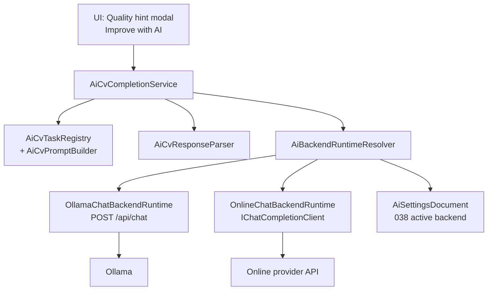

# Prompt 039 - Universal AI CV Completion (Backend-Agnostic)

Connect the **active AI backend** from prompt **038** (local Ollama model **or** any
configured online provider) to **CV editing** through a single, backend-agnostic
completion layer. The same task, prompts, privacy rules, and UI must work whether
the user runs **Gemma locally** or **GPT-4o via OpenAI** — only the transport
adapter changes.

Builds on prompts **034** (quality hints), **036–037** (local models), and **038**
(provider list, single active backend, `IChatCompletionClient`, encrypted secrets).
Does **not** implement AI-assisted import (prompt **040**).

## Goal

1. Introduce **`AiCvCompletionService`** — one Core entry point for all CV AI tasks.
2. Route completions through **`IAiBackendRuntime`** adapters:
   - **Local** → Ollama `POST /api/chat` with the active model tag,
   - **Online** → existing `IChatCompletionClient` + active provider config from **038**.
3. Define a **task registry** (`AiCvTaskKind`) with shared prompt templates and
   response parsing — new features add tasks, not new backend wiring.
4. Ship **first user-facing feature**: **Improve with AI** on selected **quality hints**
   (prompt **034**) — user reviews a suggestion, then **Accept**, **Edit**, or **Dismiss**.
5. Never auto-apply AI text; never block export; never mix with validation errors.
6. Privacy: minimal context per task; online confirmation before first CV send in a session.
7. Graceful degradation when no backend is active, Ollama is down, or provider errors.

## Non-Goals (This Prompt)

- AI-assisted **import** / PDF extraction (**040**),
- Streaming tokens to UI (single round-trip response in v1),
- Chat sidebar or multi-turn conversation history,
- Sending the **entire CV JSON** when a single-field task suffices,
- Auto-apply without explicit Accept,
- Replacing deterministic quality rules — AI **augments** hints, does not remove `CvQualityAnalyzer`,
- Provider failover chains or “best of” multi-model calls,
- Usage metering, cost estimates, token dashboards,
- New provider presets (038 catalog is sufficient),
- Quality-hint **dismiss persistence** across app restarts (still optional until save/load),
- Wi‑Fi / metered-network warnings,
- GPU / VRAM-aware model switching at runtime.

## Product Behavior

### Mental model

```text
User edits CV
    → static quality hint appears (034)
    → optional [Improve with AI] on supported hints
    → ReVitae sends minimal field context to ACTIVE backend only
    → suggestion modal shows result
    → Accept writes field / Edit focuses field / Dismiss closes
```

The user never picks “OpenAI vs Ollama” per action — that comes from **038 active backend**.

### When AI actions are available

| Active backend (038) | Improve with AI button                                                               |
| -------------------- | ------------------------------------------------------------------------------------ |
| `None`               | Visible but opens **AI setup** (or disabled + tooltip — pick one UX, document in QA) |
| `Local`              | Enabled if Ollama reachable + model tag known                                        |
| `Online`             | Enabled if provider configured + model id set                                        |

While a completion is **in flight**, disable duplicate requests for the same field.

### First supported tasks (v1)

Map quality hints → AI tasks. Only hints with a concrete **target field** and text
to improve are in v1:

| Quality hint id (`CvQualityHintIds`) | Task kind                    | Field context                           |
| ------------------------------------ | ---------------------------- | --------------------------------------- |
| `work.generic-description`           | `ImproveWorkDescription`     | Work entry `Description`                |
| `work.entry-missing-description`     | `DraftWorkDescription`       | Work entry `Description` (may be empty) |
| `personal.summary-too-short`         | `ImproveProfessionalSummary` | Personal `ShortSummary`                 |
| `personal.summary-missing`           | `DraftProfessionalSummary`   | Personal `ShortSummary`                 |
| `projects.entry-missing-description` | `ImproveProjectDescription`  | Project entry description field         |

**Not in v1:** section-empty hints (no field text), import-review hints, link-duplicate
hints — no meaningful single-field prompt.

Add **`AiCvTaskRegistry`** so UI asks `SupportsQualityHint(hintId)` instead of hard-coded
switch statements.

### Suggestion modal UX

After **Improve with AI**:

```text
┌─ AI suggestion ────────────────────────────────────────┐
│  [spinner while loading]                               │
│  ── or ──                                              │
│  Suggested text (read-only multiline, selectable)      │
│  Backend: Local · Gemma 2 2B   (or Online · OpenAI)    │
│                                                        │
│  [Accept]  [Edit in form]  [Cancel]                    │
└────────────────────────────────────────────────────────┘
```

| Action     | Behavior                                                               |
| ---------- | ---------------------------------------------------------------------- |
| **Accept** | Write suggestion into target field; refresh validation + quality hints |
| **Edit**   | Navigate to field (reuse `NavigateToQualityHint`), pre-fill suggestion |
| **Cancel** | Close modal; no data change                                            |

On error, show localized message inside modal (invalid key, rate limit, Ollama down,
empty response) + **Retry** when appropriate.

### Online privacy (session-scoped)

Before the **first** CV text send to an **online** backend in an app session:

1. Show confirm dialog (reuse 038 privacy tone):
   “Text from this CV field will be sent to {provider name} for processing.”
2. **Send** / **Cancel** — Cancel aborts the task.
3. Store **`_onlineCvSendConfirmedThisSession = true`** in memory only (not persisted).

**Local Ollama** does not show this dialog (data stays on device). Tooltip may still
say “Processed locally”.

Subsequent online tasks in the same session skip the dialog.

### Header / busy state

While any `AiCvCompletionService` request runs:

- Disable other **Improve with AI** buttons app-wide (or queue — prefer disable in v1),
- Optional: small progress on suggestion modal only (no global dock change).

Do **not** alter download dock behavior from **037**.

## Architecture

### Layer diagram



**Rule:** UI and task code call **`AiCvCompletionService` only**. They never branch on
`AiBackendKind` except for display strings (“Local · {model}” vs “Online · {provider}”).

### Backend adapter interface

```csharp
public interface IAiBackendRuntime
{
    AiBackendKind Kind { get; }

    /// <summary>Human-readable label for suggestion modal footer.</summary>
    string DescribeActiveBackend(AppLocalizer localizer);

    Task<AiChatCompletionResult> CompleteAsync(
        AiCvPromptMessages messages,
        CancellationToken cancellationToken = default);
}

public sealed record AiCvPromptMessages(
    string SystemPrompt,
    string UserPrompt);
```

Implementations:

| Class                      | When selected             | Transport                                 |
| -------------------------- | ------------------------- | ----------------------------------------- |
| `OllamaChatBackendRuntime` | `ActiveBackend == Local`  | `POST {OllamaHost}/api/chat`              |
| `OnlineChatBackendRuntime` | `ActiveBackend == Online` | Delegate to `ChatCompletionClientFactory` |

`AiBackendRuntimeResolver` reads `AiProviderConfigService.CurrentSettings` + secrets +
local `OllamaModelTag` from settings/local record. Returns **`AiBackendUnavailableReason`**
when misconfigured (no model, Ollama down, missing API key).

### Ollama chat client (new)

038 only implemented **connection Test** and **pull** — not chat. Add:

```csharp
public interface IOllamaChatClient
{
    Task<AiChatCompletionResult> ChatAsync(
        string modelTag,
        AiCvPromptMessages messages,
        CancellationToken cancellationToken = default);
}
```

HTTP shape (Ollama native API):

```json
POST /api/chat
{
  "model": "llama3.2:3b-instruct",
  "messages": [
    { "role": "system", "content": "..." },
    { "role": "user", "content": "..." }
  ],
  "stream": false,
  "options": { "num_predict": 512, "temperature": 0.4 }
}
```

Parse final `message.content` from JSON response. Map HTTP failures like online clients
(401 unlikely; connection refused → `AiSetupProviderUnavailable` equivalent for local).

**Model tag source:** `AiSettingsDocument.Local.OllamaModelTag` when active local model
matches `ActiveLocalModelId`; fallback `AiModelCatalog.TryGetById(...)?.OllamaModelTag`.

### Online runtime (reuse 038)

`OnlineChatBackendRuntime` builds `AiProviderConnectionDraft` from saved config +
`IAiSecretStorage`, resolves `AiOnlineProviderDefinition`, calls existing
`IChatCompletionClient.CompleteAsync`.

Combine system + user prompts for APIs that only accept a single user message **only**
if needed — prefer native multi-message where supported:

| API style (038)    | Mapping                                                                                  |
| ------------------ | ---------------------------------------------------------------------------------------- |
| OpenAI-compatible  | Pass system + user in `messages[]` (extend client if Test used single user message only) |
| Anthropic Messages | System string + user message                                                             |
| Gemini             | Concatenate system into user for v1 **or** extend client — document choice               |

**Implementation note:** 038 `IChatCompletionClient` currently takes one `prompt` string.
For 039, extend to `CompleteAsync(..., AiCvPromptMessages messages)` **or** add
`CompleteWithMessagesAsync` — update Test path to use a minimal user message. Keep
Test behavior unchanged.

### Universal completion service

```csharp
public sealed class AiCvCompletionService
{
    public AiCvBackendStatus GetBackendStatus();

    public bool IsQualityHintSupported(string qualityHintId);

    public Task<AiCvCompletionResult> CompleteForQualityHintAsync(
        CvExportSourceData snapshot,
        CvQualityHint hint,
        string uiCulture,
        CancellationToken cancellationToken = default);
}

public sealed record AiCvCompletionResult(
    bool Succeeded,
    string? SuggestedText,
    string? ErrorMessageKey,
    AiCvBackendDescriptor? BackendUsed);
```

Pipeline inside `CompleteForQualityHintAsync`:

1. Resolve task from hint via `AiCvTaskRegistry`.
2. Build field context + source text from `CvExportSourceData` (Core only — **never**
   read Avalonia controls in service).
3. `AiCvPromptBuilder.Build(task, context, uiCulture)` → messages.
4. Resolve backend runtime; fail fast with `AiCvNoBackendConfigured` etc.
5. `runtime.CompleteAsync(messages)`.
6. `AiCvResponseParser.Parse(rawText, task)` → trimmed plain text.
7. Return result.

### Task registry and prompts

```csharp
public enum AiCvTaskKind
{
    ImproveWorkDescription,
    DraftWorkDescription,
    ImproveProfessionalSummary,
    DraftProfessionalSummary,
    ImproveProjectDescription,
}

public static class AiCvTaskRegistry
{
    public static bool SupportsQualityHint(string hintId);
    public static AiCvTaskKind? TryGetTaskForQualityHint(string hintId);
    public static AiCvFieldTarget ResolveFieldTarget(CvQualityHint hint);
}
```

**Prompt design principles:**

- System prompt: role (“CV writing assistant”), output format (**plain text only**,
  no markdown fences, no bullet labels unless appropriate for field), language matches
  `uiCulture` (English vs Slovak instruction),
- User prompt: field label, optional metadata (job title + company for work entries),
  current text (or “empty — draft from role context”),
- Explicit: “Do not invent employers, dates, or metrics not implied by the input.”
- Max output guidance per task (e.g. work description ≤ 120 words).

Store prompt templates in **`AiCvPromptTemplates`** (Core, testable). No prompt strings
in UI layer.

### Response parser

```csharp
public static class AiCvResponseParser
{
    public static string Parse(string rawModelOutput, AiCvTaskKind task);
}
```

Rules:

- Trim whitespace,
- Strip surrounding ``` markdown fences if model disobeys,
- Reject empty → failure,
- Optional max length guard per task (truncate with ellipsis **or** fail — prefer **fail**
  with `AiCvResponseTooLong` so user retries),
- Do not attempt JSON parsing in v1 (plain text tasks only).

## UI Integration

### Quality hint modal

Extend `QualityHintModalPresenter.BuildHintRow` (or wrapper in `MainWindow.QualityHints.cs`):

- When `AiCvCompletionService.IsQualityHintSupported(hint.Id)` **and** backend not
  `None`, show **Improve with AI** button (new translation key).
- When backend is `None`, show **Set up AI** linking to `SetAiSetupModalVisible(true)`.

Add **`AiSuggestionModalOverlay`** in `MainWindow.axaml` (match existing modal patterns):

- Title, read-only `TextBox` for suggestion, backend descriptor, error panel, actions.
- Wire in `MainWindow.AiCvCompletion.cs` (new partial).

### Applying accepted text

Add narrow helpers on `MainWindow` (or section interfaces):

```csharp
void ApplyAiSuggestionToField(AiCvFieldTarget target, string text);
bool TryNavigateToField(AiCvFieldTarget target, string? prefilledText = null);
```

Reuse existing section APIs (`WorkExperienceSection`, etc.) — do not duplicate binding logic.

After apply: `UpdateValidationState()`, `UpdateQualityHints()`.

### Session privacy flag

`MainWindow.AiCvCompletion.cs`:

```csharp
private bool _onlineCvSendConfirmedThisSession;
```

Show confirm panel before first online completion; set flag on confirm.

## Core File Layout

```text
src/ReVitae.Core/Ai/Cv/
  AiCvTaskKind.cs
  AiCvTaskRegistry.cs
  AiCvFieldTarget.cs
  AiCvPromptTemplates.cs
  AiCvPromptBuilder.cs
  AiCvResponseParser.cs
  AiCvCompletionService.cs
  AiCvBackendRuntimeResolver.cs
  AiCvBackendStatus.cs
  OllamaChatClient.cs
  IOllamaChatClient.cs
  OllamaChatBackendRuntime.cs
  OnlineChatBackendRuntime.cs
  IAiBackendRuntime.cs

src/ReVitae.Core/Ai/Providers/Chat/
  IChatCompletionClient.cs          ← extend for system+user messages
  ChatCompletionClients.cs          ← implement message pairs per API style

src/ReVitae/
  MainWindow.AiCvCompletion.cs
  MainWindow.axaml                  ← AiSuggestionModalOverlay, online CV confirm panel

tests/ReVitae.Tests/Ai/Cv/
  AiCvTaskRegistryTests.cs
  AiCvPromptBuilderTests.cs
  AiCvResponseParserTests.cs
  AiCvCompletionServiceTests.cs
  OllamaChatClientTests.cs
  AiBackendRuntimeResolverTests.cs
  OnlineChatBackendRuntimeTests.cs
```

## Localization

Add EN + SK keys (`TranslationKeys` + `AppLocalizer`):

| Key                       | English (example)                                                  |
| ------------------------- | ------------------------------------------------------------------ |
| `AiCvImproveWithAi`       | Improve with AI                                                    |
| `AiCvSetUpAi`             | Set up AI                                                          |
| `AiCvSuggestionTitle`     | AI suggestion                                                      |
| `AiCvSuggestionAccept`    | Accept                                                             |
| `AiCvSuggestionEdit`      | Edit in form                                                       |
| `AiCvSuggestionCancel`    | Cancel                                                             |
| `AiCvSuggestionRetry`     | Retry                                                              |
| `AiCvSuggestionLoading`   | Generating suggestion…                                             |
| `AiCvBackendLocal`        | Local · {0}                                                        |
| `AiCvBackendOnline`       | Online · {0}                                                       |
| `AiCvOnlineSendConfirm`   | Text from this field will be sent to {0} for processing. Continue? |
| `AiCvNoBackendConfigured` | No AI selected — open AI setup and activate a model or provider.   |
| `AiCvOllamaUnavailable`   | Local Ollama is not reachable — check AI setup.                    |
| `AiCvEmptyResponse`       | The model returned an empty response. Try again.                   |
| `AiCvResponseTooLong`     | The suggestion was too long — try again or edit manually.          |
| `AiCvTaskFailed`          | AI suggestion failed: {0}                                          |

Reuse 038 keys where applicable (`AiSetupProviderInvalidKey`, rate limit, unavailable).

## Testing

Target **35+** new tests. All HTTP via injectable handlers — no live API keys in CI.

### Task registry & prompts

- Each v1 quality hint id maps to expected `AiCvTaskKind`,
- Unsupported hints return false,
- `AiCvPromptBuilder` includes job title for work tasks,
- Slovak `uiCulture` adds Slovak output instruction,
- Empty work description draft prompt does not fabricate company names when input empty.

### Response parser

- Strips ``` fences,
- Trims whitespace,
- Empty → throw or error result,
- Too-long → `AiCvResponseTooLong`.

### Ollama chat client

- Mock `POST /api/chat` with model tag + messages,
- Connection refused → failure with unavailable key,
- Parses `message.content` from Ollama JSON.

### Backend resolver

- Local active + valid tag → `OllamaChatBackendRuntime`,
- Online active + configured OpenAI → `OnlineChatBackendRuntime`,
- None → unavailable,
- Local active but missing tag → unavailable.

### Completion service (integration)

- Mock local runtime → success path end-to-end for work generic hint,
- Mock online runtime → success,
- No backend → `AiCvNoBackendConfigured` without HTTP,
- Provider 401 → maps to invalid key message key,
- Cancellation → cancelled result without partial UI apply.

### Regression

- Quality hints without AI button still work (034),
- Validation unchanged,
- 038 active backend switching still mutually exclusive,
- Export not blocked by AI modal.

## Documentation Updates

### [`docs/ai-setup.md`](../docs/ai-setup.md)

Add section **Using AI on your CV (039)**:

- Requires active backend,
- Improve with AI from quality hints,
- Local vs online privacy,
- Accept / Edit flow,
- Link to concept “AI as assistant, not author”.

### [`docs/concept.md`](../docs/concept.md)

Update Phase 2: first AI CV feature implemented (039) — assistant suggestions, user control.

### [`README.md`](../README.md)

Bullet under AI setup: universal completion layer + quality-hint assist.

### [`CHANGELOG.md`](../CHANGELOG.md)

Unreleased **Added**: prompt 039 universal AI CV completion, Ollama chat, quality-hint assist.

### Cross-links

- Update [`prompts/038-ai-provider-list-and-configuration.md`](038-ai-provider-list-and-configuration.md)
  **Out of Scope** line: change “039 — rewrite, hints” to “039 — see
  [`039-universal-ai-cv-completion.md`](039-universal-ai-cv-completion.md)”.
- [`prompts/034-cv-quality-hints.md`](034-cv-quality-hints.md): add note that **039**
  adds optional AI button on supported hints (deterministic hints remain).
- [`prompts/040-ai-assisted-cv-import.md`](040-ai-assisted-cv-import.md): import uses
  the same active backend, `uiCulture` in prompts, and online session confirm flag.

## Out of Scope (Follow-Up Prompts)

- **040** — implemented: [`040-ai-assisted-cv-import.md`](040-ai-assisted-cv-import.md),
- Multi-turn “refine this suggestion” chat,
- AI on export preview or template styling,
- Batch “improve all hints” single click,
- Persisted user opt-out of online AI per provider,
- Custom user-editable system prompts.

## Acceptance Criteria

1. **`AiCvCompletionService`** is the only Core API used by UI for CV AI tasks.
2. **Local** and **Online** backends both work for the same task kinds without UI branching.
3. **Ollama chat** client calls `/api/chat` with active model tag.
4. **Online** path reuses 038 provider config + secrets + API style adapters.
5. **Improve with AI** appears only on v1 supported quality hints.
6. **No backend** shows setup CTA — does not crash.
7. **Online session confirm** appears once before first CV send; local skips it.
8. **Accept** writes field and refreshes hints; **Edit** navigates with prefilled text.
9. AI never auto-runs without explicit button click.
10. Export remains allowed when hints exist; validation errors unchanged.
11. Suggestion modal shows which backend processed the request.
12. Errors surface localized messages (rate limit, unavailable, empty response).
13. EN + SK localization complete.
14. **35+** unit/integration tests with mocked HTTP; `./scripts/test.sh` passes.
15. Docs updated per section above.

## Suggested Implementation Order

1. Core: `AiCvFieldTarget`, task registry, prompt templates + builder, response parser,
2. Extend `IChatCompletionClient` for system+user messages; keep Test working,
3. `OllamaChatClient` + `OllamaChatBackendRuntime`,
4. `OnlineChatBackendRuntime` + resolver,
5. `AiCvCompletionService` + unit tests,
6. UI: suggestion modal AXAML + `MainWindow.AiCvCompletion.cs`,
7. Wire **Improve with AI** into quality hint modal,
8. Online session confirm panel,
9. Apply-suggestion field writers + navigation,
10. Localization,
11. Documentation + manual QA checklist,
12. Full lint / test pass.

## Manual QA Checklist

1. No active backend → hint shows **Set up AI** → opens AI setup modal.
2. Activate **local** model → **Improve with AI** on generic work description → suggestion → Accept → field updates, hint may clear.
3. Switch to **online** provider → first improve shows **online confirm** → subsequent skips confirm.
4. **Edit** opens correct field with suggestion text.
5. **Cancel** leaves field unchanged.
6. Stop Ollama → local improve shows unavailable message + Retry.
7. Invalid API key → online improve shows invalid key message.
8. Validation error on field + AI suggestion — export still blocked only by validation.
9. EN ↔ SK UI language → prompt instruction language matches (spot-check suggestion language).
10. Download dock + AI suggestion modal simultaneously — no regressions.

## Expected Result

ReVitae uses **one universal completion pipeline** for CV AI features. Whichever
backend the user activated in **038** powers **Improve with AI** on quality hints
without code forks per provider. The task registry and backend adapters are ready for
**040** import assist and future field rewrite tools — add tasks, not transports.
