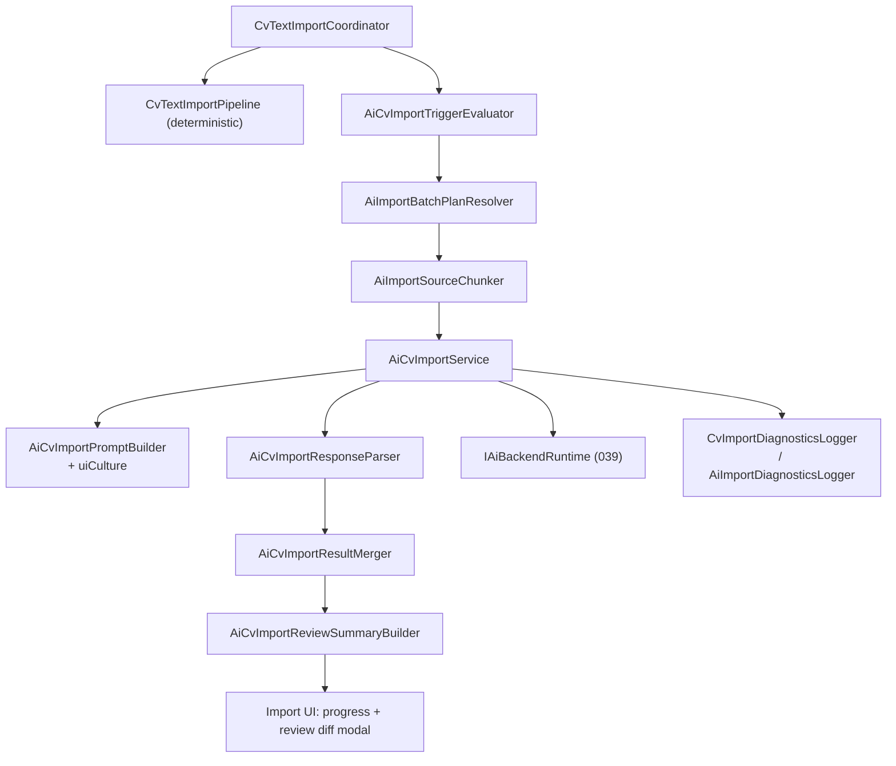
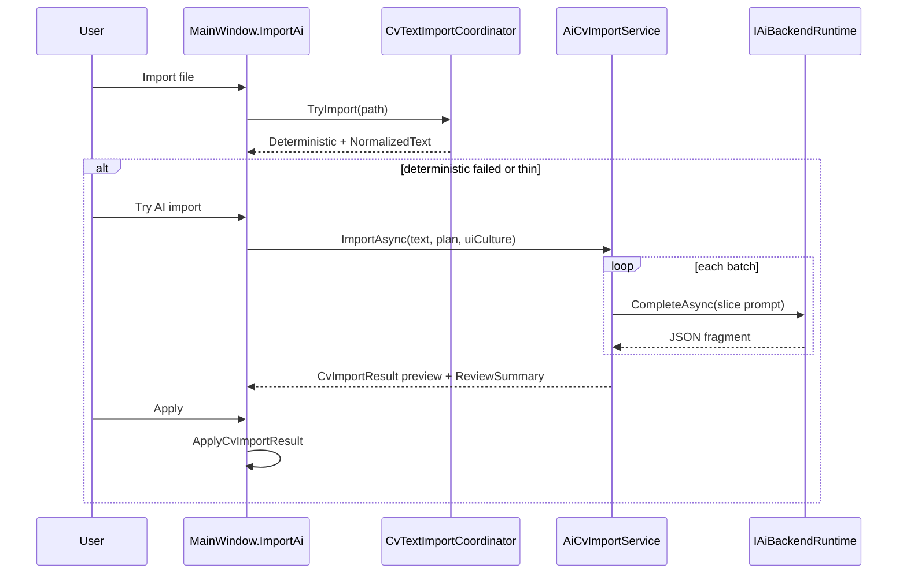
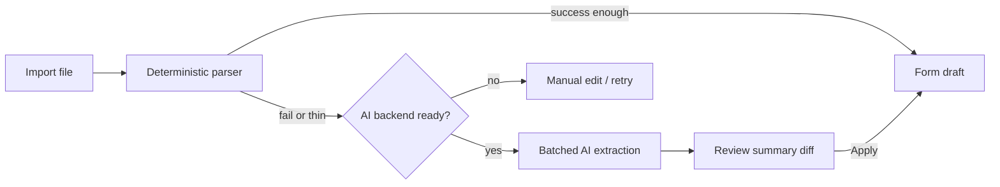
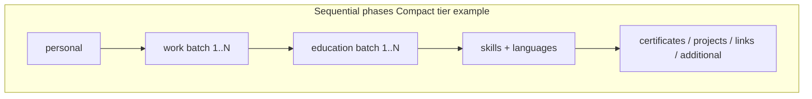
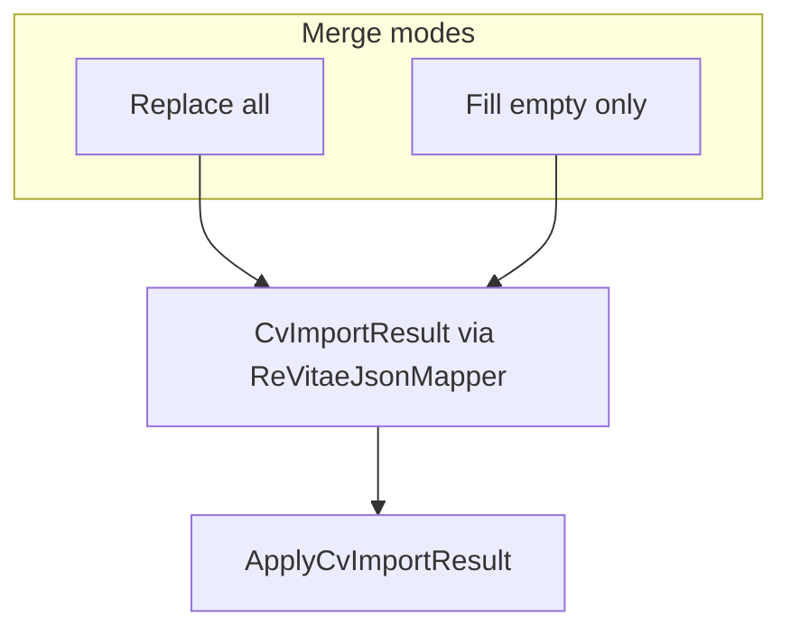

# Prompt 040 - AI-Assisted CV Import (Model-Aware Batched Extraction)

Add **optional AI-assisted import** as a **fallback and enhancement layer** on top of the
existing deterministic import pipeline (prompts **021**, **032**, **033**). When classical
parsing (PdfPig, OCR, heuristics) fails or produces a thin draft, ReVitae sends **small,
sequential extraction batches** to the **active AI backend** from prompt **038** and merges
partial JSON fragments into a single `CvImportResult`.

Builds on prompts **017** (intro/replace import UX), **032** (OCR text acquisition),
**036–038** (AI setup, single active backend), and **039** (`AiCvCompletionService`,
`IAiBackendRuntime`, task registry pattern). Reuses **`ApplyCvImportResult`** for hydration.

**Critical constraint:** local users often run **compact models** (e.g. **Gemma 2 2B**).
The implementation **must not** send the full CV text in one prompt. Extraction is
**always batched** according to a **model profile table** resolved at runtime.

Does **not** replace deterministic import, OCR, or structured format mappers; does **not**
auto-apply without user review; does **not** implement multimodal vision (PDF/image bytes
to model) in v1 — input is **normalized plain text** only.

## Goal

1. After deterministic import, optionally run **`AiCvImportService`** when triggers match.
2. Resolve an **`AiImportBatchProfile`** from the active model (local catalog entry or online
   model id) — defines chunk sizes, phase order, and per-call token limits.
3. Split source text into **phased batches**; each batch asks the model for a **minimal JSON
   slice** only (personal, then work entries, then education, …).
4. Merge batch outputs into **`CvImportResult`**; surface **`ImportWarningAiAssisted`**
   and AI-sourced field confidences as **Low** unless deterministic overlap confirms.
5. Present a **review-first** flow — user confirms before replacing or merging into the form.
6. Reuse **039** backend adapters, online session privacy confirm, and localized errors.
7. Preserve **source-language fidelity** in extracted field values (see **Locale & language**).
8. Show a **lightweight section summary diff** before Apply (see **Review modal**).
9. Emit **import-debug telemetry** for batch diagnostics without logging PII (see **Debug logging**).

## Priority

**Highest remaining Phase 2 import gap.** OCR + heuristics handle many files, but scanned /
creative layouts still yield empty or partial drafts. Small local models must remain usable.

## Non-Goals (This Prompt)

- Vision / multimodal import (send PDF page images to the model),
- Replacing `CvTextImportPipeline` or maintaining a second parallel parser long-term,
- Auto-running AI import without explicit user consent,
- Sending **entire CV JSON export** when a section slice suffices,
- Streaming tokens to UI (progress is phase/step based in v1),
- AI import for **already-successful structured formats** (`.revitae.json`, JSON Resume,
  Europass XML, CSV with mapper success) — skip AI path,
- Provider failover or multi-model voting,
- Persisting AI import preferences inside project files (**041**),
- Usage metering / cost estimates,
- Wi‑Fi / metered-network warnings,
- Custom user-editable system prompts,
- **Profile photo extraction** from PDF/image/scanned CV (see **Profile photo policy** below),
- Pre-import **time / batch-count estimates** or hard batch caps (deferred follow-up).

## Current State (Before This Prompt)

| Area              | Today                                                                                                              |
| ----------------- | ------------------------------------------------------------------------------------------------------------------ |
| Text acquisition  | PdfPig → OCR fallback (**032**), format-specific extractors                                                        |
| Parsing           | `CvTextImportPipeline` → `CvImportFieldExtractor` (deterministic)                                                  |
| Structured import | Direct mappers → `CvImportResult` (no text pipeline)                                                               |
| AI tasks          | **039** quality-hint completion only (`AiCvTaskKind` × 5)                                                          |
| Hydration         | `ApplyCvImportResult(CvImportResult)`                                                                              |
| Backend           | Single active local Ollama tag or online provider (**038**)                                                        |
| Local catalog     | `AiModelCatalog` — tiers Compact → ExtraLarge (**036**)                                                            |
| Failure UX        | `ImportErrorNoStructuredData` or partial draft + confidence highlights; **no normalized text returned on failure** |

## Product Behavior Summary

### When AI import is offered

AI import is **never silent**. Offer it only when **all** of the following hold:

1. Source path is **text-based** (PDF, DOCX, TXT, MD, HTML, RTF, OCR image, …) — not a
   successful structured mapper result.
2. Normalized source text length ≥ **80** non-whitespace characters (configurable constant).
3. Active AI backend is **configured and reachable** (**038**); otherwise show **Set up AI**.
4. At least one **trigger** matches (see table below).

| Trigger id                     | Condition                                                                                                                                                         |
| ------------------------------ | ----------------------------------------------------------------------------------------------------------------------------------------------------------------- |
| `deterministic-failed`         | Text-route import failed (`Success == false`) with `ImportErrorNoStructuredData` **and** acquired normalized text ≥ **80** chars (see **Text acquisition** below) |
| `deterministic-thin`           | Text-route `Success == true` but **`CountPopulatedSections(SectionHasData) ≤ 2`** (see helper below)                                                              |
| `deterministic-low-confidence` | Text-route success but **≥ 5** `FieldConfidences` with `CvImportConfidence.Low` **or** `ImportWarningOcrUsed` present + **`CountPopulatedSections ≤ 4`**          |
| `user-requested`               | User clicks **Try AI import** / **Enhance with AI** while preconditions 1–4 above hold                                                                            |

**Section count helper (Core):**

```csharp
internal static int CountPopulatedSections(IReadOnlyDictionary<CvImportSectionId, bool> flags) =>
    flags.Count(pair => pair.Value); // 9 keys in CvStructuredImportMapper.SectionHasData
```

**Never offer** when:

- Import route is **structured** (`CvImportFormat` is `ReVitaeJson`, `JsonResume`, `EuropassXml`, `HrXml`, or `CsvTabular`) **and** `Success == true` with **`CountPopulatedSections ≥ 5`**,
- Structured route failed because file is unreadable binary / unsupported (no usable plain text),
- Acquired normalized text shorter than **80** chars (includes `ImportErrorEmptyDocument` — nothing to send),
- User disabled AI in settings (future — **not** in v1 unless trivial flag added; skip).

### UX flows

#### A — Failed deterministic import (text route)

Today `ImportCvFromFileAsync` shows an error and returns early when `Success == false`
(intro: `ShowIntroImportError` + **Retry**; replace: `ShowReplaceCvImportError` + **Retry**).
Extend those error states — do **not** invent a new full-page panel.

```text
Import progress → text-route deterministic failed (no structured data)
    → Existing error text + [Retry] + [Try AI import]  (intro / replace import overlays)
    → Try AI import disabled/hidden when text acquisition failed or text < 80 chars
    → User clicks Try AI import
    → (Online) session confirm if not yet confirmed this session (039 flag)
    → AI import progress modal (batch stepper — total steps from plan, not fixed)
    → Review modal with section summary + field counts
    → [Apply to form] [Discard]
```

Form stays **unchanged** until user **Apply** in review modal.

#### B — Thin / low-confidence deterministic draft

```text
Import progress → deterministic partial success
    → Form populated as today (draft + confidence highlights)
    → Non-blocking banner: "Import may be incomplete — [Enhance with AI]"
    → Enhance runs batched AI → Review modal → user chooses:
         • Replace all sections with AI result, or
         • Merge: fill **empty** fields/entries only (default), keep user edits if any post-import
```

Keep v1 merge rules explicit:

- **Try AI import** after deterministic **failure** → **Replace all** on Apply (form was empty).
- **Enhance with AI** after deterministic **partial success** and form **not dirty** →
  **Replace all** on Apply (default primary button).
- **Enhance** when form **dirty** after partial import → confirm dialog; offer
  **Fill empty fields only** as default to avoid clobbering user edits.

#### C — Intro / replace import

Same as A/B; respect existing replace confirmation (**017**, **041** unsaved guards).

### AI import progress modal

```text
┌─ AI import ─────────────────────────────────────────────┐
│  Extracting CV with AI…                                 │
│  Step 3 of 7 — Work experience (batch 2 of 4)           │
│  Backend: Local · Gemma 2 2B                            │
│  [████████░░░░░░░░]  (determinate by completed batches) │
│  [Cancel]                                               │
└─────────────────────────────────────────────────────────┘
```

- **Cancel** aborts remaining batches; **v1: discard partial AI result** (form unchanged).
  Follow-up may add **Apply partial** when personal + ≥ 1 repeatable section extracted.
- Disable other AI actions app-wide while import runs (same as **039** in-flight rule).
- Treat AI import progress as a **blocking overlay** (same class as import progress — disable
  Save/Open/header import per **041** guards).

### Review modal (before apply)

Show:

- Backend label (Local · model / Online · provider),
- **Section summary diff** (lightweight — not a field-by-field diff UI):
- Warning strip: **AI-generated — review all fields before export**,
- **Apply** / **Cancel** (and **Merge empty only** when applicable).

Do **not** show raw model JSON to typical users; optional “Details” expander when
`REVITAE_IMPORT_DEBUG` is enabled (see **Debug logging**).

#### Section summary diff (v1 — in scope)

Compare **deterministic baseline** (empty on failed import, or last deterministic result on
Enhance) vs **AI merged preview** using **`AiCvImportReviewSummary`** (Core DTO):

```text
┌─ Review AI import ──────────────────────────────────────────────┐
│  Backend: Local · Gemma 2 2B                                    │
│  ⚠ AI-generated — review all fields before export.              │
│                                                                 │
│  Section summary                                                  │
│  ┌─────────────────────┬──────────────┬──────────────┐          │
│  │ Section             │ Before       │ After (AI)   │          │
│  ├─────────────────────┼──────────────┼──────────────┤          │
│  │ Personal            │ partial      │ complete     │          │
│  │ Work experience     │ 0 entries    │ 4 entries    │          │
│  │ Education           │ 0 entries    │ 2 entries    │          │
│  │ Skills              │ —            │ 1 group      │          │
│  │ …                   │              │              │          │
│  └─────────────────────┴──────────────┴──────────────┘          │
│  Sections improved: Work experience, Education, Skills            │
│                                                                 │
│  [Apply to form]  [Fill empty only]  [Cancel]                   │
└─────────────────────────────────────────────────────────────────┘
```

**Row rules:**

| Before column | After column       | Highlight                              |
| ------------- | ------------------ | -------------------------------------- |
| `—` (empty)   | populated          | “new” — section gained data            |
| `partial`     | `complete`         | personal: gained email/phone/name      |
| `N entries`   | `M entries`, M > N | show delta `(+M−N)` or `(+M)` when N=0 |
| same count    | same count         | no highlight (still list in table)     |

Use localized section names (`TranslationKeys` for section labels — reuse export/quality
hint section naming where possible). **Do not** show full text diff, side-by-side descriptions,
or per-field JSON — that remains follow-up (“full diff UI” out of scope).

**Core helper:**

```csharp
public sealed record AiCvImportReviewSummary(
    IReadOnlyList<AiCvImportSectionSummaryRow> Rows,
    IReadOnlyList<CvImportSectionId> ImprovedSections);

public sealed record AiCvImportSectionSummaryRow(
    CvImportSectionId SectionId,
    string BeforeLabel,
    string AfterLabel,
    bool IsImproved);
```

Build summary from `CountPopulatedSections` + entry counts per section on deterministic vs
AI `CvImportResult` previews (compute AI preview in Core before Apply — do not mutate form).

#### Profile photo policy (explicit out of scope)

AI import is **text-only** (v1). The model **must not** receive image bytes and prompts
**must not** ask for `profilePhotoBase64` / `profilePhotoPath`.

| Scenario                                        | Behavior after Apply                                                                  |
| ----------------------------------------------- | ------------------------------------------------------------------------------------- |
| Deterministic import had no photo               | Photo stays **empty**                                                                 |
| User already had a photo in form before Enhance | **Preserve** existing runtime photo path — AI merge must not clear `ProfilePhotoPath` |
| OCR / PDF import never extracts photos today    | **No change** — do not imply vision extraction                                        |

Document prominently in user-facing copy: _“AI import fills text fields only; profile photos
must be added manually.”_

### Locale & language (UI culture → extraction)

Pass **`uiCulture`** (`sk` / `en` — same source as **039** `CompleteForQualityHintAsync`)
into `AiCvImportService.ImportAsync` and `AiCvImportPromptBuilder`.

**System prompt must include:**

```text
Extract factual CV content exactly as written in the source document.
Preserve original spelling of names, employers, and places.
Do not translate content into English unless the source excerpt is already English.
UI language ({uiCulture}) affects these instructions only — not field values.
```

**Rules:**

- Field **values** stay in **source language** (SK/CZ/EN mixed CVs are common).
- JSON **keys** remain **camelCase English** (ReVitae schema).
- Empty strings for missing fields — never fabricate translated aliases.
- Unit tests: SK fixture excerpt → mocked response keeps `"Ján Horváth"`, not `"John Horvath"`.

**Optional v1.1:** pass detected OCR language code from Tesseract (`eng`/`slk`) as a hint
line in the user prompt — not required for v1 acceptance.

### Privacy

- **Local Ollama:** no extra dialog; tooltip “Processed locally”.
- **Online:** reuse **039** `_onlineCvSendConfirmedThisSession` — first AI import send in
  session shows confirm: _“Extracted CV text will be sent to {provider} in multiple steps.”_
- Each batch sends **only the slice** required for that phase — never the full document when
  profile forbids it.

### Debug logging (`REVITAE_IMPORT_DEBUG`)

Extend **`CvImportDiagnosticsLogger`** (or parallel **`AiImportDiagnosticsLogger`** writing
to the same session file when import debug is enabled) for AI batches.

**Log per batch (never log full prompt text, slice content, or extracted PII):**

| Field               | Example                      |
| ------------------- | ---------------------------- |
| `phase`             | `work`                       |
| `batchIndex`        | `2`                          |
| `batchCountInPhase` | `4`                          |
| `profileId`         | `gemma2-2b` / `online:small` |
| `inputChars`        | `1187`                       |
| `carryForwardChars` | `245`                        |
| `outputChars`       | `312`                        |
| `parseOk`           | `true` / `false`             |
| `retryUsed`         | `false`                      |
| `durationMs`        | `842`                        |

**Session header:** `AI import started — profile={id}, totalBatches={n}, uiCulture={culture}`

**Session footer:** `AI import finished — success={bool}, batchesOk={n}, batchesFailed={m}`

When debug enabled, review modal **Details** expander may show last **sanitized** parse error
(e.g. `JSON parse error at line 3`) — not raw model output.

**Unit tests:** assert logger receives metadata lines; assert email/name substrings do **not**
appear in log lines when debug is on (use fixture with distinctive PII).

## Architecture

### Layer diagram





**Rules:**

1. **`AiCvImportService`** is the only Core API for AI import; UI never calls Ollama/HTTP directly.
2. **One merge target:** `CvImportResult` — reuse validation + `ApplyCvImportResult`.
3. **No dual-parser merge conflicts:** AI runs **instead of** or **after** deterministic;
   merged output replaces deterministic data only after user confirms.
4. **Batch plan is mandatory** — if resolver returns null (unknown model with no safe default),
   fall back to **`Small`** profile, never **`ExtraLarge`**.

### Extraction phases (ordered)

Phases run **sequentially**. Later phases may include a **compact carry-forward summary**
(see below) but **never** the full original document on compact profiles.

| Phase id       | JSON output keys (minimal schema) | Notes                                    |
| -------------- | --------------------------------- | ---------------------------------------- |
| `personal`     | `personalInformation` only        | Name, title, contact, summary            |
| `work`         | `workExperience[]` (batch)        | Repeat until source work slice exhausted |
| `education`    | `education[]` (batch)             |                                          |
| `skills`       | `skills[]`                        | Grouped categories                       |
| `languages`    | `languages[]`                     | May combine with skills on Compact tier  |
| `certificates` | `certificates[]` (batch)          | Skipped if source slice empty            |
| `projects`     | `projects[]` (batch)              |                                          |
| `links`        | `links[]` + stray URLs            |                                          |
| `additional`   | `additionalInformation.content`   | Free text remainder                      |

**Compact tier optimization:** merge `languages` into phase after `skills` (same call) to
reduce round-trips. Document in plan resolver.

### Model-aware batching table

Implement **`AiImportBatchProfile`** (Core record) and resolve it via
**`AiImportBatchPlanResolver.Resolve(AiSettingsDocument settings)`** using
`AiProviderConfigService.CurrentSettings` (same source as **039**).

**Resolution order:**

1. Active **local** backend → lookup `AiModelCatalog.TryGetById(settings.ActiveLocalModelId)`
   when `ActiveBackend == Local`; fallback to `settings.Local?.SelectedModelId` for tag
   resolution when needed.
2. Active **online** provider → read configured model id from provider config
   (`ModelId` field, or **`DeploymentName`** for **Azure OpenAI** — Azure has no separate
   model id) → map through **`AiImportOnlineModelProfileMap`** (exact match, then substring
   heuristics, else default **`Small`**).
3. **Custom OpenAI-compatible** unknown model id → **`Small`** (safe default).

**Plan object:** `AiImportBatchPlan` includes **`TotalBatchCount`** (sum of all phase batches
after chunking) so UI progress shows **Step {completed} of {TotalBatchCount}** — never a
hard-coded “7 steps”.

#### Tier defaults (fallback when catalog id missing but tag matches)

| Tier           | Example tags                                    | Max input chars per call | Max output tokens (`num_predict`) | Work entries / batch | Edu entries / batch | Projects / batch | Phase mode        | Max carry-forward summary chars |
| -------------- | ----------------------------------------------- | ------------------------ | --------------------------------- | -------------------- | ------------------- | ---------------- | ----------------- | ------------------------------- |
| **Compact**    | `gemma2:2b`                                     | **1 200**                | **384**                           | **1**                | **1**               | **1**            | `SequentialMicro` | **280**                         |
| **Small**      | `phi3:mini`, `llama3.2:3b-instruct`             | **2 400**                | **512**                           | **2**                | **2**               | **2**            | `SequentialSmall` | **450**                         |
| **Medium**     | `mistral:7b-instruct`, `gemma2:9b`              | **5 000**                | **768**                           | **4**                | **3**               | **3**            | `SectionBatch`    | **700**                         |
| **Large**      | `mixtral:8x7b-instruct`, `llama3.3:70b` (local) | **10 000**               | **1 024**                         | **8**                | **6**               | **6**            | `SectionBatch`    | **1 000**                       |
| **ExtraLarge** | `llama3.1:70b-instruct`                         | **16 000**               | **1 536**                         | **12**               | **8**               | **8**            | `SectionFull`     | **1 200**                       |

Temperature default: **0.2** for import (all tiers). Top_p: **0.9** optional.

#### Per-model overrides (local catalog — use these when id matches)

| Catalog id     | Ollama tag              | Tier       | Max input chars | Max output tokens | Work/batch | Phase mode      | Notes                                 |
| -------------- | ----------------------- | ---------- | --------------- | ----------------- | ---------- | --------------- | ------------------------------------- |
| `gemma2-2b`    | `gemma2:2b`             | Compact    | **1 200**       | **384**           | **1**      | SequentialMicro | Combine skills+languages in one phase |
| `phi3-mini`    | `phi3:mini`             | Small      | **2 000**       | **512**           | **2**      | SequentialSmall |                                       |
| `llama32-3b`   | `llama3.2:3b-instruct`  | Small      | **2 400**       | **512**           | **2**      | SequentialSmall | Recommended local default             |
| `qwen25-3b`    | `qwen2.5:3b-instruct`   | Small      | **2 400**       | **512**           | **2**      | SequentialSmall |                                       |
| `mistral-7b`   | `mistral:7b-instruct`   | Medium     | **5 000**       | **768**           | **4**      | SectionBatch    |                                       |
| `llama31-8b`   | `llama3.1:8b-instruct`  | Medium     | **5 500**       | **768**           | **4**      | SectionBatch    |                                       |
| `gemma2-9b`    | `gemma2:9b`             | Medium     | **5 000**       | **768**           | **4**      | SectionBatch    |                                       |
| `qwen25-7b`    | `qwen2.5:7b-instruct`   | Medium     | **5 500**       | **768**           | **4**      | SectionBatch    |                                       |
| `mixtral-8x7b` | `mixtral:8x7b-instruct` | Large      | **10 000**      | **1 024**         | **8**      | SectionBatch    |                                       |
| `llama31-70b`  | `llama3.1:70b-instruct` | ExtraLarge | **16 000**      | **1 536**         | **12**     | SectionFull     |                                       |
| `llama33-70b`  | `llama3.3:70b`          | Large      | **10 000**      | **1 024**         | **8**      | SectionBatch    | Slightly smaller context than 70B 3.1 |

#### Online model profile map (v1)

| Model id pattern (case-insensitive)                                         | Resolved tier | Max input chars | Work/batch |
| --------------------------------------------------------------------------- | ------------- | --------------- | ---------- |
| `gpt-4o-mini`, `gpt-4.1-mini`, `gpt-4.1-nano`                               | Small         | 2 400           | 2          |
| `gpt-4o`, `gpt-4.1`, `claude-sonnet`, `claude-3-5-sonnet`, `gemini-2.5-pro` | Large         | 10 000          | 8          |
| `claude-3-5-haiku`, `claude-haiku`, `gemini-2.0-flash`, `gemini-flash`      | Small         | 2 400           | 2          |
| `llama-3.3-70b`, `llama3.3-70b`                                             | Large         | 10 000          | 8          |
| `mixtral-8x7b`, `mistral-small`, `deepseek-chat`                            | Medium        | 5 000           | 4          |
| `open-mistral-nemo`                                                         | Small         | 2 400           | 2          |
| _(unknown)_                                                                 | **Small**     | **2 400**       | **2**      |

Store patterns in **`AiImportOnlineModelProfileMap`** (Core static class) with unit tests.

### Source text chunking (`AiImportSourceChunker`)

Input: normalized CV text (post-`CvTextNormalizer`), batch profile, optional segmentation
from deterministic pass (`CvSegmentationResult` if available — reuse section boundaries).

**Algorithm (v1):**

1. If segmentation found section bodies → map sections to phases; each batch includes **only
   the body slice** for that section (truncate to `MaxInputChars` with head priority; add
   tail ellipsis marker `[...]`).
2. If no segmentation → split document into **overlapping windows**:
   - window size = `MaxInputChars - carryForwardSummary.Length - prompt overhead`,
   - overlap = **min(120, 10% of window)** for Compact/Small only (helps 2B not miss boundaries).
3. For **work/education/projects** repeat batches: paginate entries by `WorkEntriesPerBatch`
   using paragraph boundaries (`\n\n`) and date-line heuristics (`CvImportPatterns`).
4. Never attach more than **`MaxCarryForwardSummaryChars`** from prior extracted JSON
   (compact bullet list, not full JSON).

**Prompt overhead budget:** reserve **350 chars** on Compact, **500** on Small, **700** on
Medium+ for system + schema instructions (subtract from max input when chunking).

### Carry-forward summary (small models)

After each successful batch, build a **terse summary** for subsequent calls:

```text
Already extracted: Name: Jane Doe; Email: jane@example.com; Work: 2 entries (Acme, Beta Corp); ...
```

Include only identifiers (company, school, dates) — **no long descriptions**. Truncate to
profile limit. Omit entirely on **ExtraLarge** when full section text fits in one call.

### Prompt design (small-model safe)

**System prompt (all tiers):** ≤ **600 chars** English instruction skeleton + **locale line**
(see **Locale & language**) + one line “Respond with JSON only, no markdown fences.”

**User prompt template per phase:**

```text
Extract ONLY the fields in this JSON schema from the CV excerpt below.
If a field is missing, use "" or [].
Do not invent employers, dates, or credentials.

Schema: {minimal schema for this phase only}

Previously extracted (summary): {carryForward or "none"}

CV excerpt:
{slice}
```

**Minimal schemas** — inline in prompts as **camelCase JSON** matching
[`docs/revitae-project-json.md`](../docs/revitae-project-json.md) / `ReVitaeJsonMapper`
(`PropertyNamingPolicy = CamelCase`), **not** the full export tree in one prompt:

- `personalInformation` — `firstName`, `lastName`, `professionalTitle`, `email`, `phone`,
  `location`, `linkedInUrl`, `portfolioUrl`, `gitHubUrl`, `shortSummary` (no photo in v1),
- `workExperience[]` — `{ company, jobTitle, location, startMonth, startYear, endMonth,
endYear, isCurrentlyWorking, description }` (omit `achievements` / `employmentType` in v1
  unless model returns them — parser ignores unknown keys),
- `education[]` — `{ institution, degree, fieldOfStudy, startYear, endYear }`,
- `skills[]` — `{ category, skills: [{ name }] }`,
- avoid optional arrays in Compact tier prompts.

**Mapping:** prefer accumulating partial JSON objects and parsing through
**`ReVitaeJsonMapper.Map`** on the merged document (wrap with `"revitaeVersion": 1`) so
field mapping stays **single-source** with interchange import. `AiCvImportResultMerger`
builds the composite JSON; do not hand-map every property in duplicate.

**Response parsing:**

- Strip markdown code fences if present,
- `AiCvImportResponseParser` → phase DTO → validate with existing field schemas where applicable,
- On parse failure: **one retry** with stricter suffix: “Return valid JSON only.” Same slice,
  same profile limits,
- After retry fail: log batch failure, **continue** to next batch if partial success policy allows,
  else abort with localized error.

Add task kind (extend existing enum — do not renumber 039 values):

```csharp
public enum AiCvTaskKind
{
    ImproveWorkDescription = 0,
    DraftWorkDescription = 1,
    ImproveProfessionalSummary = 2,
    DraftProfessionalSummary = 3,
    ImproveProjectDescription = 4,
    ExtractCvImportBatch = 100,
}
```

**039 `AiCvTaskRegistry`** maps quality-hint ids only. Import batches use
**`AiImportPhase`** + batch index inside `AiCvImportService` / `AiCvImportPromptBuilder` —
do not overload `SupportsQualityHint` for import.

### Merge (`AiCvImportResultMerger`)

- Accumulate phase JSON into a single `revitaeVersion: 1` document; call
  **`ReVitaeJsonMapper.Map`** for the final `CvImportResult` (or merge deterministic +
  AI JSON trees first when user chose **fill empty only**),
- **Replace-all mode:** AI JSON replaces deterministic draft after user Apply,
- **Fill-empty-only mode:** for each section/field, keep deterministic value when non-empty;
  append array entries deduplicated by `(company, startYear, startMonth)` /
  `(institution, startYear)` / `(name)` for certificates & projects,
- **`Success`** follows the same rule as deterministic import: any structured payload per
  `HasStructuredData` semantics (personal **or** any non-empty section),
- Add warnings: `ImportWarningAiAssisted`, `ImportWarningAiPartial` when batches failed;
  preserve `ImportWarningOcrUsed` from acquisition when OCR ran,
- Field confidences from AI → **`CvImportConfidence.Low`** unless value matches deterministic
  extraction (same normalized string).
- **Strip** any `profilePhotoBase64`, `profilePhotoContentType`, or `profilePhotoPath` keys from
  AI JSON before merge; never overwrite runtime photo path unless user explicitly cleared photo.

### Text acquisition (required — fixes current import gap)

**Problem:** `CvDocumentImporter.Import` returns `CvImportResult.Failed(key)` on text-route
failure and **does not expose** normalized text or segmentation to the UI. AI import cannot
work without refactoring acquisition.

Add **`CvTextImportCoordinator`** (Core) — single entry for text-route files:

```csharp
public sealed record CvTextImportAttempt(
    CvImportFormat Format,
    CvTextExtractionResult Extraction,
    string NormalizedText,
    CvSegmentationResult Segmentation,
    CvImportResult Deterministic);
```

Flow:

1. Run the same **`ICvTextExtractor`** chain as today (PdfPig → OCR fallback per **032**).
2. Normalize via `CvTextNormalizer`; segment via `CvSectionSegmenter.Segment`.
3. Run `CvTextImportPipeline.Import` on normalized text (unchanged parser).
4. Return **both** deterministic result **and** text/segmentation **even when
   `Deterministic.Success == false`**.

Wire **`CvDocumentImporter`** text importers through the coordinator internally **or**
expose `CvTextImportCoordinator.TryImport(filePath)` for UI while keeping
`CvDocumentImporter.Import` signature stable for structured routes.

**Guardrails:**

- Cap stored normalized text at **`AiImportLimits.MaxSourceChars`** (suggest **120 000** chars)
  — truncate tail with logged warning before batching,
- Do **not** run OCR twice in one user action: coordinator caches extraction for the session.

### Integration points

#### UI (`MainWindow.ImportAi.cs` or extend import partial)

Refactor `ImportCvFromFileAsync` text path:

1. Call **`CvTextImportCoordinator.TryImport`** for text-route formats; keep
   `CvDocumentImporter.Import` for structured-only fast path **or** delegate structured
   detection inside coordinator (document choice in implementation — structured success
   must not re-acquire text unnecessarily),
2. If structured success with **`CountPopulatedSections ≥ 5`** → existing apply path, **no AI offer**,
3. Else evaluate triggers on `CvTextImportAttempt` → show AI CTA on error rows / banner,
4. On confirm → `AiCvImportService.ImportAsync(normalizedText, segmentation, plan, …)`,
5. Review modal → `ApplyCvImportResult` + `ShowImportWarnings` + `ResetProjectSession(markDirty: true)` (**041**).

Wire **Enhance with AI** non-blocking banner after thin deterministic success (form already
populated). Store last `CvTextImportAttempt` in memory until next import or New CV.

#### Reuse 039 infrastructure

- Extend **`AiCvCompletionService`** with `ImportAsync` **or** add sibling
  **`AiCvImportService`** that shares `AiBackendRuntimeResolver` + online confirm policy —
  prefer **sibling service** to keep completion tests isolated; both use `IAiBackendRuntime`.

**Service signature (illustrative):**

```csharp
public sealed record AiCvImportRequest(
    string NormalizedText,
    CvSegmentationResult Segmentation,
    CvImportResult? DeterministicBaseline,
    AiImportBatchPlan Plan,
    string UiCulture,
    AiCvImportMergeMode MergeMode,
    CancellationToken CancellationToken = default);

public sealed record AiCvImportOutcome(
    CvImportResult Result,
    AiCvImportReviewSummary ReviewSummary,
    int BatchesCompleted,
    int BatchesFailed);

Task<AiCvImportOutcome> ImportAsync(AiCvImportRequest request, IProgress<AiCvImportProgress>? progress = null);
```

Return **`AiCvImportOutcome`** to UI for review modal — do not call `ApplyCvImportResult` inside Core.

### Core file layout

```text
src/ReVitae.Core/Import/
  CvTextImportCoordinator.cs         ← text acquisition + deterministic parse bundle
  CvTextImportAttempt.cs

src/ReVitae.Core/Ai/Import/
  AiImportLimits.cs
  AiImportBatchProfile.cs
  AiImportBatchPlan.cs
  AiImportBatchPlanResolver.cs
  AiImportOnlineModelProfileMap.cs
  AiImportPhase.cs
  AiImportSourceChunker.cs
  AiImportCarryForwardSummaryBuilder.cs
  AiCvImportPromptBuilder.cs
  AiCvImportResponseParser.cs
  AiCvImportResultMerger.cs
  AiCvImportTriggerEvaluator.cs
  AiCvImportService.cs
  AiCvImportProgress.cs
  AiCvImportReviewSummaryBuilder.cs

src/ReVitae.Core/Ai/Cv/
  AiCvTaskKind.cs                    ← add ExtractCvImportBatch

src/ReVitae/
  MainWindow.ImportAi.cs
  MainWindow.axaml                   ← AiImportProgressOverlay, AiImportReviewOverlay

tests/ReVitae.Tests/Ai/Import/
  AiImportBatchPlanResolverTests.cs
  AiImportSourceChunkerTests.cs
  AiCvImportPromptBuilderTests.cs
  AiCvImportResponseParserTests.cs
  AiCvImportResultMergerTests.cs
  AiCvImportTriggerEvaluatorTests.cs
  AiCvImportServiceTests.cs          ← mocked IAiBackendRuntime
  AiCvImportReviewSummaryBuilderTests.cs
  AiImportDiagnosticsLoggerTests.cs
  CvTextImportCoordinatorEdgeCaseTests.cs
  AiCvImportLocalePromptTests.cs
  AiCvImportPhotoPolicyTests.cs
```

Add **`tests/ReVitae.Tests/Ai/Import/AiCvImportEdgeCaseTests.cs`** — consolidated edge matrix
(see **Edge-case test matrix** below).

## Localization

Add EN + SK keys (`TranslationKeys` + `AppLocalizer`); register in **RequiredKeys**:

| Constant                         | Key string                         | English (example)                                               |
| -------------------------------- | ---------------------------------- | --------------------------------------------------------------- |
| `ImportAiTryButton`              | `import.ai.tryButton`              | Try AI import                                                   |
| `IntroImportTryAi`               | `intro.import.tryAi`               | Try AI import                                                   |
| `ReplaceImportTryAi`             | `replaceImport.tryAi`              | Try AI import                                                   |
| `ImportAiEnhanceButton`          | `import.ai.enhanceButton`          | Enhance with AI                                                 |
| `ImportAiProgressTitle`          | `import.ai.progressTitle`          | AI import                                                       |
| `ImportAiProgressStep`           | `import.ai.progressStep`           | Step {0} of {1} — {2}                                           |
| `ImportAiProgressBatch`          | `import.ai.progressBatch`          | (batch {0} of {1})                                              |
| `ImportAiReviewTitle`            | `import.ai.reviewTitle`            | Review AI import                                                |
| `ImportAiReviewSummaryTitle`     | `import.ai.reviewSummaryTitle`     | Section summary                                                 |
| `ImportAiReviewSummaryBefore`    | `import.ai.reviewSummaryBefore`    | Before                                                          |
| `ImportAiReviewSummaryAfter`     | `import.ai.reviewSummaryAfter`     | After (AI)                                                      |
| `ImportAiReviewSectionsImproved` | `import.ai.reviewSectionsImproved` | Sections improved: {0}                                          |
| `ImportAiReviewPersonalPartial`  | `import.ai.reviewPersonalPartial`  | partial                                                         |
| `ImportAiReviewPersonalComplete` | `import.ai.reviewPersonalComplete` | complete                                                        |
| `ImportAiReviewEmptyDash`        | `import.ai.reviewEmptyDash`        | —                                                               |
| `ImportAiReviewEntryCount`       | `import.ai.reviewEntryCount`       | {0} entries                                                     |
| `ImportAiPhotoNotExtracted`      | `import.ai.photoNotExtracted`      | AI import fills text fields only. Add a profile photo manually. |
| `ImportAiReviewDetails`          | `import.ai.reviewDetails`          | Details                                                         |
| `ImportAiReviewWarning`          | `import.ai.reviewWarning`          | AI-generated content — review all fields before export.         |
| `ImportAiReviewApply`            | `import.ai.reviewApply`            | Apply to form                                                   |
| `ImportAiReviewCancel`           | `import.ai.reviewCancel`           | Cancel                                                          |
| `ImportAiReviewMergeEmpty`       | `import.ai.reviewMergeEmpty`       | Fill empty fields only                                          |
| `ImportAiOnlineConfirm`          | `import.ai.onlineConfirm`          | CV text will be sent to {0} in multiple steps. Continue?        |
| `ImportAiFailed`                 | `import.ai.failed`                 | AI import could not extract usable CV data.                     |
| `ImportAiPartialWarning`         | `import.ai.partialWarning`         | Some steps failed — review incomplete sections carefully.       |
| `ImportAiNoBackend`              | `import.ai.noBackend`              | Set up AI to use AI import.                                     |
| `ImportAiBannerIncomplete`       | `import.ai.bannerIncomplete`       | Import may be incomplete.                                       |
| `ImportWarningAiAssisted`        | `import.warning.aiAssisted`        | This draft was created with AI assistance — verify all fields.  |
| `ImportWarningAiPartial`         | `import.warning.aiPartial`         | AI import skipped some sections due to errors.                  |

Reuse existing **`AiCvBackendLocal`**, **`AiCvBackendOnline`**, **`AiCvOllamaUnavailable`**, rate-limit keys where applicable.

## Testing

Target **55+** new tests across unit + edge matrix; `./scripts/test.sh` must pass.

### Unit tests (`tests/ReVitae.Tests/Ai/Import/`)

| Area                             | Cases                                                                                               |
| -------------------------------- | --------------------------------------------------------------------------------------------------- |
| `AiImportBatchPlanResolver`      | every catalog id maps; unknown online id → Small; gemma2-2b → Compact limits; Azure deployment name |
| `AiImportSourceChunker`          | segmented vs unsegmented; Compact never exceeds 1200 char slice; overlap on Small                   |
| `AiCvImportPromptBuilder`        | personal phase schema only; system prompt length cap; carry-forward truncated; **uiCulture sk/en**  |
| `AiCvImportResponseParser`       | valid JSON; fenced `json`; invalid → retry flag; partial array                                      |
| `AiCvImportResultMerger`         | dedupe work entries; personal overwrite; partial batch warnings; **photo path preserved on merge**  |
| `AiCvImportTriggerEvaluator`     | failed / thin / low-confidence / user-requested; structured success skips                           |
| `AiCvImportService`              | mocked runtime: Compact plan `TotalBatchCount ≥ 5`; cancel mid-way; merge via ReVitaeJsonMapper     |
| `CvTextImportCoordinator`        | deterministic fail still returns normalized text; OCR path once; truncation at MaxSourceChars       |
| `AiCvImportReviewSummaryBuilder` | empty→N entries improved; partial→complete personal; no false improved when counts equal            |
| `AiImportDiagnosticsLogger`      | logs phase/batch metrics; **no PII substrings** in output                                           |
| `AiCvImportLocalePromptTests`    | SK culture + SK names in source → prompt contains preserve-language instruction                     |

Use **`JohnDoeStressCvDataset`** text slices — **mock model responses** with minimal JSON
fixtures per phase (do not call real Ollama in default CI).

### Edge-case test matrix (`AiCvImportEdgeCaseTests.cs`)

Each row is at least one test method (table-driven `[Theory]` encouraged).

| #   | Area           | Scenario                                                     | Expected                                            |
| --- | -------------- | ------------------------------------------------------------ | --------------------------------------------------- |
| 1   | Trigger        | Structured `.revitae.json` success, 6 sections               | AI **not** offered                                  |
| 2   | Trigger        | Text PDF deterministic fail, 500 chars text                  | `deterministic-failed` true                         |
| 3   | Trigger        | Text PDF fail, 40 chars text                                 | AI **not** offered                                  |
| 4   | Trigger        | Thin success: 2 sections populated                           | `deterministic-thin` true                           |
| 5   | Trigger        | OCR warning + 3 sections                                     | `deterministic-low-confidence` true                 |
| 6   | Trigger        | Successful import 5+ sections                                | all triggers false                                  |
| 7   | Batch plan     | `gemma2-2b`                                                  | max input ≤ 1200, skills+languages combined phase   |
| 8   | Batch plan     | Unknown online model id                                      | Small profile                                       |
| 9   | Batch plan     | Azure active backend                                         | resolves deployment name                            |
| 10  | Chunker        | No section headers (garbled CV)                              | overlapping windows, Compact overlap ≥ 1            |
| 11  | Chunker        | 50k char CV                                                  | truncated to `MaxSourceChars` before plan           |
| 12  | Chunker        | Work section 20 entries, Compact                             | 20 sequential work batches                          |
| 13  | Parser         | Model returns markdown fenced JSON                           | parse success                                       |
| 14  | Parser         | Invalid JSON twice                                           | batch failed; `ImportWarningAiPartial` if others ok |
| 15  | Parser         | Extra unknown JSON keys                                      | ignored; map succeeds                               |
| 16  | Parser         | `profilePhotoBase64` in model output                         | **stripped** before merge                           |
| 17  | Merger         | Duplicate work `(company, startYear, startMonth)`            | single entry                                        |
| 18  | Merger         | Fill-empty-only: deterministic email set, AI email different | keep deterministic                                  |
| 19  | Merger         | Fill-empty-only: deterministic work 1, AI work 3             | append 2 new deduped                                |
| 20  | Merger         | Replace-all after failed deterministic                       | AI personal replaces empty form                     |
| 21  | Merger         | AI-only success criteria                                     | matches `HasStructuredData`                         |
| 22  | Service        | Cancel on batch 3 of 10                                      | no Apply; form unchanged                            |
| 23  | Service        | Backend unreachable before start                             | localized error; no partial                         |
| 24  | Service        | Online rate limit on batch 2                                 | error + Retry on batch 2                            |
| 25  | Locale         | UI `sk`, source `"Ján Horváth"`                              | merged result keeps diacritics                      |
| 26  | Locale         | UI `en`, source `"Ing. Maria Nováková"`                      | no forced translation in merger                     |
| 27  | Photo          | Enhance with existing profile photo path                     | path unchanged after merge                          |
| 28  | Photo          | Apply AI after text import                                   | `ProfilePhotoPath` empty                            |
| 29  | Review summary | Before 0 work, after 4 work                                  | `IsImproved` true for WorkExperience                |
| 30  | Review summary | Before 2 work, after 2 work (same companies)                 | `IsImproved` false                                  |
| 31  | Coordinator    | Password-protected PDF                                       | no text; AI not offered                             |
| 32  | Coordinator    | OCR unavailable, image file                                  | extraction fail; AI hidden                          |
| 33  | Coordinator    | Second import same session                                   | OCR not invoked twice (mock call count)             |
| 34  | Debug log      | Debug on, John Doe email in slice                            | log lines exclude `@` email pattern                 |
| 35  | Debug log      | Debug off                                                    | no AI batch lines written                           |
| 36  | JSON map       | Full merged AI document                                      | `ReVitaeJsonMapper` → valid `CvImportResult`        |
| 37  | JSON map       | AI returns `endMonth: 0`                                     | normalized or rejected per field schema             |
| 38  | Integration    | John Doe text, mocked AI phases                              | 0 validation errors after Apply                     |
| 39  | Integration    | Enhance partial deterministic                                | `CountPopulatedSections` increases                  |
| 40  | Integration    | 041 dirty project + Enhance replace                          | confirm dialog shown (UI test or manual)            |
| 41  | Regression     | 039 quality-hint AI during import progress                   | Improve with AI disabled                            |
| 42  | Regression     | 031/033 deterministic ReVitae PDF                            | no AI banner on happy path                          |

Mark slow or OCR-dependent cases with `[Trait("Category", "ImportAiIntegration")]` if needed;
default CI runs mock-only tests.

### Integration tests

- Deterministic fail on garbled text → trigger true → mocked AI phases → `ApplyCvImportResult`
  yields **0** validation errors for John Doe fixture text.
- Deterministic partial + Enhance → merged result has more sections than deterministic alone;
  **review summary** lists improved sections.
- Structured `.revitae.json` import → AI trigger **false**.
- **`AiCvImportReviewSummaryBuilder`** snapshot test for fixed deterministic vs AI pair.

### Manual QA checklist

1. **Gemma 2 2B** (Compact): import scanned OCR PDF → AI import → progress shows **≥ 5 steps**,
   slices small; final draft usable after review.
2. **Llama 3.2 3B**: same file completes in fewer batches than Compact.
3. Online provider (gpt-4o-mini): online confirm once per session; multi-step progress.
4. No backend → **Set up AI** CTA, no crash.
5. Cancel mid-import → form unchanged.
6. Partial deterministic → banner **Enhance with AI** → **review summary table** → Apply.
7. Successful JSON Resume import → no AI banner.
8. EN ↔ SK strings on new modals; **SK CV names unchanged** after AI import with UI in SK.
9. AI import + download dock simultaneously — no regressions.
10. Import debug log (`REVITAE_IMPORT_DEBUG`) records phase/batch sizes **without** full PII text.
11. Review modal shows **photo not extracted** note; photo section empty after Apply.
12. Enhance with existing profile photo → photo **still present** after Apply.
13. Debug **Details** expander shows parse errors only when `REVITAE_IMPORT_DEBUG` set.

## Documentation Updates

| File                                                                             | Change                                                                                                                                                        |
| -------------------------------------------------------------------------------- | ------------------------------------------------------------------------------------------------------------------------------------------------------------- |
| **[`docs/ai-import.md`](../docs/ai-import.md)** _(new)_                          | Primary user + dev doc: triggers, batching table summary, locale policy, photo policy, review summary diff, debug logging, **3 mermaid diagrams** (see below) |
| [`docs/import-formats.md`](../docs/import-formats.md)                            | Short **AI-assisted fallback** section linking to `ai-import.md`; note text-only                                                                              |
| [`docs/ai-setup.md`](../docs/ai-setup.md)                                        | Remove “not yet import”; link `ai-import.md`; model tier → batch size                                                                                         |
| [`docs/concept.md`](../docs/concept.md)                                          | Move AI import from “Still open” to implemented after prompt lands                                                                                            |
| [`README.md`](../README.md)                                                      | Roadmap + feature bullet; link **`docs/ai-import.md`**                                                                                                        |
| [`CHANGELOG.md`](../CHANGELOG.md)                                                | Unreleased entry with test count delta                                                                                                                        |
| [`prompts/039-universal-ai-cv-completion.md`](039-universal-ai-cv-completion.md) | Cross-link: import uses same backend; shared uiCulture / online confirm                                                                                       |
| [`prompts/032-ocr-cv-import.md`](032-ocr-cv-import.md)                           | Cross-link: OCR text feeds AI import when heuristics fail                                                                                                     |
| [`prompts/041-local-cv-project-save-load.md`](041-local-cv-project-save-load.md) | Cross-link: dirty guard on Enhance replace                                                                                                                    |

### Required content for **`docs/ai-import.md`**

1. **Overview** — deterministic first, AI optional, batched for small models.
2. **When AI import is offered** — trigger table (user-facing wording).
3. **Model batching** — simplified tier table (Compact → ExtraLarge) + link to prompt **040**.
4. **Review before apply** — section summary diff screenshot/description.
5. **Language behavior** — source text preserved; UI locale does not translate CV content.
6. **Profile photos** — not extracted; manual upload only.
7. **Privacy** — local vs online multi-step confirm.
8. **Debug** — `REVITAE_IMPORT_DEBUG` env var; what is / is not logged.

**Required mermaid diagrams in `docs/ai-import.md`:**







Also add mermaid to **README** (optional one-liner flow) linking to `docs/ai-import.md` if
README already uses mermaid elsewhere.

## Out of Scope (Follow-Up Prompts)

- Multimodal vision import (page images to GPT-4o / Gemini Vision),
- Per-user editable import prompts,
- Automatic AI import without button click,
- Parallel batch requests (sequential only in v1 — protects small models and rate limits),
- **Full field-by-field diff UI** (side-by-side descriptions / JSON compare — v1 has **section summary diff** only),
- Pre-import time estimates and **`MaxBatchesPerImport`** hard caps,
- AI import from clipboard / URL fetch.

## Validation (Definition of Done)

- `./scripts/test.sh` passes with **55+** new tests in `tests/ReVitae.Tests/Ai/Import/`.
- `npm run lint` passes.
- Manual QA checklist (13 items) completed on **gemma2:2b** and one online provider.
- **`docs/ai-import.md`** published with 3 mermaid diagrams; README + import-formats link to it.

## Acceptance Criteria

1. **`AiImportBatchPlanResolver`** returns profile for every **`AiModelCatalog`** entry and
   unknown online models default to **Small**, never unbounded input; Azure uses deployment name.
2. **Gemma 2 2B** profile uses **≤ 1 200** char input per call and **`TotalBatchCount ≥ 5`**
   on a multi-section CV fixture (test asserts call count and max prompt length).
3. **`CvTextImportCoordinator`** exposes normalized text when deterministic import fails.
4. **`AiCvImportService`** is the sole Core AI-import API; UI uses **`ApplyCvImportResult`**
   after review.
5. Deterministic parser remains default; AI runs only on triggers or user action.
6. Structured format success with **`CountPopulatedSections ≥ 5`** never invokes AI import.
7. Online session confirm before first import send; local skips it.
8. User must **Apply** in review modal — no silent form mutation.
9. Partial batch failures surface **`ImportWarningAiPartial`**; merge policy documented in code.
10. Final merge goes through **`ReVitaeJsonMapper`** (no duplicate property mapping).
11. **`AiCvImportReviewSummary`** shown in review modal before Apply; improved sections highlighted.
12. **`uiCulture`** passed to prompts; SK source names preserved in merged result (tests 25–26).
13. **Profile photo** never extracted; existing photo preserved on Enhance merge.
14. **`REVITAE_IMPORT_DEBUG`** logs batch metadata without PII; unit test asserts no email in logs.
15. EN + SK localization complete.
16. **55+** unit/integration/edge tests; `./scripts/test.sh` passes; `npm run lint` passes.
17. **`docs/ai-import.md`** created with **3 mermaid diagrams**; cross-links from README/import-formats/ai-setup.

## Suggested Implementation Order

1. Core: `CvTextImportCoordinator` + `CvTextImportAttempt` (text exposed on failure),
2. `AiImportBatchProfile`, `AiImportBatchPlan`, resolver + online map + Azure branch,
3. `AiImportSourceChunker` + carry-forward builder + unit tests,
4. `AiCvImportPromptBuilder` + `AiCvImportResponseParser` + phase schemas,
5. `AiCvImportResultMerger` (composite JSON → `ReVitaeJsonMapper`) + trigger evaluator,
6. `AiCvImportService` (sequential batch loop, `TotalBatchCount`, cancel, `uiCulture`),
7. `AiCvImportReviewSummaryBuilder` + review modal AXAML,
8. Extend `AiCvTaskKind` only; wire `AiImportDiagnosticsLogger`,
9. UI: Try AI on intro/replace error rows, progress + review modals, Enhance banner,
10. Online confirm reuse from **039** (`_onlineCvSendConfirmedThisSession`),
11. Localization (including review summary + photo note keys),
12. **`docs/ai-import.md`** + cross-links + mermaid; update import-formats / ai-setup / concept / README / CHANGELOG,
13. Edge-case test matrix (`AiCvImportEdgeCaseTests.cs`) — **55+** tests,
14. Manual QA on **gemma2:2b** + SK locale name preservation,
15. Full lint / test pass.

## Expected Result

ReVitae offers **AI-assisted import** that respects **small local models** through
**mandatory, model-specific batching**. **Gemma 2 2B** users get sequential micro-phases
with tiny JSON slices instead of one overloaded prompt. Larger local and online models
scale batch sizes via the profile table. The feature reuses **038/039** backend wiring,
feeds the existing **`CvImportResult` → `ApplyCvImportResult`** path, shows a **section
summary diff** before apply, preserves **source-language** field values, never extracts
**profile photos**, and supports **debug batch telemetry** without PII in logs.
Deterministic import remains the fast, offline-first default.
